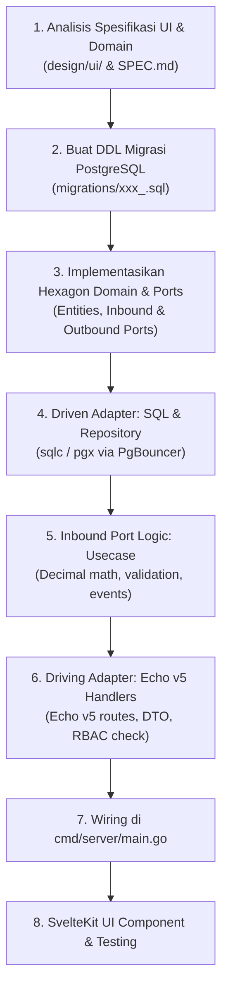

# 🏛️ ERP Monolith Development Skill

Skill ini memandu AI agent dalam merancang, menulis, menguji, dan memelihara kode pada proyek **ERP Monolith**. Proyek ini menerapkan arsitektur **Modular Monolith** dengan pendekatan **Hexagonal Architecture (Ports & Adapters)** pada setiap modul domain di backend Golang (Echo v5, PostgreSQL, PgBouncer) dan antarmuka berbasis SvelteKit 2 / Svelte 5.

---

## 🧭 Prinsip Utama (Non-Negotiable Rules)

1. **Hexagonal Modular Monolith & Anti-Circular Dependency**:
   - Seluruh modul bisnis berada di `internal/modules/<nama_modul>/`.
   - **Inbound Ports**: Interface Usecase yang mendefinisikan operasi bisnis domain.
   - **Driving Adapters**: Controller HTTP menggunakan **Echo v5** (`github.com/labstack/echo/v5`) di folder `delivery/http`.
   - **Core Domain**: Model bisnis, kalkulasi finansial (`decimal.Decimal`), dan aturan validasi di `domain/`.
   - **Outbound Ports**: Interface Repository dan Consumer-Defined Contracts di `domain/contracts.go`.
   - **Driven Adapters**: Implementasi repository PostgreSQL via `pgx/v5` & `sqlc` yang berkomunikasi melalui **PgBouncer** di `repository/`.
   - Modul dilarang keras meng-import package usecase atau internal modul lain secara langsung.
   - Gunakan **Event Bus** untuk interaksi asinkron / efek samping (contoh: posting jurnal dari invoice).
   - Baca panduan lengkap di: [Aturan Arsitektur](./references/architecture-rules.md).

2. **Basis Data PostgreSQL & PgBouncer Connection Pooling**:
   - Database Engine: **PostgreSQL 16+**.
   - Pooler Proxy: **PgBouncer** dengan mode `pool_mode = transaction`.
   - Konfigurasi `pgx/v5`: Menggunakan simple protocol (`QueryExecModeSimpleProtocol`) untuk menjamin kompatibilitas transaksi pada PgBouncer.
   - Setiap tabel wajib menggunakan prefiks modul (`acc_`, `inv_`, `sal_`, `pur_`, `sys_`, dll.).
   - Tidak boleh ada query SQL JOIN lintas domain modul privat. Gunakan snapshot denormalisasi saat transaksi dibuat.
   - Kolom audit wajib: `company_id`, `branch_id`, `created_at`, `created_by`, `updated_at`, `updated_by`.

3. **Presisi Finansial Wajib Desimal**:
   - Dilarang keras menggunakan `float32` atau `float64` untuk nominal uang, diskon, persentase pajak, dan stok.
   - Wajib gunakan `github.com/shopspring/decimal`.
   - Kolom database menggunakan `NUMERIC(18, 4)` atau `NUMERIC(15, 2)`.

4. **Tech Stack Resmi**:
   - Backend: Golang 1.22+, Echo v5 Router, PostgreSQL 16+, PgBouncer, `pgx/v5`, `sqlc`, `shopspring/decimal`.
   - Frontend: SvelteKit 2, Svelte 5 (Runes), Tailwind CSS, Vite.
   - Daftar pustaka UI lengkap: [Referensi Tech Stack](./references/tech-stack.md).

---

## 🛠️ Alur Kerja Implementasi Fitur/Modul

Saat diminta membuat fitur baru atau mengimplementasikan modul dari desain (`design/ui/`), ikuti langkah terstruktur berikut:



Gunakan checklist lengkap di [Checklist Implementasi Modul](./references/module-checklist.md) untuk verifikasi setiap langkah.

---

## 📂 Struktur File Standar per Modul (Hexagonal)

Setiap modul di bawah `internal/modules/<nama_modul>/` wajib memiliki struktur:

```text
internal/modules/<nama_modul>/
├── domain/                   # Hexagon Core
│   ├── entity.go             # Struct domain utama dan validation rules
│   ├── errors.go             # Sentinel errors domain (ErrNotFound, ErrInvalidState)
│   ├── events.go             # Struct payload event yang dipublikasikan
│   ├── ports.go              # Inbound Ports (Usecase interfaces)
│   └── contracts.go          # Outbound Ports (Repo & Consumer-defined inter-module contracts)
├── usecase/                  # Inbound Port Implementations
│   ├── usecase.go            # Orchestrator usecase struct & logic
│   └── usecase_test.go       # Unit test dengan mock outbound ports
├── repository/               # Driven Adapter (PostgreSQL via PgBouncer)
│   ├── repository.go         # SQL execution via pgx/sqlc
│   └── queries.sql           # Query SQL mentah untuk sqlc
└── delivery/
    └── http/                 # Driving Adapter (Echo v5 HTTP Server)
        ├── handler.go        # Echo v5 handlers, parsing context & DTO
        ├── routes.go         # Registrasi Echo v5 sub-routes
        └── dto/              # Request / Response JSON structs
```

---

## 🔍 Perintah Verifikasi & Testing

Setelah melakukan perubahan kode, selalu jalankan langkah verifikasi:

```bash
# 1. Format kode Go
go fmt ./...

# 2. Cek linter & circular dependencies
go vet ./...

# 3. Jalankan pengujian unit
go test -v -race ./internal/...

# 4. Generate query sqlc (jika ada perubahan file SQL)
sqlc generate

# 5. Type-check & lint Frontend (jika di folder frontend)
npm run check
npm run test
```

---

## 📚 Dokumen Terkait

- [Master System Specification (SPEC.md)](file:///opt/dev/erp_monolith/SPEC.md)
- [Modul & Fitur ERP (erp_modules.md)](file:///opt/dev/erp_monolith/design/erp_modules.md)
- [Arsitektur Backend Go (erp_backend_architecture.md)](file:///opt/dev/erp_monolith/design/erp_backend_architecture.md)
- [Panduan Library UI (erp_ui_thirdparty_libraries.md)](file:///opt/dev/erp_monolith/design/erp_ui_thirdparty_libraries.md)
- [Roadmap & Urutan Implementasi (roadmap_implementasi.md)](file:///opt/dev/erp_monolith/design/roadmap_implementasi.md)
