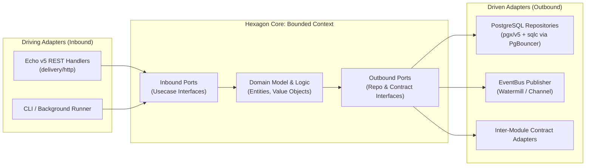
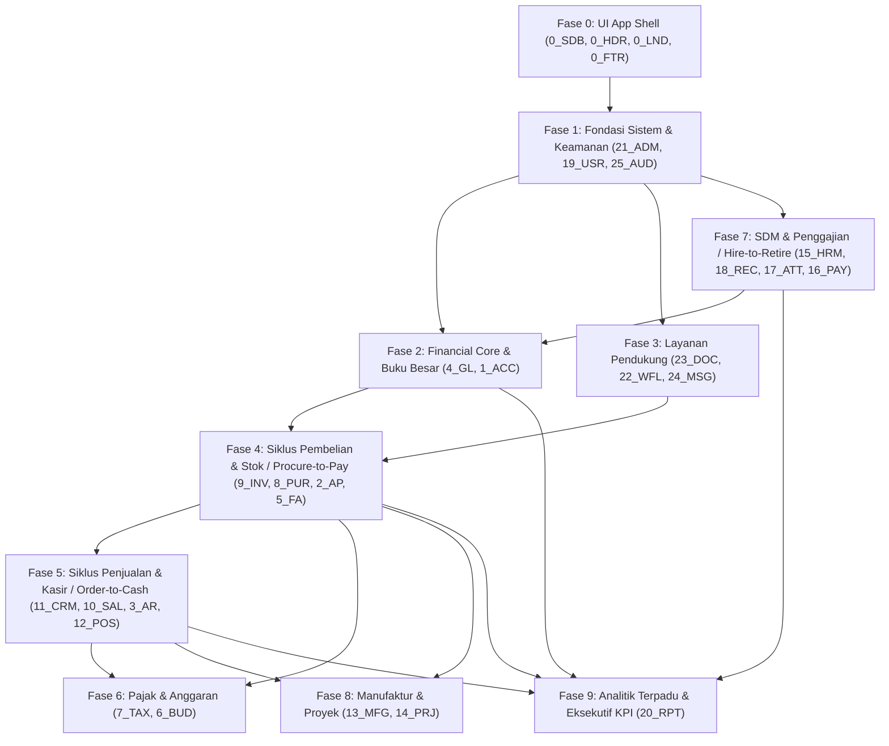

# 🏛️ Master System Specification — Enterprise ERP Monolith

> **Dokumen Spesifikasi Teknis & Fungsional Resmi**  
> Proyek: `erp_monolith` | Repositori: `jeruktutut2/arp-monolith`  
> Arsitektur: Go Modular Monolith (Hexagonal Architecture / Ports & Adapters)  
> Full Stack: **Golang (Go 1.22+)**, **Echo v5**, **PostgreSQL 16+**, **PgBouncer**, **golang-migrate**, **SvelteKit 2 (Svelte 5 Runes)**, **Bun**  
> Dokumen Sumber: [erp_modules.md](file:///opt/dev/erp_monolith/design/erp_modules.md), [erp_backend_architecture.md](file:///opt/dev/erp_monolith/design/erp_backend_architecture.md), [erp_ui_thirdparty_libraries.md](file:///opt/dev/erp_monolith/design/erp_ui_thirdparty_libraries.md), [roadmap_implementasi.md](file:///opt/dev/erp_monolith/design/roadmap_implementasi.md)

---

## 📌 1. Ikhtisar & Tujuan Sistem

Sistem ERP Monolith ini dirancang sebagai solusi manajemen sumber daya perusahaan tingkat enterprise (*enterprise-grade*) yang mencakup **25 modul bisnis inti** dan **179 antarmuka UI**.

### 1.1 Tujuan Utama
1. **Integritas Finansial Penuh**: Pencatatan transaksi buku besar (*General Ledger*) otomatis melalui mekanisme *double-entry bookkeeping*, menjamin tidak ada saldo gantung atau perbedaan pembukuan antar-modul.
2. **Kinerja Tinggi & Skalabilitas Koneksi**: Mengadopsi pola **Modular Monolith** dalam bahasa pemrograman **Golang**, dikompilasi menjadi satu berkas biner (*single deployable binary*) dengan HTTP framework performa tinggi **Echo v5**, serta pengelolaan ribuan koneksi konkuren melalui **PgBouncer** di depan basis data **PostgreSQL**.
3. **Pemisahan Batas Domain & Hexagonal Architecture**: Menerapkan **Hexagonal Architecture (Ports & Adapters)** pada setiap modul (*bounded context*), mengisolasi aturan bisnis dari detail I/O, serta mencegah ketergantungan melingkar (*circular imports*) di Go melalui *consumer-defined interfaces* dan *event bus*.
4. **Pengalaman Pengguna Modern Berbasis SvelteKit & Bun**: Antarmuka dibangun penuh menggunakan **SvelteKit 2** + **Svelte 5 (Runes)** dan dikelola dengan runtime/package manager ultra-cepat **Bun**, dilengkapi dukungan penuh *dark/light mode*, navigasi responsif 64px *mini-rail*, dan integrasi library khusus untuk kebutuhan industri (Gantt, Workflow Node Builder, Keyboard-First POS, Virtualized DataGrid, dan ECharts).
5. **Multi-Perusahaan & Multi-Cabang**: Isolasi data per `company_id` dan `branch_id` di setiap transaksi dan pembukuan.

---

## 🏢 2. Cakupan 25 Modul Bisnis (Domain Matrix)

Sistem mengelompokkan 25 modul ke dalam 6 kategori bisnis utama serta 1 kelompok UI Shell:

| No | Kategori | Kode | Nama Modul | Deskripsi Singkat & Tanggung Jawab Utama |
|:--:|:---|:---:|:---|:---|
| 0 | **UI Shell** | `0_SDB`<br>`0_HDR`<br>`0_LND`<br>`0_FTR` | App Shell Global | Sidebar navigasi 64px/expand, Top Header dengan Branch Switcher & Notifikasi, Portal Landing Page, dan System Status Footer. |
| 1 | **Keuangan** | `ACC` | Akuntansi & Keuangan | Bagan Akun (*Chart of Accounts*), Jurnal Umum, Periode Fiskal, Rekonsiliasi Bank, dan Multi-Mata Uang. |
| 2 | **Keuangan** | `AP` | Hutang Usaha | Penerimaan faktur vendor, *Three-Way Matching* (PO-GR-Invoice), jadwal pembayaran, dan kartu hutang. |
| 3 | **Keuangan** | `AR` | Piutang Usaha | Faktur penjualan, batas kredit pelanggan (*credit limit*), alokasi pembayaran kasir/bank, dan kartu piutang. |
| 4 | **Keuangan** | `GL` | Buku Besar | *General Ledger*, neraca saldo (*trial balance*), jurnal penyesuaian, jurnal penutup, dan dimensi akuntansi. |
| 5 | **Keuangan** | `FA` | Aset Tetap | Registrasi aset, depresiasi otomatis (garis lurus/saldo menurun), revaluasi aset, transfer, dan pelepasan (*disposal*). |
| 6 | **Keuangan** | `BUD` | Anggaran | Alokasi anggaran departemen/proyek, *budget revision*, guard alert pencegahan *overspending*, dan analisis varians. |
| 7 | **Keuangan** | `TAX` | Perpajakan | Konfigurasi tarif pajak (PPN/PPh), e-Faktur, e-Bupot, rekonsiliasi pajak, dan persiapan laporan SPT. |
| 8 | **Rantai Pasok** | `PUR` | Pembelian | Permintaan Pembelian (PR), Penawaran Vendor (RFQ), Purchase Order (PO), dan evaluasi vendor. |
| 9 | **Rantai Pasok** | `INV` | Persediaan & Gudang | Master barang/satuan/kategori, mutasi stok, kartu stok (*FIFO/Average*), *batch/serial tracking*, dan *stock opname*. |
| 10 | **Penjualan & CRM** | `SAL` | Penjualan | Penawaran harga (*quotation*), *Sales Order* (SO), Surat Jalan / Pengiriman (*Delivery Order*), dan komisi sales. |
| 11 | **Penjualan & CRM** | `CRM` | Hubungan Pelanggan | Manajemen prospek (*leads*), peluang kerja sama (*deals pipeline*), riwayat interaksi, dan tiket komplain pelanggan. |
| 12 | **Penjualan & CRM** | `POS` | Kasir (*Point of Sale*) | Antarmuka kasir cepat (*keyboard-first*), scanner barcode otomatis, shift kasir, dan cetak langsung struk thermal ESC/POS. |
| 13 | **Operasional** | `MFG` | Manufaktur | *Bill of Materials* (BOM), Perintah Kerja (*Work Order / SPK*), perutean produksi (*routing*), dan kontrol kualitas (QC). |
| 14 | **Operasional** | `PRJ` | Manajemen Proyek | *Work Breakdown Structure* (WBS), Gantt Chart interaktif, *milestones*, pencatatan jam kerja (*timesheet*), dan anggaran proyek. |
| 15 | **SDM** | `HRM` | Data Personalia | Master data pegawai, bagan organisasi, manajemen kontrak, cuti & izin karyawan, serta evaluasi performa. |
| 16 | **SDM** | `PAY` | Penggajian (*Payroll*) | Komponen gaji, kalkulasi otomatis PPh 21 & BPJS Kesehatan/TK, pembuatan slip gaji, dan file transfer bank bulk. |
| 17 | **SDM** | `ATT` | Absensi & Presensi | Integrasi mesin absensi fisik (fingerprint/RFID), absensi mobile geo-tagging, lembur, dan rekap jam kerja bulanan. |
| 18 | **SDM** | `REC` | Rekrutmen | Portal lowongan kerja internal/eksternal, seleksi pelamar, jadwal wawancara, dan proses *onboarding*. |
| 19 | **Sistem** | `USR` | Manajemen Pengguna | Autentikasi JWT/Session, akun pengguna, profil, MFA, dan penugasan peran (*role assignments*). |
| 20 | **Sistem** | `RPT` | Laporan & Analitik | Eksekutif dashboard terpadu, generator laporan lintas modul, ekspor data (Excel/PDF), dan grafik analitik. |
| 21 | **Sistem** | `ADM` | Administrasi Sistem | Profil perusahaan, struktur cabang/entitas, format penomoran dokumen otomatis (*number sequences*), dan pengaturan umum. |
| 22 | **Sistem** | `WFL` | Alur Kerja Persetujuan | Editor visual berbasis graf (*nodes & edges*), persetujuan berjenjang (*multi-tier approval*), dan trigger otomatis. |
| 23 | **Sistem** | `DOC` | Manajemen Dokumen | Pengunggahan berkas lampiran transaksi, versioning berkas, folder kategori, dan ekstraksi metadata/OCR. |
| 24 | **Sistem** | `MSG` | Pesan & Notifikasi | Pusat notifikasi in-app, push alert, pengiriman email SMTP/API, dan integrasi WhatsApp gateway. |
| 25 | **Sistem** | `AUD` | Jejak Audit (*Audit Trail*) | Pencatatan mutlak (*immutable log*) setiap aksi pembuatan, pembaruan, dan penghapusan data transaksi secara otomatis. |

---

## 🏛️ 3. Spesifikasi Arsitektur Backend (Golang & Hexagonal Architecture)

Backend dibangun dengan pendekatan **Modular Monolith** berprinsip **Hexagonal Architecture (Ports & Adapters)** pada setiap modul domain.

### 3.1 Pola Hexagonal Architecture per Modul
Setiap modul bisnis merepresentasikan sebuah heksagon mandiri:



1. **Core Domain (Pusat Heksagon)**:
   - Terletak di `internal/modules/<nama_modul>/domain/`.
   - Berisi entitas bisnis murni, kalkulasi keuangan (`decimal.Decimal`), aturan validasi invarian, dan *domain errors*. Bebas dari dependensi framework HTTP atau database.
2. **Inbound Ports & Driving Adapters (Sisi Input)**:
   - **Inbound Ports**: Interface Use Case yang diekspos domain untuk mengeksekusi proses bisnis (misal: `CreateSalesOrderUseCase`).
   - **Driving Adapters**: Handler HTTP yang dibangun dengan **Echo v5** (`github.com/labstack/echo/v5`), bertugas membaca request JSON, validasi input, menerjemahkan konteks aktor/tenant, dan memanggil Inbound Port.
3. **Outbound Ports & Driven Adapters (Sisi Output)**:
   - **Outbound Ports**: Interface abstraksi persistensi (`OrderRepository`), publikasi event (`EventPublisher`), atau kebutuhan modul luar (`InventoryStockDeductor`).
   - **Driven Adapters**: Implementasi konkrit seperti repository PostgreSQL (`pgx/v5` + `sqlc`), koneksi via **PgBouncer**, pengirim pesan event bus, dan modul integrasi eksternal.

### 3.2 Struktur Direktori Standar per Modul
```text
erp_monolith/
├── cmd/
│   └── server/
│       └── main.go                 # Entry point: Inisialisasi PgBouncer/Postgres Pool, Echo v5 router, EventBus, wiring inter-module
│
├── internal/
│   ├── platform/                   # Komponen teknis infrastruktur (Non-Bisnis)
│   │   ├── database/               # Pool pgx/v5 ke PgBouncer, Transaction Manager, sqlc runner
│   │   ├── eventbus/               # In-Memory Event Dispatcher / Watermill channel
│   │   ├── middleware/             # Echo v5 Middleware: TenantScope, AuthJWT, AuditActor, Recovery, CORS, RateLimit
│   │   ├── logger/                 # Structured logging (slog / zap)
│   │   └── response/               # Standar response JSON, error mapper, pagination helper
│   │
│   ├── shared/                     # Shared Kernel (Konsep Domain Global)
│   │   ├── money/                  # Tipe Decimal arbitrary precision (github.com/shopspring/decimal)
│   │   ├── types/                  # CompanyID, BranchID, UserID, Nullable types
│   │   ├── audit/                  # Context Actor (UserID, IP, UserAgent)
│   │   └── apperrors/              # Kode error terpadu (NotFound, Conflict, Unauthorized, Validation)
│   │
│   └── modules/                    # BOUNDED CONTEXTS (Modul Bisnis Heksagonal)
│       ├── acc/                    # Modul Akuntansi & Buku Besar (ACC, GL, AP, AR)
│       │   ├── domain/             # Core Domain (Entities, VO, Domain Errors) & Ports (Contracts & Repo Interfaces)
│       │   ├── usecase/            # Inbound Port Implementations (Business Logic & Orchestration)
│       │   ├── repository/         # Driven Adapter: Akses Data PostgreSQL (sqlc / pgx via PgBouncer)
│       │   └── delivery/
│       │       └── http/           # Driving Adapter: Echo v5 Handlers, DTO Request/Response, Routes
│       ├── inv/                    # Modul Persediaan & Gudang (INV)
│       ├── pur/                    # Modul Pembelian (PUR)
│       ├── sal/                    # Modul Penjualan & Kasir (SAL, POS)
│       ├── hrm/                    # Modul SDM & Payroll (HRM, PAY, ATT, REC)
│       └── system/                 # Modul Pendukung (USR, ADM, WFL, DOC, MSG, AUD, RPT)
│
├── migrations/                     # Berkas DDL SQL terurut (001_adm.sql, 002_acc.sql, ...)
├── sqlc.yaml                       # Konfigurasi generator kode Go dari SQL
├── go.mod
└── go.sum
```

### 3.3 Pola Komunikasi Antar-Modul
1. **Komunikasi Sinkron (Validasi Transaksional)**:
   - Dilarang keras melakukan import konkrit antar-modul (`import "internal/modules/inventory"` di dalam package `sales` adalah **pelanggaran arsitektur**).
   - Gunakan **Consumer-Defined Interface (Outbound Port)** pada package `domain` modul pemanggil:
     ```go
     // internal/modules/sal/domain/contracts.go
     type InventoryService interface {
         ReserveStock(ctx context.Context, itemID string, qty decimal.Decimal) error
     }
     ```
   - Modul `inv` menyediakan adapter yang mengimplementasikan port tersebut. Penghubungan (*wiring*) dilakukan saat startup di `cmd/server/main.go`.

2. **Komunikasi Asinkron (Side-Effects & Posting Jurnal)**:
   - Modul penerbit aksi mempublikasikan domain event ke `EventBus`:
     ```go
     eventBus.Publish(ctx, "sales.invoice_approved", domain.InvoiceApprovedEvent{
         InvoiceID: inv.ID,
         CompanyID: inv.CompanyID,
         Amount:    inv.GrandTotal,
     })
     ```
   - Modul yang berkepentingan (`acc`, `aud`, `msg`) mendaftarkan subscriber tanpa memiliki ketergantungan langsung ke usecase pengirim.

### 3.4 Penanganan Presisi Finansial
- **ATURAN MUTLAK**: Dilarang menggunakan tipe bawaan `float32` atau `float64` untuk seluruh representasi mata uang, harga pokok/jual, diskon, tarif pajak, dan kuantitas stok barang.
- Wajib menggunakan library `github.com/shopspring/decimal`.
- Di PostgreSQL, gunakan tipe data kolom `NUMERIC(18, 4)` atau `NUMERIC(15, 2)`.

---

## 🗄️ 4. Spesifikasi Database, Persistensi & Connection Pooling

### 4.1 Standar Basis Data & Pooler
- **Database Engine**: PostgreSQL 16+.
- **Connection Pooler Proxy**: **PgBouncer** (ditempatkan di antara aplikasi Golang dan server PostgreSQL).
  - **Pool Mode**: `transaction` (`pool_mode = transaction`) untuk efisiensi koneksi tertinggi, memungkinkan ribuan transaksi konkuren berbagi kumpulan koneksi server PostgreSQL yang ramping.
  - **Arsitektur Koneksi**:
    ```text
    [Echo v5 App Instances] --(pgxpool: pgx/v5)--> [PgBouncer Proxy :6432] --(TCP)--> [PostgreSQL Server :5432]
    ```
  - **Kesesuaian Driver `pgx/v5`**: Karena PgBouncer menggunakan *transaction pooling*, konfigurasi driver `pgxpool` diatur dengan mode query sederhana (*simple protocol*) atau *nameless prepared statements* (`default_query_exec_mode = QueryExecModeSimpleProtocol` atau `QueryExecModeExec`) guna mencegah konflik statement antar transaksi.
- **Query Generator**: `sqlc` (`github.com/sqlc-dev/sqlc`) untuk menghasilkan kode Go yang type-safe dari berkas `.sql` murni.
- **Migration Tool**: **`golang-migrate`** (`github.com/golang-migrate/migrate/v4`) dengan skema berkas migrasi berpasangan `migrations/<seq>_<name>.up.sql` dan `migrations/<seq>_<name>.down.sql`. Eksekusi migrasi skema DDL wajib diarahkan langsung ke port direct PostgreSQL (:5432) guna mendukung transaksi DDL menyeluruh.

### 4.2 Kepemilikan Tabel & Isolasi Skema
Tiap modul memiliki tabel dengan prefiks unik atau Postgres Schema terpisah:
- `adm_` / `sys_`: Tabel administrasi, audit trail, format penomoran (`adm_companies`, `adm_branches`, `sys_audit_logs`).
- `usr_`: Tabel pengguna, peran, dan sesi (`usr_users`, `usr_roles`, `usr_permissions`).
- `acc_`: Tabel bagan akun, jurnal, periode fiskal (`acc_coa`, `acc_journal_entries`, `acc_fiscal_years`).
- `inv_`: Tabel master barang, gudang, mutasi stok (`inv_items`, `inv_warehouses`, `inv_stock_ledger`).
- `pur_`: Tabel pengadaan (`pur_requisitions`, `pur_orders`, `pur_receipts`).
- `sal_`: Tabel penjualan (`sal_orders`, `sal_invoices`, `sal_deliveries`).
- `wfl_`: Tabel definisi alur kerja grafis (`wfl_definitions` menggunakan tipe data `JSONB`).

> [!IMPORTANT]
> **Larangan Cross-Domain SQL JOIN**: Modul `sales` tidak diperbolehkan melakukan SQL JOIN langsung ke tabel privat `acc_coa`. Jika membutuhkan snapshot data (seperti nama pelanggan atau kode barang), simpan data denormalisasi pada saat pembuatan transaksi.

### 4.3 Format Standar Kolom Audit
Setiap tabel master dan transaksional wajib memuat kolom jejak audit:
```sql
company_id   UUID NOT NULL,
branch_id    UUID NOT NULL,
created_at   TIMESTAMPTZ NOT NULL DEFAULT CURRENT_TIMESTAMP,
created_by   UUID NOT NULL,
updated_at   TIMESTAMPTZ NOT NULL DEFAULT CURRENT_TIMESTAMP,
updated_by   UUID NOT NULL,
deleted_at   TIMESTAMPTZ NULL -- untuk soft-delete jika disyaratkan
```

---

## 🌐 5. Spesifikasi Protokol API & Format Respons

### 5.1 Format Respons JSON Standar
Seluruh endpoint REST HTTP mengembalikan struktur seragam:

```json
{
  "success": true,
  "code": "OK",
  "message": "Transaksi berhasil disimpan.",
  "data": { ... },
  "meta": {
    "page": 1,
    "limit": 20,
    "total_records": 150,
    "total_pages": 8
  },
  "trace_id": "req-98fbc1-872"
}
```

Format respons kesalahan (*Error Response*):
```json
{
  "success": false,
  "code": "VALIDATION_FAILED",
  "message": "Input data tidak valid.",
  "errors": [
    { "field": "account_id", "message": "Akun tidak ditemukan atau tidak aktif." }
  ],
  "trace_id": "req-98fbc1-872"
}
```

---

## 🎨 6. Spesifikasi Frontend (SvelteKit 2 + Svelte 5 + Bun)

Frontend dibangun menggunakan **SvelteKit 2** dengan paradigma reaktivitas **Svelte 5 Runes** (`$state`, `$derived`, `$props`, `$effect`), dipadukan dengan **Tailwind CSS**, dan dikelola dengan **Bun** sebagai JavaScript runtime & package manager utama.

### 6.1 Runtime & Tooling (Bun)
- **Package Manager & Runtime**: **Bun** (`bun install`, `bun run dev`, `bun run build`, `bun test`).
- **Keunggulan untuk ERP**:
  - Resolusi dependensi dan instalasi paket pihak ketiga (AG Grid, XYFlow, ECharts) secara instan via `bun install`.
  - Eksekusi task build Vite dan test runner super-cepat tanpa lag startup Node.js.
  - Kompatibilitas penuh dengan ekosistem NPM dan modul SvelteKit modern.

### 6.2 Arsitektur App Shell
- **Drawer & Rail Navigasi (`0_SDB`)**: Sidebar kiri dinamis yang mendukung mode normal (expand 260px) dan mode mini-rail (64px) dengan tooltip flyout otomatis.
- **Top Header Bar (`0_HDR`)**: Sticky navigation bar dengan breadcrumbs dinamis, switcher multi-cabang, pencarian global lintas dokumen, dan user profile drawer.
- **System Footer (`0_FTR`)**: Menampilkan latensi koneksi API realtime, environment badge (Dev/Staging/Prod), dan nomor versi rilis ERP.

### 6.3 Integrasi Library Pihak Ketiga Khusus
Berdasarkan dokumen teknis [erp_ui_thirdparty_libraries.md](file:///opt/dev/erp_monolith/design/erp_ui_thirdparty_libraries.md):

1. **Interactive Gantt Chart (`14_PRJ`)**: Menggunakan **Frappe Gantt** (MIT, Zero Dependency) untuk visualisasi WBS, drag-and-drop jadwal tugas, dan *dependency lines*.
2. **Visual Workflow Node Builder (`22_WFL`)**: Menggunakan **XYFlow (`@xyflow/svelte`)** untuk merancang kanvas alur persetujuan berbasis Node (Trigger, Condition, Approval, Action) dan disimpan dalam format JSONB.
3. **Keyboard-First POS Cashier (`12_POS`)**:
   - `hotkeys-js`: Bind shortcut `F1` (pencarian), `F2` (qty), `F12` (bayar), `Esc` (batal).
   - `on-scan.js`: Intersepsi scanner barcode fisik agar tidak mengotori input teks biasa.
   - `esc-pos-encoder` + WebUSB/WebSerial: Cetak langsung struk belanja ke printer thermal tanpa popup dialog print browser.
4. **Heavy Enterprise DataGrid (`1_ACC`, `4_GL`, `9_INV`)**: Menggunakan **AG Grid Community / TanStack Table** dengan fitur *DOM Virtualization* untuk merender puluhan ribu baris jurnal dan kartu stok tanpa penurunan frame rate.
5. **Dashboard & Analitik Interaktif (`20_RPT`, `17_ATT`)**: Menggunakan **Apache ECharts** untuk grafik multi-sumbu, slider rentang tanggal (*dataZoom*), dan kalender heatmap kehadiran tahunan.

---

## 🔐 7. Spesifikasi Keamanan, Multi-Tenancy & RBAC

1. **Isolasi Multi-Tenancy**:
   - Context HTTP wajib memuat `TenantContext` (`CompanyID`, `BranchID`).
   - Setiap query database wajib memfilter record berdasarkan `company_id`.
2. **Role-Based Access Control (RBAC)**:
   - Izin (*permissions*) didefinisikan dengan skema `resource:action` (contoh: `acc_journal:create`, `acc_journal:post`, `pur_order:approve`).
   - Middleware `RequirePermission(...)` memvalidasi hak akses sebelum mengeksekusi usecase.
3. **Immutable Audit Trail (`25_AUD`)**:
   - Setiap mutasi data dicatat secara asinkron ke tabel `sys_audit_logs`.
   - Data mencakup: ID Aktor, Waktu, Modul, Nama Tabel, Tipe Aksi (CREATE/UPDATE/DELETE), Nilai Lama (*Old JSON*), dan Nilai Baru (*New JSON*).

---

## 🗺️ 8. Rencana Implementasi Bertahap (Phased Roadmap)

Urutan pengerjaan mengikuti prinsip **ketergantungan data tanpa siklus (*acyclic topological order*)** dari [roadmap_implementasi.md](file:///opt/dev/erp_monolith/design/roadmap_implementasi.md):



---

## 🧪 9. Strategi Pengujian & Kualitas Kode

1. **Unit Testing Domain & Usecase**:
   - Pengujian murni tanpa I/O database dengan teknik mock interface.
   - Target cakupan kode domain: minimal **85%**.
2. **Database Integration Testing**:
   - Pengujian query SQL/sqlc menggunakan PostgreSQL nyata (via *ephemeral database* atau `testcontainers-go`).
3. **Decimal Rounding Verification**:
   - Seluruh kalkulasi pajak, diskon bertingkat, dan amortisasi aset wajib diuji terhadap skenario pembulatan presisi desimal.
4. **Single Binary Build**:
   - Kompilasi frontend via Bun & Vite (`bun run build`) menghasilkan berkas statis di folder `dist/` atau `build/client/`.
   - Asset tersebut di-embed ke dalam executable Go via `//go:embed dist/*`, menghasilkan 1 file biner yang siap di-deploy tanpa dependensi eksternal selain PostgreSQL.
