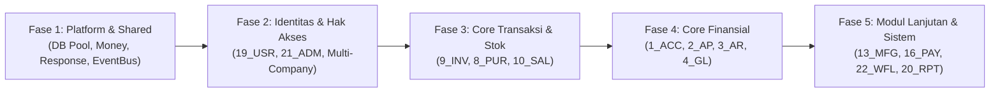

# 🏛️ Panduan Arsitektur Backend Go untuk Sistem ERP
> **Dokumen Referensi Arsitektur Sistem**  
> Disesuaikan untuk kebutuhan 25 modul ERP pada [erp_modules.md](file:///Users/bsa/Documents/por/erp/design/erp_modules.md) dan desain UI terkait.

---

## 📌 1. Ringkasan Eksekutif (TL;DR)

Untuk sistem ERP berskala 25 modul bisnis, pendekatan **paling ideal di Golang** adalah:

> **Modular Monolith (Package by Domain / Bounded Context)**  
> Dipadukan dengan **Clean Architecture (Ports & Adapters)** di dalam masing-masing modul, serta komunikasi antar-modul berbasis **Interfaces (Sync)** dan **Domain Events (Async)**.

### Mengapa Bukan Layer Biasa atau Feature Murni?
- **Layer Biasa (Horizontal)** cepat menjadi bencana di Go karena aturan ketat kompilasi: *circular dependency* (`import cycle not allowed`), serta penumpukan ratusan struct di satu folder global.
- **Featured Murni (Micro-slicing per sub-fitur)** terlalu terfragmentasi karena sub-fitur di dalam modul ERP (misal: CoA, Jurnal, Periode di modul Akuntansi) memiliki relasi transaksional yang sangat rapat.
- **Modular Monolith** memberikan batas domain (*bounded context*) yang jelas, mudah di-maintain oleh tim terpisah, tetap hemat resource server (1 binary deployable), dan *microservices-ready*.

---

## ⚖️ 2. Analisis Perbandingan Pendekatan

| Dimensi | Layer Biasa (Horizontal) | Featured Murni (Sub-feature) | Modular Monolith *(Rekomendasi)* |
| :--- | :--- | :--- | :--- |
| **Pola Folder** | `handlers/`, `services/`, `repos/`, `models/` | `features/journal/`, `features/coa/`, dll | `modules/accounting/`, `modules/inventory/`, dll |
| **Resiko Circular Import di Go** | 🔴 **Sangat Tinggi** (antar layer dan domain saling silang) | 🟠 **Sedang–Tinggi** (antar sub-fitur dalam 1 modul butuh data sesama) | 🟢 **Sangat Rendah** (terisolasi per modul via event/interface) |
| **Kohesi Bisnis** | Rendah (kode satu proses bisnis tersebar di banyak folder) | Sangat Tinggi di sub-fitur, tapi lemah di level modul utuh | Tinggi (satu modul memuat seluruh aturan domainnya) |
| **Skalabilitas Tim** | Sering terjadi *merge conflict* pada file/folder bersama | Baik, namun package sprawl (bisa >200 package) | Sangat Baik (tiap modul bisa dipegang engineer berbeda) |
| **Database Transaction** | Rentan cross-table join tanpa batas | Sulit mengelola transaksi lintas sub-fitur | Jelas (satu transaksi per modul, event untuk cross-modul) |
| **Migrasi ke Microservice** | Hampir mustahil tanpa *rewrite* total | Cukup sulit menyatukan dependensi | **Mudah** (tinggal memotong 1 folder modul menjadi service mandiri) |

---

## 🗂️ 3. Rekomendasi Struktur Folder Proyek

Mengikuti standar Go Layout (`cmd/`, `internal/`):

```text
erp-backend/
├── cmd/
│   └── server/
│       └── main.go                 # Entry point: dependency injection, wiring inter-module, start HTTP/gRPC
│
├── internal/
│   │
│   ├── platform/                   # Infrastruktur Teknis Bersama (Non-Business)
│   │   ├── database/               # Pool DB PostgreSQL, transaction manager helper
│   │   ├── eventbus/               # Event bus in-memory atau message broker (Watermill/Channel)
│   │   ├── middleware/             # Auth, TenantContext, RequestID, AuditLog, CORS
│   │   ├── logger/                 # Structured logging (zap / slog)
│   │   └── response/               # Standard JSON response, HTTP status, pagination parser
│   │
│   ├── shared/                     # Shared Kernel (Konsep Domain Global)
│   │   ├── money/                  # Tipe data Decimal/Money (hindari float64!)
│   │   ├── types/                  # CompanyID, BranchID, UserID, NullString, PageQuery
│   │   ├── audit/                  # Context info pembuat aksi (Actor, IP, UserAgent)
│   │   └── apperrors/              # Standard domain errors (NotFound, Conflict, Unauthorized)
│   │
│   └── modules/                    # === BOUNDED CONTEXTS (25 Modul Bisnis) ===
│       │
│       ├── accounting/             # [1_ACC, 2_AP, 3_AR, 4_GL] Financial Core
│       │   ├── delivery/
│       │   │   └── http/           # Handler REST (Gin/Echo/Chi), DTO Request/Response
│       │   ├── domain/             # Entitas inti (CoA, JournalEntry), Value Objects, Domain Errors
│       │   ├── usecase/            # Logika bisnis (PostingJurnal, TutupBuku, Rekonsiliasi)
│       │   └── repository/         # Query SQL / sqlc / pgx implementation
│       │
│       ├── inventory/              # [9_INV] Persediaan & Gudang
│       │   ├── delivery/http/
│       │   ├── domain/
│       │   ├── usecase/
│       │   └── repository/
│       │
│       ├── sales/                  # [10_SAL] Penjualan & Faktur
│       │   ├── delivery/http/
│       │   ├── domain/
│       │   ├── usecase/
│       │   └── repository/
│       │
│       ├── purchasing/             # [8_PUR] Pembelian & Penerimaan Barang
│       │   └── ...
│       │
│       ├── hrm/                    # [15_HRM, 16_PAY, 17_ATT, 18_REC] SDM & Payroll
│       │   └── ...
│       │
│       └── system/                 # [19_USR, 21_ADM, 22_WFL, 25_AUD] Modul Pendukung Sistem
│           └── ...
│
├── migrations/                     # SQL DDL per modul (e.g., 001_acc.sql, 002_inv.sql)
├── go.mod
└── go.sum
```

---

## 🛠️ 4. Pola Implementasi Kunci untuk ERP di Go

### A. Mengatasi Circular Dependency Antar-Modul
Dalam ERP, `Sales` membutuhkan `Inventory` (potong stok), dan `Accounting` membutuhkan data `Sales` (jurnal pendapatan). Di Go, package `sales` **tidak boleh** meng-import package `accounting` jika `accounting` juga meng-import `sales`.

Gunakan dua mekanisme komunikasi:

#### 1. Synchronous via Contract Interface (Saat butuh validasi instan / transaksional)
Letakkan interface di sisi konsumen (*consumer-defined interface*):
```go
// internal/modules/sales/domain/contracts.go
package domain

import "context"

type StockDeductor interface {
    DeductStock(ctx context.Context, itemID string, qty int) error
}
```
Modul `inventory` mengimplementasikan fungsi tersebut. Penggabungannya dilakukan di `cmd/server/main.go` tanpa membuat `sales` meng-import kode konkrit `inventory`.

#### 2. Asynchronous via Domain Events (Untuk aksi berantai / side-effects)
Saat faktur penjualan disetujui:
```go
// Di dalam usecase Sales:
eventBus.Publish(ctx, "sales.invoice_issued", domain.InvoiceIssuedEvent{
    InvoiceID:   inv.ID,
    CustomerID:  inv.CustomerID,
    TotalAmount: inv.TotalAmount,
    IssuedAt:    inv.CreatedAt,
})

// Di dalam subscriber Accounting (mendengarkan event tanpa direct import ke usecase sales):
eventBus.Subscribe("sales.invoice_issued", func(ctx context.Context, evt domain.InvoiceIssuedEvent) error {
    return accUseCase.CreateJournalFromInvoice(ctx, evt)
})
```

---

### B. Isolasi Data & Kepemilikan Tabel (Data Ownership)
Hindari direct SQL `JOIN` antar tabel milik domain yang berbeda (misal: `sales_order` langsung join ke tabel privat `acc_chart_of_accounts`).

- Gunakan **Prefix Tabel** atau **Postgres Schema**:
  - Skema Akuntansi: `acc_coa`, `acc_journals`, `acc_fiscal_periods`
  - Skema Persediaan: `inv_items`, `inv_stock_movements`, `inv_warehouses`
  - Skema Penjualan: `sal_orders`, `sal_invoices`
- Jika modul lain butuh nama pelanggan atau nama barang, simpan data snapshot (*denormalization*) di tabel transaksi atau ambil via query interface modul pemilik data.

---

### C. Penanganan Angka Keuangan & Multi-Currency
> [!CAUTION]
> **Haram menggunakan `float64` untuk nominal uang, pajak, dan kuantitas persediaan di ERP.** `float64` memiliki kelemahan presisi biner (*floating point rounding errors*).

Gunakan salah satu dari dua pendekatan:
1. **Library Decimal Arbitrary Precision**: `github.com/shopspring/decimal` (paling direkomendasikan untuk akuntansi multi-mata uang).
2. **Integer Cents**: Menyimpan nilai dalam satuan terkecil (sen/rupiah utuh).

---

## 🧰 5. Rekomendasi Tech Stack Golang untuk ERP

1. **HTTP Router / Web Framework**:
   - `chi` (`github.com/go-chi/chi/v5`): Sangat direkomendasikan karena 100% kompatibel dengan `net/http` standar dan mempermudah registrasi sub-router per modul.
   - Alternatif: `Echo` (cepat dan kaya middleware bawaan).
2. **Database Access**:
   - `sqlc` (`github.com/sqlc-dev/sqlc`): Meng-generate kode Go type-safe langsung dari query SQL murni. Sangat ideal untuk laporan keuangan kompleks, query aging hutang/piutang, dan rekonsiliasi bank.
   - Driver: `pgx/v5` (`github.com/jackc/pgx/v5`) untuk performa tinggi dengan PostgreSQL.
3. **Database Migration**:
   - `golang-migrate/migrate` atau `pressly/goose`.
4. **Event Bus & Background Processing**:
   - Fase Awal: In-Memory Go Channel dispatcher atau `ThreeDotsLabs/watermill`.
   - Latar Belakang / Job Scheduler: `hibiken/asynq` (Redis-based) atau `riverqueue/river` (Postgres-based transactional outbox).
5. **Autentikasi & RBAC Multi-Level**:
   - `casbin/casbin` atau RBAC sederhana berbasis Bitmask / Database Permissions yang di-cache di Redis.

---

## 🗺️ 6. Roadmap Langkah Implementasi



1. **Fase 1**: Siapkan `internal/platform` (koneksi DB, standard response, audit logging context) dan `internal/shared` (Money struct, Tenant/Company ID).
2. **Fase 2**: Implementasikan User Management & Multi-Company/Branch (`19_USR`, `21_ADM`) sebagai pondasi hak akses dan isolasi data per perusahaan.
3. **Fase 3**: Bangun modul operasional rantai pasok: Item & Stock (`9_INV`), Pembelian (`8_PUR`), Penjualan (`10_SAL`).
4. **Fase 4**: Bangun modul keuangan (`1_ACC`, `4_GL`, `2_AP`, `3_AR`) yang menerima pencatatan jurnal otomatis via domain events dari Fase 3.
5. **Fase 5**: Lanjutkan ke modul spesialis seperti Manufaktur (`13_MFG`), Penggajian (`16_PAY`), Workflow Approval (`22_WFL`), dan Pelaporan Terpusat (`20_RPT`).
