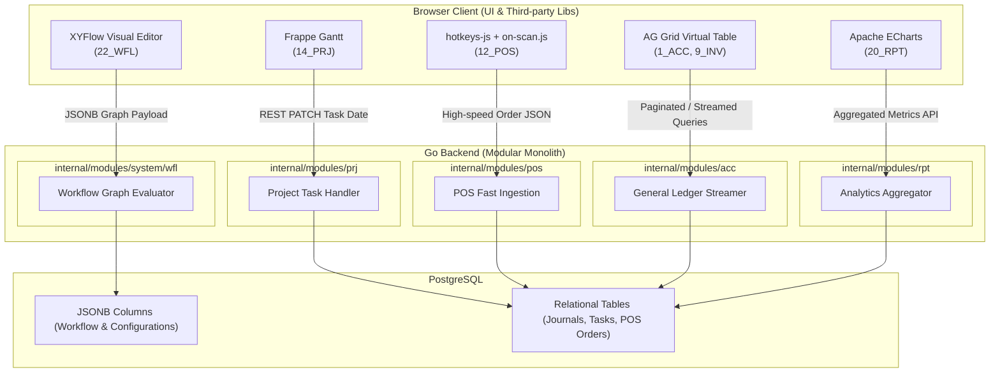

# 🎨 Panduan Library UI Pihak Ketiga untuk Fitur Kompleks ERP
> **Dokumen Referensi Frontend & Integrasi Library Pihak Ketiga**  
> Disesuaikan untuk fitur interaktif kompleks pada 25 modul ERP ([erp_modules.md](file:///Users/bsa/Documents/por/erp/design/erp_modules.md)) dan melengkapi arsitektur Go backend ([erp_backend_architecture.md](file:///Users/bsa/Documents/por/erp/design/erp_backend_architecture.md)).

---

## 📌 1. Ringkasan Eksekutif & Matriks Lisensi

Untuk menjaga aplikasi ERP tetap legal, scalable, dan memiliki performa tinggi, berikut adalah ringkasan library pihak ketiga yang direkomendasikan dengan prioritas **lisensi MIT (bebas royalti untuk kebutuhan komersial)**:

| Fitur Kompleks | Modul Terkait | Library Rekomendasi Utama | Lisensi | Alternatif Enterprise |
| :--- | :--- | :--- | :--- | :--- |
| **Gantt Chart Interaktif** | `14_PRJ` (Project) | **Frappe Gantt** | **MIT** | DHTMLX Gantt *(GPL/Komersial)* |
| **Workflow Builder (Visual)** | `22_WFL` (Workflow) | **XYFlow** (`@xyflow/svelte` / `vue`) | **MIT** | Rete.js *(MIT)* / bpmn-js *(Camunda)* |
| **POS Keyboard Shortcuts** | `12_POS` (Point of Sale) | **hotkeys-js** | **MIT** | Mousetrap *(Apache 2.0)* |
| **Barcode Scanner Ingestion**| `12_POS` (Point of Sale) | **on-scan.js** | **MIT** | Custom Keystroke Buffer |
| **Direct Thermal Receipt** | `12_POS` (Point of Sale) | **WebUSB / Web Serial API** + `esc-pos-encoder` | **MIT** | QZ Tray *(Komersial)* |
| **Heavy DataGrid (>10k row)**| `1_ACC`, `4_GL`, `9_INV` | **AG Grid (Community)** / **TanStack Table** | **MIT** | Handsontable *(Komersial)* |
| **Dashboard & Analitik** | `20_RPT` (Reporting) | **Apache ECharts** | **Apache 2.0** | Chart.js *(MIT)* |

---

## 📅 2. Modul `14_PRJ`: Interactive Gantt Chart

Manajemen proyek dalam ERP membutuhkan visualisasi jadwal dinamis: drag tanggal, ubah durasi (*resize* bar), menghubungkan ketergantungan antar-tugas (*dependencies*), dan indikator kemajuan (*progress*).

### Pilihan Utama: **Frappe Gantt** (`github.com/frappe/gantt`)
- **Mengapa Dipilih:** Digunakan langsung pada **ERPNext** (salah satu ERP open-source terpopuler di dunia).
- **Keunggulan:**
  - **Zero Dependency & Pure Vanilla JS** (hanya ~15 KB). Sangat mudah dipasang baik di Go Template (HTMX), Svelte, maupun Vue.
  - Ringan dan cepat saat merender puluhan task sekaligus.
  - Mendukung view: Day, Week, Month, Year.
- **Kontrak Data JSON dengan Go Backend:**
```json
[
  {
    "id": "TSK-001",
    "name": "Pondasi Bangunan",
    "start": "2026-10-01",
    "end": "2026-10-15",
    "progress": 100,
    "dependencies": ""
  },
  {
    "id": "TSK-002",
    "name": "Pemasangan Rangka Baja",
    "start": "2026-10-16",
    "end": "2026-11-05",
    "progress": 35,
    "dependencies": "TSK-001"
  }
]
```
- **Integrasi Go Backend:**
  - Modul `internal/modules/prj/delivery/http` hanya perlu mengekspos endpoint `GET /api/projects/:id/tasks` dan `PATCH /api/projects/:id/tasks/:taskId` (saat bar di-drag atau di-resize).

---

## 🔀 3. Modul `22_WFL`: Drag-and-Drop Workflow Builder

Sistem persetujuan berjenjang (*multi-tier approval*) dan alur kerja otomatis membutuhkan kanvas visual berbasis *Node* dan *Edge* (konektor panah).

### Pilihan Utama: **XYFlow** (`@xyflow/svelte` atau `@xyflow/vue`)
- **Mengapa Dipilih:** Merupakan evolusi modern dari *React Flow* yang kini mendukung Svelte dan Vue secara *first-class*.
- **Keunggulan:**
  - Kanvas zoom & pan dengan performa 60 FPS.
  - **Custom Node:** Tiap kotak persetujuan bisa disematkan komponen custom (misal: dropdown role approver, input nominal threshold `> Rp 10.000.000`, switch notifikasi email).
  - Validasi koneksi (mencegah loop tak terhingga).
- **Format Skema Alur yang Dikirim ke Go:**
```json
{
  "workflow_id": "WFL-EXPENSE-CLAIM",
  "nodes": [
    { "id": "1", "type": "trigger", "data": { "event": "expense_submitted" } },
    { "id": "2", "type": "condition", "data": { "field": "total_amount", "operator": ">", "value": 5000000 } },
    { "id": "3", "type": "approval", "data": { "approver_role": "FINANCE_DIRECTOR" } },
    { "id": "4", "type": "action", "data": { "action": "post_journal" } }
  ],
  "edges": [
    { "id": "e1-2", "source": "1", "target": "2" },
    { "id": "e2-3", "source": "2", "target": "3", "label": "True" },
    { "id": "e3-4", "source": "3", "target": "4" }
  ]
}
```
- **Integrasi Go Backend:**
  - Skema di atas disimpan dalam kolom `jsonb` PostgreSQL di tabel `wfl_definitions`.
  - Workflow Engine di Go (`internal/modules/system/workflow`) membaca graph JSON ini untuk mengevaluasi kondisi saat ada event transaksi masuk.

---

## 💳 4. Modul `12_POS`: Keyboard-First POS Cashier

Kasir ritel/restoran tidak boleh mengandalkan mouse demi kecepatan transaksi. Modul ini membutuhkan kombinasi 3 library spesialis:

### A. Shortcut & Hotkey Engine: **`hotkeys-js`**
- **Fungsi:** Mengikat tombol `F1`–`F12`, `Esc`, `Enter`, dan `NumPad` ke fungsi kasir.
- **Implementasi:**
  ```javascript
  import hotkeys from 'hotkeys-js';

  // F1: Fokus ke cari produk, F12: Modal Bayar, Esc: Reset
  hotkeys('f1,f2,f12,esc', function (event, handler) {
    event.preventDefault();
    switch (handler.key) {
      case 'f1': document.getElementById('search-input').focus(); break;
      case 'f2': focusQuantityInput(); break;
      case 'f12': openPaymentModal(); break;
      case 'esc': resetCart(); break;
    }
  });
  ```

### B. Barcode Scanner Detection: **`on-scan.js`**
- **Fungsi:** Barcode scanner fisik (USB/Bluetooth) bertindak seperti keyboard berkecepatan sangat tinggi (<30ms antar-karakter diakhiri tombol `Enter`).
- **Masalah umum tanpa library ini:** Jika kursor kasir sedang berada di kolom nama kasir atau note, scan barcode akan mengetik teks secara acak ke field tersebut.
- **Solusi `on-scan.js`:** Mendeteksi input barcode secara global di seluruh window dan langsung memasukkan item ke keranjang:
  ```javascript
  onScan.attachTo(document, {
    suffixKeyCodes: [13], // Enter key
    reactToPaste: true,
    onScan: function(barcodeString) {
      addItemToCartByBarcode(barcodeString); // Panggil API / update keranjang
    }
  });
  ```

### C. Thermal Receipt Direct Print: **WebUSB / Web Serial API** + `esc-pos-encoder`
- **Fungsi:** Mencetak struk ke printer thermal (Epson, Xprinter, Star) langsung tanpa memunculkan dialog print browser (`Ctrl+P`).
- Menggunakan protokol standar printer kasir: **ESC/POS**.

---

## 📊 5. Modul `1_ACC`, `4_GL`, `9_INV`: Enterprise Heavy DataGrid

Halaman Buku Besar (*General Ledger*), Jurnal Akuntansi, dan Kartu Stok Persediaan sering kali memuat **puluhan ribu baris data transaksi**.

### Pilihan Utama: **AG Grid (Community Edition)** atau **TanStack Table**
- **Mengapa Dipilih:**
  - **DOM Virtualization:** Hanya merender 30–50 baris yang terlihat di layar, sehingga browser tidak akan *lag* atau *freeze* meski memuat 100.000 data.
  - **Fitur Bawaan Enterprise:** Multi-column sort, column pin (membekukan kolom kode & nama akun), inline cell editing (seperti Microsoft Excel), dan quick export ke CSV/Excel.
  - Kompatibel dengan Svelte, Vue, maupun Vanilla JS.

---

## 📈 6. Modul `20_RPT`: Dashboard & Visualisasi Analitik

Laporan eksekutif membutuhkan grafik multi-dimensi (analisis laba rugi, rasio likuiditas, heatmap kehadiran karyawan).

### Pilihan Utama: **Apache ECharts** (`echarts.apache.org`)
- **Mengapa Dipilih:** Jauh lebih lengkap daripada Chart.js untuk kebutuhan enterprise/finansial.
- **Fitur Unggulan untuk ERP:**
  - **Multi-Axis Charts:** Menampilkan Grafik Pendapatan (Bar chart di sumbu Y kiri) bersamaan dengan Rasio Margin Keuntungan (Line chart di sumbu Y kanan).
  - **Data Zoom Slider:** Memungkinkan manajemen menggeser rentang tanggal transaksi finansial secara interaktif.
  - **Heatmap Calendar:** Sangat cocok untuk modul Absensi (`17_ATT`) guna melihat pola kehadiran per tanggal dalam 1 tahun kalender.

---

## 🏗️ 7. Pola Arsitektur Integrasi dengan Go Backend



### Tips Praktis Implementasi:
1. **Penyimpanan Struktur Fleksibel (Workflow & Konfigurasi):** Gunakan tipe data `jsonb` di PostgreSQL untuk data yang dihasilkan oleh library berbasis grafis/kanvas seperti XYFlow.
2. **Streaming Data Besar (DataGrid):** Untuk laporan Buku Besar ribuan baris, gunakan pagination berbasis kursor (*cursor-based pagination*) atau *server-side streaming* dari Go agar penggunaan memori tetap minimal.
3. **Penyatuan Aset Frontend:** Jika menggunakan Svelte atau Vue, gunakan Vite untuk meng-bundle library pihak ketiga ini menjadi file JS statis yang di-embed langsung ke binary Go via fitur `//go:embed` saat proses build produksi.
