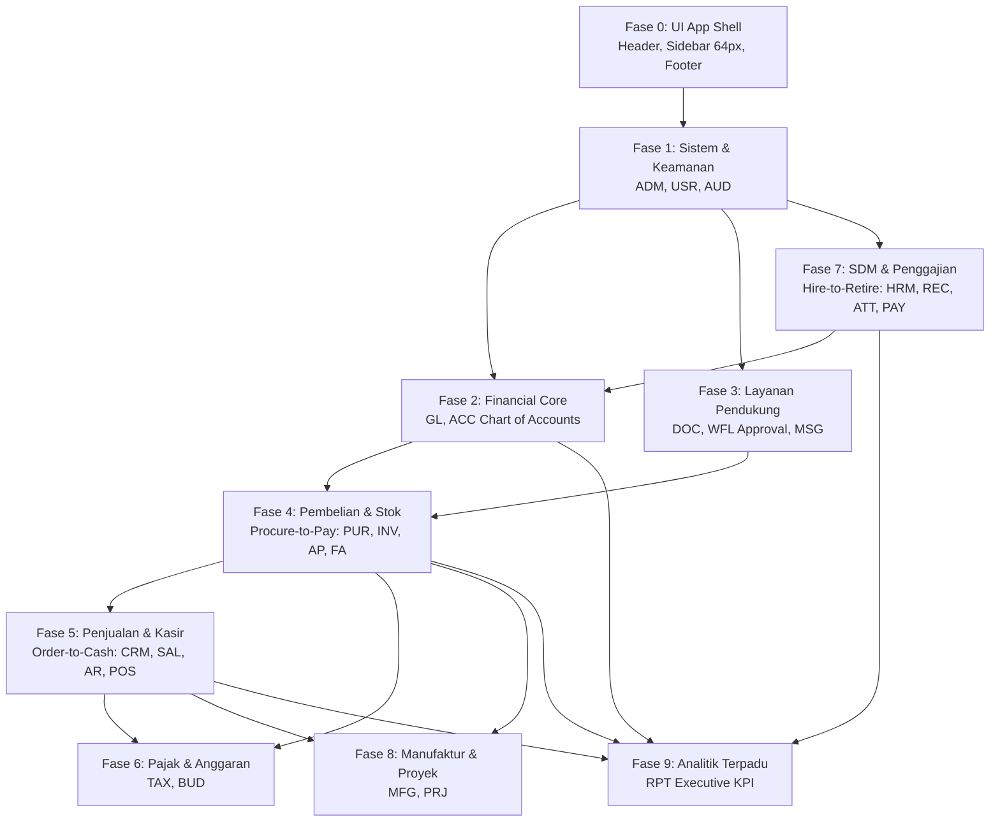

# 📋 Catatan Rencana & Urutan Implementasi Modul dan Fitur ERP
> **Dokumen Resmi Urutan Pengerjaan Proyek ERP System**  
> Berdasarkan analisis ketergantungan teknis (*Topological Dependency*) pada 25 modul bisnis dan 179 antarmuka UI mockup di folder `design/ui/`.

---
## 📌 1. Prinsip Penentuan Urutan Pengerjaan

Dalam pengembangan sistem ERP berskala enterprise, modul tidak dapat dibangun secara acak. Urutan implementasi dirancang dengan prinsip **ketergantungan data nol-siklus (*acyclic data flow*)**:

1. **Fondasi UI Shell (Fase 0)** dibangun pertama agar seluruh modul memiliki rumah layout yang sama (Header, Sidebar 64px rail, Footer status, Theme Switcher).
2. **Fondasi Sistem & Keamanan (Fase 1)** wajib ada agar ID Perusahaan, Cabang, Format Nomor Dokumen, dan Hak Akses Pengguna (RBAC) siap digunakan oleh modul lain.
3. **Fondasi Keuangan & Buku Besar (Fase 2)** adalah "muara akhir" seluruh transaksi bisnis. Chart of Accounts (CoA) dan mesin jurnal harus ada sebelum modul pembelian dan penjualan melakukan posting otomatis.
4. **Layanan Pendukung (Fase 3)** seperti Upload Dokumen dan Approval Workflow disiapkan sebelum transaksi pengadaan.
5. **Siklus Pembelian & Persediaan (Fase 4)** menghasilkan stok barang masuk sebelum barang tersebut bisa dijual.
6. **Siklus Penjualan & Piutang (Fase 5)** menjual stok yang tersedia dan membukukan piutang/kas ke akuntansi.
7. **Perpajakan & SDM/Payroll (Fase 6 & 7)** memproses pajak transaksi serta siklus kepegawaian hingga penggajian.
8. **Operasional Lanjutan & Analitik (Fase 8 & 9)** melengkapi manufaktur, proyek, serta dashboard laporan eksekutif.

---

## 🗺️ 2. Ringkasan 9 Fase Implementasi Modul

| Fase | Nama Fase | Modul Terlibat | Kategori | Estimasi Timeline |
| :--- | :--- | :--- | :--- | :--- |
| **Fase 0** | **Shell Antarmuka Pengguna & Layout Global (App Shell UI)** | `0_SDB`, `0_HDR`, `0_LND`, `0_FTR` | Sistem / UI | `Fondasi Awal` |
| **Fase 1** | **Fondasi Sistem, Konfigurasi & Keamanan** | `21_ADM`, `19_USR`, `25_AUD` | Sistem | `Minggu 1 – 4` |
| **Fase 2** | **Fondasi Akuntansi & Buku Besar (Financial Core)** | `4_GL`, `1_ACC` | Keuangan | `Minggu 3 – 6` |
| **Fase 3** | **Layanan Pendukung Lintas Modul** | `23_DOC`, `22_WFL`, `24_MSG` | Sistem | `Minggu 5 – 8` |
| **Fase 4** | **Siklus Pembelian & Persediaan (Procure-to-Pay)** | `9_INV`, `8_PUR`, `2_AP`, `5_FA` | Keuangan, Rantai Pasok | `Minggu 7 – 12` |
| **Fase 5** | **Siklus Penjualan, CRM & Kasir (Order-to-Cash)** | `11_CRM`, `10_SAL`, `3_AR`, `12_POS` | Keuangan, Penjualan & CRM | `Minggu 11 – 16` |
| **Fase 6** | **Perpajakan & Anggaran** | `7_TAX`, `6_BUD` | Keuangan | `Minggu 15 – 18` |
| **Fase 7** | **Siklus SDM & Penggajian (Hire-to-Retire)** | `15_HRM`, `18_REC`, `17_ATT`, `16_PAY` | SDM | `Minggu 17 – 24` |
| **Fase 8** | **Operasional Manufaktur & Manajemen Proyek** | `13_MFG`, `14_PRJ` | Operasional | `Minggu 23 – 28` |
| **Fase 9** | **Analitik, Executive KPI & Pelaporan Terpadu** | `20_RPT` | Sistem | `Minggu 27 – 30` |

---

## 📂 3. Detail Rencana Modul dan Fitur per Fase

### Fase 0 — Shell Antarmuka Pengguna & Layout Global (App Shell UI)
> **Timeline Target:** `Fondasi Awal`  
> **Tujuan Utama:** Membangun struktur layout utama aplikasi SvelteKit 2 + Svelte 5 SSR (Sidebar drawer & rail state 64px, Header bar dengan search/switcher/popovers, Footer status, serta split-screen container). Seluruh halaman modul berikutnya akan di-render di dalam App Shell ini.

#### 📦 Modul `0_SDB` — Sidebar Navigasi Lengkap

- **Kategori:** `Sistem / UI`
- **Deskripsi Modul:** Navigasi vertikal utama 25 modul ke dalam 6 kategori bisnis, accordion menu, toggle burger collapse (64px mini-rail), status pill, dan profil user di footer.
- **Input Dependensi Dari:** —
- **Output Dialirkan Ke:** Seluruh Halaman Aplikasi

| No | Prioritas | Fitur & Komponen UI | Spesifikasi | Mockup Light | Mockup Dark | Deskripsi Interaksi |
|:--:|:---------:|:--------------------|:-----------:|:------------:|:-----------:|:--------------------|
| 1 | 🔴 `MVP / P1` | **Komponen Sidebar Navigasi Lengkap (Left Sidebar Navigation)** | [📄 Spesifikasi](ui/0_SDB/sidebar.md) | [🖼️ Buka Light](ui/0_SDB/sidebar-light.jpg) | [🌙 Buka Dark](ui/0_SDB/sidebar-dark.jpg) | desain panel navigasi vertikal tingkat enterprise yang mengorganisasi seluruh **25 Modul ERP** ke dalam 6 kelompok kategori bis... |

#### 📦 Modul `0_HDR` — Header Bar & Popovers

- **Kategori:** `Sistem / UI`
- **Deskripsi Modul:** Header bar atas: global search dokumen, branch switcher multi-entitas, popover notifikasi pending, quick actions, dan user menu.
- **Input Dependensi Dari:** —
- **Output Dialirkan Ke:** Seluruh Halaman Aplikasi

| No | Prioritas | Fitur & Komponen UI | Spesifikasi | Mockup Light | Mockup Dark | Deskripsi Interaksi |
|:--:|:---------:|:--------------------|:-----------:|:------------:|:-----------:|:--------------------|
| 1 | 🔴 `MVP / P1` | **Komponen Header Navigasi Lengkap (Top Navigation Bar)** | [📄 Spesifikasi](ui/0_HDR/header.md) | [🖼️ Buka Light](ui/0_HDR/header-light.jpg) | [🌙 Buka Dark](ui/0_HDR/header-dark.jpg) | desain header terpadu tingkat enterprise yang mencakup identitas brand (`E ERPSystem`), *Breadcrumbs Path Navigation* kontekstu... |

#### 📦 Modul `0_LND` — Portal Landing Page

- **Kategori:** `Sistem / UI`
- **Deskripsi Modul:** Halaman portal awal publik / login gate sistem ERP dengan ringkasan fitur dan akses login terautentikasi.
- **Input Dependensi Dari:** —
- **Output Dialirkan Ke:** Auth / Login

| No | Prioritas | Fitur & Komponen UI | Spesifikasi | Mockup Light | Mockup Dark | Deskripsi Interaksi |
|:--:|:---------:|:--------------------|:-----------:|:------------:|:-----------:|:--------------------|
| 1 | 🔴 `MVP / P1` | **Halaman Landing Page Publik ERP (Enterprise Public Portal)** | [📄 Spesifikasi](ui/0_LND/landing-page.md) | [🖼️ Buka Light](ui/0_LND/landing-page-light.jpg) | [🌙 Buka Dark](ui/0_LND/landing-page-dark.jpg) | gerbang utama publik dan calon pengguna korporasi yang menampilkan proposisi nilai sistem ERP generasi baru berbasis arsitektur... |

#### 📦 Modul `0_FTR` — Footer Global & System Status

- **Kategori:** `Sistem / UI`
- **Deskripsi Modul:** Status koneksi server realtime, versi rilis ERP, copyright, dan indikator latensi API gateway.
- **Input Dependensi Dari:** —
- **Output Dialirkan Ke:** Seluruh Halaman Aplikasi

| No | Prioritas | Fitur & Komponen UI | Spesifikasi | Mockup Light | Mockup Dark | Deskripsi Interaksi |
|:--:|:---------:|:--------------------|:-----------:|:------------:|:-----------:|:--------------------|
| 1 | 🔴 `MVP / P1` | **Komponen Footer Enterprise & Status Bar Sistem (Global Footer)** | [📄 Spesifikasi](ui/0_FTR/footer.md) | [🖼️ Buka Light](ui/0_FTR/footer-light.jpg) | [🌙 Buka Dark](ui/0_FTR/footer-dark.jpg) | desain footer terpadu tingkat enterprise yang menyediakan peta navigasi komprehensif ke seluruh modul sistem, transparansi kepa... |

---

### Fase 1 — Fondasi Sistem, Konfigurasi & Keamanan
> **Timeline Target:** `Minggu 1 – 4`  
> **Tujuan Utama:** Menyediakan data konfigurasi dasar, otentikasi pengguna, otorisasi role-based access control (RBAC), serta pencatatan audit log otomatis yang wajib ada sebelum modul bisnis dapat digunakan.

#### 📦 Modul `21_ADM` — ADM — Administrasi & Pengaturan

- **Kategori:** `Sistem`
- **Deskripsi Modul:** Konfigurasi profil perusahaan, mata uang, zona waktu, multi-cabang, dan format penomoran dokumen otomatis (PO, SO, INV, dll).
- **Input Dependensi Dari:** —
- **Output Dialirkan Ke:** Seluruh Modul ERP

| No | Prioritas | Fitur & Komponen UI | Spesifikasi | Mockup Light | Mockup Dark | Deskripsi Interaksi |
|:--:|:---------:|:--------------------|:-----------:|:------------:|:-----------:|:--------------------|
| 1 | 🔴 `MVP / P1` | **Formulir Profil Perusahaan & Legalitas** | [📄 Spesifikasi](ui/21_ADM/company-profile-config.md) | [🖼️ Buka Light](ui/21_ADM/company-profile-config-light.jpg) | [🌙 Buka Dark](ui/21_ADM/company-profile-config-dark.jpg) | desain *Split-Screen Form* dengan formulir konfigurasi identitas badan usaha di sebelah kiri (Kode Entitas `CORP-ID-01`, nama P... |
| 2 | 🔴 `MVP / P1` | **Formulir Pengaturan Regional & Master Data Umum** | [📄 Spesifikasi](ui/21_ADM/regional-localization-masterdata.md) | [🖼️ Buka Light](ui/21_ADM/regional-localization-masterdata-light.jpg) | [🌙 Buka Dark](ui/21_ADM/regional-localization-masterdata-dark.jpg) | desain *Split-Screen Form* dengan formulir konfigurasi lokalisasi di sebelah kiri (Nomor Konfigurasi `REG-CONF-ID-01`, mata uan... |
| 3 | 🔴 `MVP / P1` | **Formulir Penomoran Dokumen Otomatis** | [📄 Spesifikasi](ui/21_ADM/document-numbering-sequence.md) | [🖼️ Buka Light](ui/21_ADM/document-numbering-sequence-light.jpg) | [🌙 Buka Dark](ui/21_ADM/document-numbering-sequence-dark.jpg) | desain *Split-Screen Form* dengan formulir konfigurasi pola penomoran di sebelah kiri (Kode Skema `SEQ-CONF-PUR-PO`, modul `8_P... |
| 4 | 🟡 `Iterasi 2` | **Formulir Multi-Entitas Anak Usaha & Cabang** | [📄 Spesifikasi](ui/21_ADM/multi-company-branch-setup.md) | [🖼️ Buka Light](ui/21_ADM/multi-company-branch-setup-light.jpg) | [🌙 Buka Dark](ui/21_ADM/multi-company-branch-setup-dark.jpg) | desain *Split-Screen Form* dengan formulir pendaftaran entitas anak usaha di sebelah kiri (Kode Entitas `ENT-SUB-02`, nama PT S... |
| 5 | 🟡 `Iterasi 2` | **Formulir API Keys, Webhook & Manajemen Lisensi** | [📄 Spesifikasi](ui/21_ADM/api-license-integration-manager.md) | [🖼️ Buka Light](ui/21_ADM/api-license-integration-manager-light.jpg) | [🌙 Buka Dark](ui/21_ADM/api-license-integration-manager-dark.jpg) | desain *Split-Screen Form* dengan formulir konfigurasi integrasi di sebelah kiri (3 API Keys: `erpk_live_7x...` ERP Mobile App ... |
| 6 | 🟡 `Iterasi 2` | **Formulir Jadwal Backup & Disaster Recovery** | [📄 Spesifikasi](ui/21_ADM/system-backup-recovery.md) | [🖼️ Buka Light](ui/21_ADM/system-backup-recovery-light.jpg) | [🌙 Buka Dark](ui/21_ADM/system-backup-recovery-dark.jpg) | desain *Split-Screen Form* dengan formulir kebijakan cadangan database di sebelah kiri (Nomor Konfigurasi `BCK-CONF-DAILY-DR`, ... |

#### 📦 Modul `19_USR` — USR — User Management & Keamanan

- **Kategori:** `Sistem`
- **Deskripsi Modul:** Autentikasi sesi/JWT, manajemen user, role & permission (RBAC), hak akses menu sidebar, dan perlindungan keamanan akun.
- **Input Dependensi Dari:** ADM (config)
- **Output Dialirkan Ke:** Seluruh Modul ERP

| No | Prioritas | Fitur & Komponen UI | Spesifikasi | Mockup Light | Mockup Dark | Deskripsi Interaksi |
|:--:|:---------:|:--------------------|:-----------:|:------------:|:-----------:|:--------------------|
| 1 | 🔴 `MVP / P1` | **Login / Autentikasi** | [📄 Spesifikasi](ui/19_USR/login.md) | [🖼️ Buka Light](ui/19_USR/login-light.jpg) | [🌙 Buka Dark](ui/19_USR/login-dark.jpg) | Design mockup halaman Login untuk modul `USR` (User Management) dalam ERP System. |
| 2 | 🔴 `MVP / P1` | **Manajemen Sesi (Session Management & Force Logout)** | [📄 Spesifikasi](ui/19_USR/session-management.md) | [🖼️ Buka Light](ui/19_USR/session-management-light.jpg) | [🌙 Buka Dark](ui/19_USR/session-management-dark.jpg) | Design mockup antarmuka **Manajemen Sesi Pengguna (Session Management)**: pemantauan sesi login aktif secara real-time, konfigu... |
| 3 | 🔴 `MVP / P1` | **Role-Based Access Control (RBAC) & Permission Matrix** | [📄 Spesifikasi](ui/19_USR/rbac.md) | [🖼️ Buka Light](ui/19_USR/rbac-light.jpg) | [🌙 Buka Dark](ui/19_USR/rbac-dark.jpg) | Design mockup antarmuka pengelolaan Role, Permission (Izin Akses per Fitur/Aksi), dan Privilege (Hak Akses Khusus) untuk modul ... |
| 4 | 🔴 `MVP / P1` | **Hak Akses Modul, Menu, dan Aksi (CRUD)** | [📄 Spesifikasi](ui/19_USR/menu-access.md) | — | — | Design mockup antarmuka konfigurasi hak akses berbutir halus (*fine-grained*) pada struktur navigasi hierarkis Modul, Menu/Sub-... |
| 5 | 🔴 `MVP / P1` | **Formulir Registrasi & Pembuatan Akun Baru (User Registration & Account Provisioning)** | [📄 Spesifikasi](ui/19_USR/user-management.md) | [🖼️ Buka Light](ui/19_USR/user-management-light.jpg) | [🌙 Buka Dark](ui/19_USR/user-management-dark.jpg) | desain *Split-Screen Form* dengan formulir pendaftaran pengguna di sebelah kiri (Nama lengkap, email korporat SSO, username log... |
| 6 | 🔴 `MVP / P1` | **Formulir Pembentukan Grup Pengguna & Organisasi** | [📄 Spesifikasi](ui/19_USR/user-group.md) | [🖼️ Buka Light](ui/19_USR/user-group-light.jpg) | [🌙 Buka Dark](ui/19_USR/user-group-dark.jpg) | desain *Split-Screen Form* dengan formulir input grup pengguna di sebelah kiri (Nama grup Komite Approval PO, tipe Jalur Perset... |
| 7 | 🔴 `MVP / P1` | **Profil Pengguna (User Profile)** | [📄 Spesifikasi](ui/19_USR/user-profile.md) | [🖼️ Buka Light](ui/19_USR/user-profile-light-mode.jpg) | [🌙 Buka Dark](ui/19_USR/user-profile-dark-mode.jpg) | Design mockup halaman Profil Pengguna untuk modul `USR` (User Management) dalam ERP System. |
| 8 | 🟡 `Iterasi 2` | **Reset & Lupa Kata Sandi (Forgot Password)** | [📄 Spesifikasi](ui/19_USR/reset-password.md) | [🖼️ Buka Light](ui/19_USR/reset-password-light.jpg) | [🌙 Buka Dark](ui/19_USR/reset-password-dark.jpg) | pemulihan akun dan reset kata sandi menggunakan opsi verifikasi **Email** atau **SMS / WhatsApp OTP** pada modul `USR` (User Ma... |
| 9 | 🟡 `Iterasi 2` | **Kebijakan Kata Sandi (Password Policy)** | [📄 Spesifikasi](ui/19_USR/password-policy.md) | [🖼️ Buka Light](ui/19_USR/password-policy-light.jpg) | [🌙 Buka Dark](ui/19_USR/password-policy-dark.jpg) | Dokumentasi spesifikasi antarmuka dan visual untuk **Kebijakan Kata Sandi (Password Policy)**: standar kompleksitas, masa kedal... |
| 10 | 🟡 `Iterasi 2` | **Akun Terkunci (Account Lockout)** | [📄 Spesifikasi](ui/19_USR/account-lockout.md) | [🖼️ Buka Light](ui/19_USR/account-lockout-light.jpg) | [🌙 Buka Dark](ui/19_USR/account-lockout-dark.jpg) | peringatan penangguhan akun sementara setelah 5 kali percobaan gagal login pada modul `USR` (User Management) dalam ERP System. |
| 11 | 🟡 `Iterasi 2` | **Verifikasi 2FA / Multi-Factor Authentication** | [📄 Spesifikasi](ui/19_USR/mfa-2fa.md) | [🖼️ Buka Light](ui/19_USR/mfa-2fa-light.jpg) | [🌙 Buka Dark](ui/19_USR/mfa-2fa-dark.jpg) | Design mockup halaman verifikasi dua langkah (2FA/MFA) untuk modul `USR` (User Management) dalam ERP System. |
| 12 | 🟡 `Iterasi 2` | **Impersonasi Pengguna (User Impersonation)** | [📄 Spesifikasi](ui/19_USR/impersonation.md) | [🖼️ Buka Light](ui/19_USR/impersonation-light.jpg) | [🌙 Buka Dark](ui/19_USR/impersonation-dark.jpg) | fitur Super Administrator untuk mensimulasikan dan melihat sistem persis seperti yang dialami pengguna target guna keperluan ve... |
| 13 | 🟡 `Iterasi 2` | **Formulir Penerbitan API Key & Kredensial** | [📄 Spesifikasi](ui/19_USR/api-keys.md) | [🖼️ Buka Light](ui/19_USR/api-keys-light.jpg) | [🌙 Buka Dark](ui/19_USR/api-keys-dark.jpg) | desain *Split-Screen Form* dengan formulir input kredensial API di sebelah kiri (Nama integrasi Tokopedia Sync, environment Pro... |
| 14 | 🟡 `Iterasi 2` | **Kontrol Akses IP (IP Whitelist / Blacklist)** | [📄 Spesifikasi](ui/19_USR/ip-control.md) | [🖼️ Buka Light](ui/19_USR/ip-control-light.jpg) | [🌙 Buka Dark](ui/19_USR/ip-control-dark.jpg) | pembatasan akses berdasarkan alamat IP kantor, subnet CIDR cabang, gateway VPN korporat, dan pemblokiran otomatis IP berbahaya ... |
| 15 | 🟡 `Iterasi 2` | **Riwayat Login & Log Keamanan (Security Audit Logs)** | [📄 Spesifikasi](ui/19_USR/security-log.md) | [🖼️ Buka Light](ui/19_USR/security-log-light.jpg) | [🌙 Buka Dark](ui/19_USR/security-log-dark.jpg) | audit trail lengkap riwayat autentikasi pengguna, kegagalan login, peringatan insiden akun (*account lockout*), perubahan izin ... |

#### 📦 Modul `25_AUD` — AUD — Audit Trail & Integritas

- **Kategori:** `Sistem`
- **Deskripsi Modul:** Pencatatan log aktivitas pengguna dan riwayat perubahan data (before-after diff) secara append-only untuk kepatuhan dan audit.
- **Input Dependensi Dari:** Seluruh Modul ERP
- **Output Dialirkan Ke:** — (Standalone)

| No | Prioritas | Fitur & Komponen UI | Spesifikasi | Mockup Light | Mockup Dark | Deskripsi Interaksi |
|:--:|:---------:|:--------------------|:-----------:|:------------:|:-----------:|:--------------------|
| 1 | 🔴 `MVP / P1` | **Formulir Penelusuran Log Aktivitas Pengguna** | [📄 Spesifikasi](ui/25_AUD/user-activity-audit-explorer.md) | [🖼️ Buka Light](ui/25_AUD/user-activity-audit-explorer-light.jpg) | [🌙 Buka Dark](ui/25_AUD/user-activity-audit-explorer-dark.jpg) | desain *Split-Screen Form* dengan formulir kueri audit aktivitas di sebelah kiri (Nomor Penelusuran `AUD-ACT-2026/09`, akun pen... |
| 2 | 🔴 `MVP / P1` | **Formulir Pelacakan Mutasi Nilai Data** | [📄 Spesifikasi](ui/25_AUD/data-change-diff-tracker.md) | [🖼️ Buka Light](ui/25_AUD/data-change-diff-tracker-light.jpg) | [🌙 Buka Dark](ui/25_AUD/data-change-diff-tracker-dark.jpg) | desain *Split-Screen Form* dengan formulir parameter mutasi entitas di sebelah kiri (Nomor Pelacakan `DIFF-TRK-2026/09`, tabel ... |
| 3 | 🔴 `MVP / P1` | **Formulir Monitoring Login & Brute Force** | [📄 Spesifikasi](ui/25_AUD/login-security-bruteforce-monitor.md) | [🖼️ Buka Light](ui/25_AUD/login-security-bruteforce-monitor-light.jpg) | [🌙 Buka Dark](ui/25_AUD/login-security-bruteforce-monitor-dark.jpg) | desain *Split-Screen Form* dengan formulir parameter penelusuran anomali di sebelah kiri (Nomor Insiden `SEC-LOG-2026/09`, akun... |
| 4 | 🟡 `Iterasi 2` | **Formulir Penelusuran Akses Data Sensitif** | [📄 Spesifikasi](ui/25_AUD/sensitive-data-access-audit.md) | [🖼️ Buka Light](ui/25_AUD/sensitive-data-access-audit-light.jpg) | [🌙 Buka Dark](ui/25_AUD/sensitive-data-access-audit-dark.jpg) | desain *Split-Screen Form* dengan formulir kueri data sensitif di sebelah kiri (Nomor Audit `AUD-SENS-2026/09`, kategori data `... |
| 5 | 🟡 `Iterasi 2` | **Formulir Laporan Integritas Log & ISO 27001** | [📄 Spesifikasi](ui/25_AUD/compliance-tamper-integrity-report.md) | [🖼️ Buka Light](ui/25_AUD/compliance-tamper-integrity-report-light.jpg) | [🌙 Buka Dark](ui/25_AUD/compliance-tamper-integrity-report-dark.jpg) | desain *Split-Screen Form* dengan formulir parameter audit di sebelah kiri (Nomor Laporan `REP-COMPL-ISO27001-2026`, standar ke... |
| 6 | 🟡 `Iterasi 2` | **Formulir Tanggap Darurat Insiden Keamanan** | [📄 Spesifikasi](ui/25_AUD/security-incident-containment.md) | [🖼️ Buka Light](ui/25_AUD/security-incident-containment-light.jpg) | [🌙 Buka Dark](ui/25_AUD/security-incident-containment-dark.jpg) | desain *Split-Screen Form* dengan formulir eksekusi isolasi ancaman di sebelah kiri (Nomor Tiket Insiden `INC-SEC-2026-004`, kl... |

---

### Fase 2 — Fondasi Akuntansi & Buku Besar (Financial Core)
> **Timeline Target:** `Minggu 3 – 6`  
> **Tujuan Utama:** Membangun pusat pencatatan debit/kredit dan laporan keuangan. Seluruh modul operasional berikutnya (PUR, AP, SAL, AR, PAY) akan memposting jurnal otomatis ke CoA di modul ini.

#### 📦 Modul `4_GL` — GL — Buku Besar (General Ledger)

- **Kategori:** `Keuangan`
- **Deskripsi Modul:** Dimensi akuntansi (cost center, departemen, proyek), akun ledger detail, trial balance, jurnal penyesuaian, dan penutupan buku.
- **Input Dependensi Dari:** ACC, Modul Keuangan
- **Output Dialirkan Ke:** RPT, BUD

| No | Prioritas | Fitur & Komponen UI | Spesifikasi | Mockup Light | Mockup Dark | Deskripsi Interaksi |
|:--:|:---------:|:--------------------|:-----------:|:------------:|:-----------:|:--------------------|
| 1 | 🔴 `MVP / P1` | **Formulir Perekaman Dimensi Finansial & Cost Center** | [📄 Spesifikasi](ui/4_GL/accounting-dimensions.md) | [🖼️ Buka Light](ui/4_GL/accounting-dimensions-light.jpg) | [🌙 Buka Dark](ui/4_GL/accounting-dimensions-dark.jpg) | desain *Split-Screen Form* dengan formulir input dimensi di sebelah kiri (Tipe Pusat Biaya / Cost Center, Departemen Induk Divi... |
| 2 | 🔴 `MVP / P1` | **Buku Besar per Akun (General Ledger Account)** | [📄 Spesifikasi](ui/4_GL/ledger-account.md) | [🖼️ Buka Light](ui/4_GL/ledger-account-light.jpg) | [🌙 Buka Dark](ui/4_GL/ledger-account-dark.jpg) | pencatatan kronologis mutasi debit/kredit per akun CoA, penelusuran dokumen sumber transaksi (*Drill-down to Journal / Source D... |
| 3 | 🔴 `MVP / P1` | **Neraca Saldo (Trial Balance)** | [📄 Spesifikasi](ui/4_GL/trial-balance.md) | [🖼️ Buka Light](ui/4_GL/trial-balance-light.jpg) | [🌙 Buka Dark](ui/4_GL/trial-balance-dark.jpg) | rekapitulasi keseimbangan debit dan kredit seluruh akun buku besar (Saldo Awal, Mutasi Periode, dan Saldo Akhir), deteksi selis... |
| 4 | 🟡 `Iterasi 2` | **Formulir Input Jurnal Penyesuaian / AJP** | [📄 Spesifikasi](ui/4_GL/adjusting-entry.md) | [🖼️ Buka Light](ui/4_GL/adjusting-entry-light.jpg) | [🌙 Buka Dark](ui/4_GL/adjusting-entry-dark.jpg) | desain *Split-Screen Form* dengan formulir entri akun multi-baris di sebelah kiri (Pilih kategori penyesuaian, tanggal tutup bu... |
| 5 | 🟡 `Iterasi 2` | **Formulir Eksekusi Jurnal Penutup** | [📄 Spesifikasi](ui/4_GL/closing-entry.md) | [🖼️ Buka Light](ui/4_GL/closing-entry-light.jpg) | [🌙 Buka Dark](ui/4_GL/closing-entry-dark.jpg) | desain *Split-Screen Form* dengan formulir input tutup buku di sebelah kiri (Tahun buku fiskal 2025/2026, tanggal cut-off 31 De... |
| 6 | 🟡 `Iterasi 2` | **Formulir Jurnal Eliminasi Intercompany** | [📄 Spesifikasi](ui/4_GL/intercompany-elimination.md) | [🖼️ Buka Light](ui/4_GL/intercompany-elimination-light.jpg) | [🌙 Buka Dark](ui/4_GL/intercompany-elimination-dark.jpg) | desain *Split-Screen Form* dengan formulir input eliminasi di sebelah kiri (Entitas Induk PT Nusa Indah Metalindo vs Anak PT Ba... |
| 7 | 🟡 `Iterasi 2` | **Laporan Buku Besar Detail & Ringkasan** | [📄 Spesifikasi](ui/4_GL/gl-reports.md) | [🖼️ Buka Light](ui/4_GL/gl-reports-light.jpg) | [🌙 Buka Dark](ui/4_GL/gl-reports-dark.jpg) | agregasi saldo per kelompok akun (Aset, Liabilitas, Ekuitas, Pendapatan, Beban), perbandingan mutasi debit/kredit YTD, dan anal... |

#### 📦 Modul `1_ACC` — ACC — Akuntansi & Keuangan

- **Kategori:** `Keuangan`
- **Deskripsi Modul:** Chart of Accounts (CoA) multi-level, jurnal umum (voucher JV), periode fiskal, rekonsiliasi bank, dan laporan keuangan (Neraca & Laba Rugi).
- **Input Dependensi Dari:** AP, AR, FA, PAY, SAL, PUR
- **Output Dialirkan Ke:** RPT, BUD, TAX

| No | Prioritas | Fitur & Komponen UI | Spesifikasi | Mockup Light | Mockup Dark | Deskripsi Interaksi |
|:--:|:---------:|:--------------------|:-----------:|:------------:|:-----------:|:--------------------|
| 1 | 🔴 `MVP / P1` | **Formulir Perekaman Akun Bagan Akun / CoA** | [📄 Spesifikasi](ui/1_ACC/chart-of-accounts.md) | — | — | desain *Split-Screen Form* dengan formulir input registrasi akun di sebelah kiri (Klasifikasi utama Aktiva/Kewajiban/Ekuitas/Pe... |
| 2 | 🔴 `MVP / P1` | **Formulir Penutupan Periode Fiskal** | [📄 Spesifikasi](ui/1_ACC/fiscal-period.md) | [🖼️ Buka Light](ui/1_ACC/fiscal-period-light.jpg) | [🌙 Buka Dark](ui/1_ACC/fiscal-period-dark.jpg) | desain *Split-Screen Form* dengan formulir input penutupan di sebelah kiri (Jenis penutupan bulanan/tahunan, periode Juli 2026,... |
| 3 | 🔴 `MVP / P1` | **Formulir Pencatatan Jurnal Voucher** | [📄 Spesifikasi](ui/1_ACC/journal-entry.md) | [🖼️ Buka Light](ui/1_ACC/journal-entry-light.jpg) | [🌙 Buka Dark](ui/1_ACC/journal-entry-dark.jpg) | desain *Split-Screen Form* dengan formulir input entri akuntansi di sebelah kiri (Header voucher JV, tanggal fiskal, referensi ... |
| 4 | 🔴 `MVP / P1` | **Laporan Keuangan (Financial Statements)** | [📄 Spesifikasi](ui/1_ACC/financial-reports.md) | [🖼️ Buka Light](ui/1_ACC/financial-reports-light.jpg) | [🌙 Buka Dark](ui/1_ACC/financial-reports-dark.jpg) | Laba Rugi Komprehensif (*Income Statement / P&L*), Neraca (*Balance Sheet*), Laporan Arus Kas (*Cash Flow*), dan Perubahan Ekui... |
| 5 | 🟡 `Iterasi 2` | **Rekonsiliasi Bank (Bank Reconciliation)** | [📄 Spesifikasi](ui/1_ACC/bank-reconciliation.md) | [🖼️ Buka Light](ui/1_ACC/bank-reconciliation-light.jpg) | [🌙 Buka Dark](ui/1_ACC/bank-reconciliation-dark.jpg) | pencocokan mutasi rekening koran (*Bank Statement MT940 / CSV*) vs pembukuan kas/bank ERP, deteksi selisih (*Variance Detection... |
| 6 | 🟡 `Iterasi 2` | **Formulir Update Kurs & Revaluasi Valas** | [📄 Spesifikasi](ui/1_ACC/multi-currency.md) | [🖼️ Buka Light](ui/1_ACC/multi-currency-light.jpg) | [🌙 Buka Dark](ui/1_ACC/multi-currency-dark.jpg) | desain *Split-Screen Form* dengan formulir input kurs valuta asing di sebelah kiri (Pilihan valas USD/SGD/EUR, tanggal kurs, Ku... |
| 7 | 🟡 `Iterasi 2` | **Laporan Aging Hutang & Piutang (AR & AP Aging)** | [📄 Spesifikasi](ui/1_ACC/aging-reports.md) | [🖼️ Buka Light](ui/1_ACC/aging-reports-light.jpg) | [🌙 Buka Dark](ui/1_ACC/aging-reports-dark.jpg) | analisis jatuh tempo piutang/hutang berdasarkan bucket waktu (*Current 0-30 hari, 31-60 hari, 61-90 hari, >90 hari macet*), sko... |
| 8 | 🟡 `Iterasi 2` | **Multi-Cabang & Konsolidasi (Multi-Company)** | [📄 Spesifikasi](ui/1_ACC/multi-company.md) | [🖼️ Buka Light](ui/1_ACC/multi-company-light.jpg) | [🌙 Buka Dark](ui/1_ACC/multi-company-dark.jpg) | konsolidasi laporan holding, cabang regional, eliminasi transaksi antar-perusahaan (*Intercompany Eliminations*), dan rekonsili... |

---

### Fase 3 — Layanan Pendukung Lintas Modul
> **Timeline Target:** `Minggu 5 – 8`  
> **Tujuan Utama:** Infrastruktur pendukung proses bisnis: penyimpanan berkas lampiran transaksi, mesin persetujuan bertingkat (multi-level DoA), dan saluran notifikasi instan.

#### 📦 Modul `23_DOC` — DOC — Manajemen Dokumen

- **Kategori:** `Sistem`
- **Deskripsi Modul:** Upload berkas bukti transaksi (PO, faktur, kontrak PKWT, surat jalan), kontrol hak akses berkas, OCR, dan pencarian full-text.
- **Input Dependensi Dari:** Seluruh Modul ERP
- **Output Dialirkan Ke:** PUR, SAL, HRM, REC

| No | Prioritas | Fitur & Komponen UI | Spesifikasi | Mockup Light | Mockup Dark | Deskripsi Interaksi |
|:--:|:---------:|:--------------------|:-----------:|:------------:|:-----------:|:--------------------|
| 1 | 🔴 `MVP / P1` | **Formulir Unggah & Pengindeksan Metadata Dokumen** | [📄 Spesifikasi](ui/23_DOC/document-upload-indexing.md) | [🖼️ Buka Light](ui/23_DOC/document-upload-indexing-light.jpg) | [🌙 Buka Dark](ui/23_DOC/document-upload-indexing-dark.jpg) | desain *Split-Screen Form* dengan formulir klasifikasi berkas di sebelah kiri (Nomor Arsip `DOC-2026/09-0812`, judul Surat Perj... |
| 2 | 🔴 `MVP / P1` | **Formulir Hak Akses & Watermark DRM** | [📄 Spesifikasi](ui/23_DOC/document-access-permissions.md) | [🖼️ Buka Light](ui/23_DOC/document-access-permissions-light.jpg) | [🌙 Buka Dark](ui/23_DOC/document-access-permissions-dark.jpg) | desain *Split-Screen Form* dengan formulir kebijakan akses di sebelah kiri (Nomor Kebijakan `SEC-DRM-2026/09`, dokumen rahasia ... |
| 3 | 🔴 `MVP / P1` | **Formulir Kontrol Versi Dokumen & Addendum** | [📄 Spesifikasi](ui/23_DOC/document-version-control.md) | [🖼️ Buka Light](ui/23_DOC/document-version-control-light.jpg) | [🌙 Buka Dark](ui/23_DOC/document-version-control-dark.jpg) | desain *Split-Screen Form* dengan formulir pendaftaran revisi versi di sebelah kiri (Nomor Induk `DOC-KTR-IKN-01`, versi lama `... |
| 4 | 🟡 `Iterasi 2` | **Formulir Pemantauan Masa Berlaku & Kedaluwarsa Dokumen** | [📄 Spesifikasi](ui/23_DOC/contract-expiry-tracking.md) | [🖼️ Buka Light](ui/23_DOC/contract-expiry-tracking-light.jpg) | [🌙 Buka Dark](ui/23_DOC/contract-expiry-tracking-dark.jpg) | desain *Split-Screen Form* dengan formulir pengaturan jatuh tempo di sebelah kiri (Nomor Pemantauan `EXP-TRK-2026/09`, judul Po... |
| 5 | 🟡 `Iterasi 2` | **Formulir Pembubuhan Tanda Tangan & e-Meterai** | [📄 Spesifikasi](ui/23_DOC/digital-signature-signing.md) | [🖼️ Buka Light](ui/23_DOC/digital-signature-signing-light.jpg) | [🌙 Buka Dark](ui/23_DOC/digital-signature-signing-dark.jpg) | desain *Split-Screen Form* dengan formulir koordinat penandatanganan di sebelah kiri (Nomor Dokumen `KTR-SUB-2026/09-0012` Kont... |
| 6 | 🟡 `Iterasi 2` | **Formulir Pencarian Cerdas Arsip & Penelusuran OCR** | [📄 Spesifikasi](ui/23_DOC/ocr-fulltext-search-explorer.md) | [🖼️ Buka Light](ui/23_DOC/ocr-fulltext-search-explorer-light.jpg) | [🌙 Buka Dark](ui/23_DOC/ocr-fulltext-search-explorer-dark.jpg) | desain *Split-Screen Form* dengan formulir parameter pencarian di sebelah kiri (Nomor Kueri `OCR-SRCH-2026`, kata kunci `"Uji K... |

#### 📦 Modul `22_WFL` — WFL — Workflow & Approval

- **Kategori:** `Sistem`
- **Deskripsi Modul:** Designer visual alur persetujuan, matriks otorisasi nilai rupiah (DoA), inbox approval tindakan cepat, dan eskalasi SLA.
- **Input Dependensi Dari:** PUR, SAL, HRM, BUD, REC
- **Output Dialirkan Ke:** MSG (notifikasi)

| No | Prioritas | Fitur & Komponen UI | Spesifikasi | Mockup Light | Mockup Dark | Deskripsi Interaksi |
|:--:|:---------:|:--------------------|:-----------:|:------------:|:-----------:|:--------------------|
| 1 | 🔴 `MVP / P1` | **Formulir Matriks Otorisasi Finansial (DoA)** | [📄 Spesifikasi](ui/22_WFL/multi-level-approval-matrix.md) | [🖼️ Buka Light](ui/22_WFL/multi-level-approval-matrix-light.jpg) | [🌙 Buka Dark](ui/22_WFL/multi-level-approval-matrix-dark.jpg) | desain *Split-Screen Form* dengan formulir pengaturan tingkatan batas nominal di sebelah kiri (Nomor Matriks `MTRX-FIN-AUTH-202... |
| 2 | 🔴 `MVP / P1` | **Formulir Tindakan Otorisasi Persetujuan** | [📄 Spesifikasi](ui/22_WFL/approval-inbox-action.md) | [🖼️ Buka Light](ui/22_WFL/approval-inbox-action-light.jpg) | [🌙 Buka Dark](ui/22_WFL/approval-inbox-action-dark.jpg) | desain *Split-Screen Form* dengan formulir keputusan otorisator di sebelah kiri (Nomor Dokumen `PO-2026/09/0088` Pengadaan Besi... |
| 3 | 🔴 `MVP / P1` | **Formulir Desain Alur Persetujuan Visual (Workflow Designer)** | [📄 Spesifikasi](ui/22_WFL/visual-workflow-designer.md) | [🖼️ Buka Light](ui/22_WFL/visual-workflow-designer-light.jpg) | [🌙 Buka Dark](ui/22_WFL/visual-workflow-designer-dark.jpg) | desain *Split-Screen Form* dengan formulir konfigurasi alur bertingkat di sebelah kiri (Nomor Skema `WFL-PUR-PO-01`, modul `8_P... |
| 4 | 🟡 `Iterasi 2` | **Formulir Jejak Audit Persetujuan** | [📄 Spesifikasi](ui/22_WFL/workflow-audit-trail-history.md) | [🖼️ Buka Light](ui/22_WFL/workflow-audit-trail-history-light.jpg) | [🌙 Buka Dark](ui/22_WFL/workflow-audit-trail-history-dark.jpg) | desain *Split-Screen Form* dengan formulir pencarian rekam jejak di sebelah kiri (Nomor Dokumen `PO-2026/09/0088`, jenis transa... |
| 5 | 🟡 `Iterasi 2` | **Formulir Aturan Eskalasi Otomatis & SLA** | [📄 Spesifikasi](ui/22_WFL/sla-escalation-rule-config.md) | [🖼️ Buka Light](ui/22_WFL/sla-escalation-rule-config-light.jpg) | [🌙 Buka Dark](ui/22_WFL/sla-escalation-rule-config-dark.jpg) | desain *Split-Screen Form* dengan formulir batas waktu respon & jalur eskalasi di sebelah kiri (Nomor Aturan `ESC-RULE-PUR-002`... |
| 6 | 🟡 `Iterasi 2` | **Formulir Pelimpahan Wewenang & Pejabat Pengganti (Plt)** | [📄 Spesifikasi](ui/22_WFL/delegation-substitution-setup.md) | [🖼️ Buka Light](ui/22_WFL/delegation-substitution-setup-light.jpg) | [🌙 Buka Dark](ui/22_WFL/delegation-substitution-setup-dark.jpg) | desain *Split-Screen Form* dengan formulir mandat wewenang di sebelah kiri (Nomor Mandat `DEL-MND-2026/09-03`, pemberi wewenang... |

#### 📦 Modul `24_MSG` — MSG — Pesan & Notifikasi

- **Kategori:** `Sistem`
- **Deskripsi Modul:** Pusat notifikasi in-app real-time (SSE/WebSocket), gateway email & WhatsApp, template pesan dinamis, dan delivery audit log.
- **Input Dependensi Dari:** WFL, CRM, Modul Bisnis
- **Output Dialirkan Ke:** — (User Center)

| No | Prioritas | Fitur & Komponen UI | Spesifikasi | Mockup Light | Mockup Dark | Deskripsi Interaksi |
|:--:|:---------:|:--------------------|:-----------:|:------------:|:-----------:|:--------------------|
| 1 | 🔴 `MVP / P1` | **Formulir Pusat Notifikasi Realtime & WebSocket** | [📄 Spesifikasi](ui/24_MSG/inapp-realtime-push-center.md) | [🖼️ Buka Light](ui/24_MSG/inapp-realtime-push-center-light.jpg) | [🌙 Buka Dark](ui/24_MSG/inapp-realtime-push-center-dark.jpg) | desain *Split-Screen Form* dengan formulir konfigurasi transport WebSocket di sebelah kiri (Nomor Konfigurasi `NOTIF-CENTER-CON... |
| 2 | 🔴 `MVP / P1` | **Formulir Konfigurasi Multi-Channel Gateway** | [📄 Spesifikasi](ui/24_MSG/notification-channel-gateway-config.md) | [🖼️ Buka Light](ui/24_MSG/notification-channel-gateway-config-light.jpg) | [🌙 Buka Dark](ui/24_MSG/notification-channel-gateway-config-dark.jpg) | desain *Split-Screen Form* dengan formulir pengaturan konektivitas di sebelah kiri (Nomor Konfigurasi `GW-CONF-2026/09`, WhatsA... |
| 3 | 🔴 `MVP / P1` | **Formulir Desain Templat Pesan Interaktif** | [📄 Spesifikasi](ui/24_MSG/interactive-message-template-builder.md) | [🖼️ Buka Light](ui/24_MSG/interactive-message-template-builder-light.jpg) | [🌙 Buka Dark](ui/24_MSG/interactive-message-template-builder-dark.jpg) | desain *Split-Screen Form* dengan formulir perancangan pesan di sebelah kiri (Kode Templat `TMPL-WA-PO-APPR`, nama terdaftar `n... |
| 4 | 🟡 `Iterasi 2` | **Formulir Pembuat Aturan Pemicu Notifikasi** | [📄 Spesifikasi](ui/24_MSG/event-notification-rule-builder.md) | [🖼️ Buka Light](ui/24_MSG/event-notification-rule-builder-light.jpg) | [🌙 Buka Dark](ui/24_MSG/event-notification-rule-builder-dark.jpg) | desain *Split-Screen Form* dengan formulir logika kondisi pemicu di sebelah kiri (Nomor Aturan `RULE-NOTIF-PUR-04`, modul sumbe... |
| 5 | 🟡 `Iterasi 2` | **Formulir Penelusuran Log Pengiriman Pesan** | [📄 Spesifikasi](ui/24_MSG/delivery-log-audit-tracker.md) | [🖼️ Buka Light](ui/24_MSG/delivery-log-audit-tracker-light.jpg) | [🌙 Buka Dark](ui/24_MSG/delivery-log-audit-tracker-dark.jpg) | desain *Split-Screen Form* dengan formulir pencarian log transmisi di sebelah kiri (Nomor Pelacakan `LOG-TRK-MSG-2026`, filter ... |
| 6 | 🟡 `Iterasi 2` | **Formulir Siaran Pesan Massal** | [📄 Spesifikasi](ui/24_MSG/broadcast-blast-campaign.md) | [🖼️ Buka Light](ui/24_MSG/broadcast-blast-campaign-light.jpg) | [🌙 Buka Dark](ui/24_MSG/broadcast-blast-campaign-dark.jpg) | desain *Split-Screen Form* dengan formulir pengaturan kampanye siaran di sebelah kiri (Nomor Kampanye `BLAST-HR-2026/09-01`, ju... |

---

### Fase 4 — Siklus Pembelian & Persediaan (Procure-to-Pay)
> **Timeline Target:** `Minggu 7 – 12`  
> **Tujuan Utama:** Siklus pengadaan barang dari pemasok: pengajuan kebutuhan barang (PR), penerbitan pesanan (PO), penerimaan fisik gudang (GR), pencatatan hutang (AP), dan kapitalisasi aset tetap (FA).

#### 📦 Modul `9_INV` — INV — Persediaan & Gudang (Inventory)

- **Kategori:** `Rantai Pasok`
- **Deskripsi Modul:** Master barang, satuan UoM, struktur gudang & bin/rak, mutasi stok, opname fisik, valuasi HPP FIFO/Average, dan reorder point.
- **Input Dependensi Dari:** PUR (barang masuk), MFG
- **Output Dialirkan Ke:** SAL (barang keluar), ACC

| No | Prioritas | Fitur & Komponen UI | Spesifikasi | Mockup Light | Mockup Dark | Deskripsi Interaksi |
|:--:|:---------:|:--------------------|:-----------:|:------------:|:-----------:|:--------------------|
| 1 | 🔴 `MVP / P1` | **Formulir Master Barang & Produk** | [📄 Spesifikasi](ui/9_INV/item-master.md) | [🖼️ Buka Light](ui/9_INV/item-master-light.jpg) | [🌙 Buka Dark](ui/9_INV/item-master-dark.jpg) | desain *Split-Screen Form* dengan formulir input master produk di sebelah kiri (Kode SKU `ITM-STL-001`, kategori Bahan Baku, na... |
| 2 | 🔴 `MVP / P1` | **Formulir Multi-Gudang & Lokasi Rak/Bin** | [📄 Spesifikasi](ui/9_INV/warehouse-bin-location.md) | [🖼️ Buka Light](ui/9_INV/warehouse-bin-location-light.jpg) | [🌙 Buka Dark](ui/9_INV/warehouse-bin-location-dark.jpg) | desain *Split-Screen Form* dengan formulir input lokasi gudang di sebelah kiri (Gudang Utama Cikarang, Zona A Logam Berat, Loro... |
| 3 | 🔴 `MVP / P1` | **Formulir Penerimaan Barang Gudang** | [📄 Spesifikasi](ui/9_INV/goods-receipt-inv.md) | [🖼️ Buka Light](ui/9_INV/goods-receipt-inv-light.jpg) | [🌙 Buka Dark](ui/9_INV/goods-receipt-inv-dark.jpg) | desain *Split-Screen Form* dengan formulir input penerimaan di sebelah kiri (Nomor PO `PO-2026-0881`, nomor surat jalan vendor ... |
| 4 | 🔴 `MVP / P1` | **Formulir Pengeluaran Bahan Baku Pabrik** | [📄 Spesifikasi](ui/9_INV/goods-issue-inv.md) | [🖼️ Buka Light](ui/9_INV/goods-issue-inv-light.jpg) | [🌙 Buka Dark](ui/9_INV/goods-issue-inv-dark.jpg) | desain *Split-Screen Form* dengan formulir input pengeluaran bahan di sebelah kiri (Referensi Perintah Kerja `WO-2026-FAB-001`,... |
| 5 | 🟡 `Iterasi 2` | **Formulir Transfer Stok Antar-Gudang** | [📄 Spesifikasi](ui/9_INV/stock-transfer.md) | [🖼️ Buka Light](ui/9_INV/stock-transfer-light.jpg) | [🌙 Buka Dark](ui/9_INV/stock-transfer-dark.jpg) | desain *Split-Screen Form* dengan formulir input transfer stok di sebelah kiri (Gudang Asal Pusat Cikarang, Gudang Tujuan Caban... |
| 6 | 🟡 `Iterasi 2` | **Formulir Rekonsiliasi Stock Opname & Penyesuaian Fisik** | [📄 Spesifikasi](ui/9_INV/stock-opname.md) | [🖼️ Buka Light](ui/9_INV/stock-opname-light.jpg) | [🌙 Buka Dark](ui/9_INV/stock-opname-dark.jpg) | desain *Split-Screen Form* dengan formulir input rekonsiliasi opname di sebelah kiri (Gudang Utama Cikarang Rak BIN-A01-R3, tan... |
| 7 | 🟡 `Iterasi 2` | **Formulir Valuasi Persediaan & Tutup Buku Stok** | [📄 Spesifikasi](ui/9_INV/inventory-valuation.md) | [🖼️ Buka Light](ui/9_INV/inventory-valuation-light.jpg) | [🌙 Buka Dark](ui/9_INV/inventory-valuation-dark.jpg) | desain *Split-Screen Form* dengan formulir input periode valuasi di sebelah kiri (Periode Agustus 2026, cut-off 31/08/2026, PSA... |
| 8 | 🟡 `Iterasi 2` | **Formulir Safety Stock & Auto Reorder Point** | [📄 Spesifikasi](ui/9_INV/reorder-point-replenishment.md) | [🖼️ Buka Light](ui/9_INV/reorder-point-replenishment-light.jpg) | [🌙 Buka Dark](ui/9_INV/reorder-point-replenishment-dark.jpg) | desain *Split-Screen Form* dengan formulir input parameter pengadaan otomatis di sebelah kiri (Pemakaian harian 2.000 KG/hari, ... |
| 9 | 🟡 `Iterasi 2` | **Formulir Pencatatan & Penelusuran Batch / Serial Number** | [📄 Spesifikasi](ui/9_INV/batch-serial-tracking.md) | [🖼️ Buka Light](ui/9_INV/batch-serial-tracking-light.jpg) | [🌙 Buka Dark](ui/9_INV/batch-serial-tracking-dark.jpg) | desain *Split-Screen Form* dengan formulir input batch/lot di sebelah kiri (Nomor batch `LOT-KS-202608-01`, SKU Pelat Baja `ITM... |

#### 📦 Modul `8_PUR` — PUR — Pembelian (Purchasing)

- **Kategori:** `Rantai Pasok`
- **Deskripsi Modul:** Purchase Requisition (PR), RFQ & perbandingan vendor, Purchase Order (PO), Goods Receipt (GRN), dan retur pembelian.
- **Input Dependensi Dari:** WFL (approval), DOC
- **Output Dialirkan Ke:** INV (stok masuk), AP (invoice), FA

| No | Prioritas | Fitur & Komponen UI | Spesifikasi | Mockup Light | Mockup Dark | Deskripsi Interaksi |
|:--:|:---------:|:--------------------|:-----------:|:------------:|:-----------:|:--------------------|
| 1 | 🔴 `MVP / P1` | **Formulir Permintaan Pembelian / PR** | [📄 Spesifikasi](ui/8_PUR/purchase-requisition.md) | [🖼️ Buka Light](ui/8_PUR/purchase-requisition-light.jpg) | [🌙 Buka Dark](ui/8_PUR/purchase-requisition-dark.jpg) | desain *Split-Screen Form* dengan formulir input kebutuhan pengadaan di sebelah kiri (Divisi pemohon pabrikasi, tanggal target ... |
| 2 | 🔴 `MVP / P1` | **Approval Workflow Pembelian (Procurement Approvals)** | [📄 Spesifikasi](ui/8_PUR/pur-approval-workflow.md) | [🖼️ Buka Light](ui/8_PUR/pur-approval-workflow-light.jpg) | [🌙 Buka Dark](ui/8_PUR/pur-approval-workflow-dark.jpg) | batas wewenang otorisasi (Supervisor &le; Rp 25 Jt, Manager &le; Rp 100 Jt, VP/Director &le; Rp 500 Jt, President Director &gt;... |
| 3 | 🔴 `MVP / P1` | **Formulir Permintaan Penawaran Harga / RFQ** | [📄 Spesifikasi](ui/8_PUR/request-for-quotation.md) | [🖼️ Buka Light](ui/8_PUR/request-for-quotation-light.jpg) | [🌙 Buka Dark](ui/8_PUR/request-for-quotation-dark.jpg) | desain *Split-Screen Form* dengan formulir input tender RFQ di sebelah kiri (Referensi PR, batas akhir penawaran bidding, Incot... |
| 4 | 🔴 `MVP / P1` | **Matriks Komparasi Penawaran Vendor (Vendor Comparison)** | [📄 Spesifikasi](ui/8_PUR/vendor-quotation-comparison.md) | [🖼️ Buka Light](ui/8_PUR/vendor-quotation-comparison-light.jpg) | [🌙 Buka Dark](ui/8_PUR/vendor-quotation-comparison-dark.jpg) | komparasi komprehensif harga per unit, total nilai DPP, lead time pengiriman, termin pembayaran TOP, ketersediaan Certificate o... |
| 5 | 🟡 `Iterasi 2` | **Formulir Penerbitan Purchase Order / PO** | [📄 Spesifikasi](ui/8_PUR/purchase-order.md) | [🖼️ Buka Light](ui/8_PUR/purchase-order-light.jpg) | [🌙 Buka Dark](ui/8_PUR/purchase-order-dark.jpg) | desain *Split-Screen Form* dengan formulir input PO di sebelah kiri (Vendor PT Krakatau Steel, referensi hasil tender RFQ, ETA ... |
| 6 | 🟡 `Iterasi 2` | **Formulir Penerimaan Barang / GRN** | [📄 Spesifikasi](ui/8_PUR/goods-receipt.md) | [🖼️ Buka Light](ui/8_PUR/goods-receipt-light.jpg) | [🌙 Buka Dark](ui/8_PUR/goods-receipt-dark.jpg) | desain *Split-Screen Form* dengan formulir input penerimaan di sebelah kiri (Tarik PO Krakatau Steel, nomor surat jalan vendor ... |
| 7 | 🟡 `Iterasi 2` | **Formulir Retur Pembelian / Purchase Return** | [📄 Spesifikasi](ui/8_PUR/purchase-return.md) | [🖼️ Buka Light](ui/8_PUR/purchase-return-light.jpg) | [🌙 Buka Dark](ui/8_PUR/purchase-return-dark.jpg) | desain *Split-Screen Form* dengan formulir input retur di sebelah kiri (Tarik GRN penerimaan gudang, vendor tujuan PT Krakatau ... |
| 8 | 🟡 `Iterasi 2` | **Formulir Blanket Purchase Agreement** | [📄 Spesifikasi](ui/8_PUR/blanket-order.md) | [🖼️ Buka Light](ui/8_PUR/blanket-order-light.jpg) | [🌙 Buka Dark](ui/8_PUR/blanket-order-dark.jpg) | desain *Split-Screen Form* dengan formulir input kontrak pengadaan di sebelah kiri (Vendor PT Krakatau Steel Tbk, periode kontr... |
| 9 | 🟡 `Iterasi 2` | **Evaluasi Kinerja Vendor / Vendor Rating (Scorecard)** | [📄 Spesifikasi](ui/8_PUR/vendor-rating.md) | [🖼️ Buka Light](ui/8_PUR/vendor-rating-light.jpg) | [🌙 Buka Dark](ui/8_PUR/vendor-rating-dark.jpg) | kartu skor penilaian kuartalan, analisis persentase On-Time Delivery (OTD), tingkat penerimaan kualitas lolos QC (Quality Pass ... |

#### 📦 Modul `2_AP` — AP — Hutang Usaha (Accounts Payable)

- **Kategori:** `Keuangan`
- **Deskripsi Modul:** Registrasi invoice vendor, three-way matching (PO ↔ GR ↔ Invoice), jadwal pembayaran, bulk payment pelunasan, dan laporan aging hutang.
- **Input Dependensi Dari:** PUR (PO & GR)
- **Output Dialirkan Ke:** ACC (jurnal hutang/kas), TAX (PPN Masukan)

| No | Prioritas | Fitur & Komponen UI | Spesifikasi | Mockup Light | Mockup Dark | Deskripsi Interaksi |
|:--:|:---------:|:--------------------|:-----------:|:------------:|:-----------:|:--------------------|
| 1 | 🔴 `MVP / P1` | **Formulir Pendaftaran Rekanan / Vendor Baru** | [📄 Spesifikasi](ui/2_AP/vendor-management.md) | [🖼️ Buka Light](ui/2_AP/vendor-management-light.jpg) | [🌙 Buka Dark](ui/2_AP/vendor-management-dark.jpg) | desain *Split-Screen Form* dengan formulir input legalitas rekanan di sebelah kiri (Nama PT/CV, NPWP 16 Digit, NIB OSS, status ... |
| 2 | 🔴 `MVP / P1` | **Formulir Rekam Invoice Tagihan Supplier** | [📄 Spesifikasi](ui/2_AP/vendor-invoice.md) | [🖼️ Buka Light](ui/2_AP/vendor-invoice-light.jpg) | [🌙 Buka Dark](ui/2_AP/vendor-invoice-dark.jpg) | desain *Split-Screen Form* dengan formulir input tagihan di sebelah kiri (Pilih vendor, nomor faktur vendor, referensi PO & GRN... |
| 3 | 🔴 `MVP / P1` | **Three-Way Matching (PO — GRN — Invoice)** | [📄 Spesifikasi](ui/2_AP/three-way-matching.md) | [🖼️ Buka Light](ui/2_AP/three-way-matching-light.jpg) | [🌙 Buka Dark](ui/2_AP/three-way-matching-dark.jpg) | validasi otomatis lintas dokumen Pesanan Pembelian (*Purchase Order*), Bukti Penerimaan Barang (*Goods Receipt Note / GRN*), da... |
| 4 | 🟡 `Iterasi 2` | **Penjadwalan Pembayaran Vendor (Payment Schedule)** | [📄 Spesifikasi](ui/2_AP/payment-schedule.md) | [🖼️ Buka Light](ui/2_AP/payment-schedule-light.jpg) | [🌙 Buka Dark](ui/2_AP/payment-schedule-dark.jpg) | perkiraan arus kas keluar, pemanfaatan diskon termin pembayaran awal (*Early Payment Discount 2/10 Net 30*), dan persetujuan ot... |
| 5 | 🟡 `Iterasi 2` | **Formulir Eksekusi Pembayaran Massal / Bulk Payment** | [📄 Spesifikasi](ui/2_AP/bulk-payment.md) | [🖼️ Buka Light](ui/2_AP/bulk-payment-light.jpg) | [🌙 Buka Dark](ui/2_AP/bulk-payment-dark.jpg) | desain *Split-Screen Form* dengan formulir input batch transfer di sebelah kiri (Rekening sumber BCA Giro Utama, metode transfe... |
| 6 | 🟡 `Iterasi 2` | **Formulir Debit Note & Retur Pembelian** | [📄 Spesifikasi](ui/2_AP/debit-note.md) | [🖼️ Buka Light](ui/2_AP/debit-note-light.jpg) | [🌙 Buka Dark](ui/2_AP/debit-note-dark.jpg) | desain *Split-Screen Form* dengan formulir input klaim retur di sebelah kiri (Pilih supplier, invoice asal, line item cacat/rus... |
| 7 | 🟡 `Iterasi 2` | **Laporan Hutang & Aging Payable (AP Aging)** | [📄 Spesifikasi](ui/2_AP/ap-aging-report.md) | [🖼️ Buka Light](ui/2_AP/ap-aging-report-light.jpg) | [🌙 Buka Dark](ui/2_AP/ap-aging-report-dark.jpg) | distribusi kewajiban hutang supplier berdasarkan bucket waktu (*Current 0-30 hari, 31-60 hari, 61-90 hari, >90 hari*), rasio DP... |

#### 📦 Modul `5_FA` — FA — Aset Tetap (Fixed Assets)

- **Kategori:** `Keuangan`
- **Deskripsi Modul:** Registrasi aset dari PO, otomatisasi penyusutan bulanan (straight line / declining balance), mutasi lokasi aset, dan penghapusan (disposal).
- **Input Dependensi Dari:** PUR (pembelian aset)
- **Output Dialirkan Ke:** ACC (jurnal penyusutan & buku besar)

| No | Prioritas | Fitur & Komponen UI | Spesifikasi | Mockup Light | Mockup Dark | Deskripsi Interaksi |
|:--:|:---------:|:--------------------|:-----------:|:------------:|:-----------:|:--------------------|
| 1 | 🔴 `MVP / P1` | **Formulir Registrasi Aset Baru** | [📄 Spesifikasi](ui/5_FA/asset-registry.md) | [🖼️ Buka Light](ui/5_FA/asset-registry-light.jpg) | [🌙 Buka Dark](ui/5_FA/asset-registry-dark.jpg) | desain *Split-Screen Form* dengan formulir input di sebelah kiri (Identitas fisik aset, nilai perolehan, masa manfaat, lokasi &... |
| 2 | 🔴 `MVP / P1` | **Metode Penyusutan Aset (Depreciation Methods)** | [📄 Spesifikasi](ui/5_FA/depreciation-methods.md) | [🖼️ Buka Light](ui/5_FA/depreciation-methods-light.jpg) | [🌙 Buka Dark](ui/5_FA/depreciation-methods-dark.jpg) | konfigurasi metode depresiasi komersial (PSAK) vs fiskal (UU HPP / Dirjen Pajak), perlakuan metode Garis Lurus (*Straight-Line*... |
| 3 | 🔴 `MVP / P1` | **Formulir Eksekusi Penyusutan Otomatis** | [📄 Spesifikasi](ui/5_FA/auto-depreciation.md) | [🖼️ Buka Light](ui/5_FA/auto-depreciation-light.jpg) | [🌙 Buka Dark](ui/5_FA/auto-depreciation-dark.jpg) | desain *Split-Screen Form* dengan formulir input penyusutan di sebelah kiri (Periode Agustus 2026, tanggal cut-off 31/08/2026, ... |
| 4 | 🔴 `MVP / P1` | **Formulir Mutasi & Transfer Aset** | [📄 Spesifikasi](ui/5_FA/asset-transfer.md) | [🖼️ Buka Light](ui/5_FA/asset-transfer-light.jpg) | [🌙 Buka Dark](ui/5_FA/asset-transfer-dark.jpg) | desain *Split-Screen Form* dengan formulir input mutasi di sebelah kiri (Pemilihan aset, perpindahan lokasi fisik asal vs tujua... |
| 5 | 🟡 `Iterasi 2` | **Laporan Daftar Aset & Nilai Buku (Fixed Asset Schedule)** | [📄 Spesifikasi](ui/5_FA/asset-reports.md) | [🖼️ Buka Light](ui/5_FA/asset-reports-light.jpg) | [🌙 Buka Dark](ui/5_FA/asset-reports-dark.jpg) | agregasi saldo awal perolehan, penambahan aktiva dari pembelian, pengurangan dari pelepasan/disposal, beban depresiasi YTD, dan... |
| 6 | 🟡 `Iterasi 2` | **Formulir Pelepasan & Penjualan Aset** | [📄 Spesifikasi](ui/5_FA/asset-disposal.md) | [🖼️ Buka Light](ui/5_FA/asset-disposal-light.jpg) | [🌙 Buka Dark](ui/5_FA/asset-disposal-dark.jpg) | desain *Split-Screen Form* dengan formulir input pelepasan di sebelah kiri (Pemilihan aset terdaftar, alasan *write-off* / lela... |
| 7 | 🟡 `Iterasi 2` | **Formulir Revaluasi Aset Tetap** | [📄 Spesifikasi](ui/5_FA/asset-revaluation.md) | [🖼️ Buka Light](ui/5_FA/asset-revaluation-light.jpg) | [🌙 Buka Dark](ui/5_FA/asset-revaluation-dark.jpg) | desain *Split-Screen Form* dengan formulir pengajuan appraisal di sebelah kiri (Pemilihan aset terdaftar, input lembaga KJPP, t... |
| 8 | 🟡 `Iterasi 2` | **Formulir Stock Opname & Scan Barcode Aset** | [📄 Spesifikasi](ui/5_FA/asset-barcode-opname.md) | [🖼️ Buka Light](ui/5_FA/asset-barcode-opname-light.jpg) | [🌙 Buka Dark](ui/5_FA/asset-barcode-opname-dark.jpg) | desain *Split-Screen Form* dengan formulir input pemindaian di sebelah kiri (Lokasi audit Plant Cikarang, nomor tag aset `FA-20... |

---

### Fase 5 — Siklus Penjualan, CRM & Kasir (Order-to-Cash)
> **Timeline Target:** `Minggu 11 – 16`  
> **Tujuan Utama:** Siklus mendapatkan pendapatan: penanganan prospek pelanggan (CRM), pesanan penjualan (SO), pengeluaran stok (DO), penagihan piutang (AR), dan kasir ritel langsung (POS).

#### 📦 Modul `11_CRM` — CRM — Customer Relationship Management

- **Kategori:** `Penjualan & CRM`
- **Deskripsi Modul:** Database prospek (leads), pipeline tahapan deal/opportunity, log aktivitas interaksi sales, dan konversi menjadi penawaran harga.
- **Input Dependensi Dari:** —
- **Output Dialirkan Ke:** SAL (quotation & SO), MSG

| No | Prioritas | Fitur & Komponen UI | Spesifikasi | Mockup Light | Mockup Dark | Deskripsi Interaksi |
|:--:|:---------:|:--------------------|:-----------:|:------------:|:-----------:|:--------------------|
| 1 | 🔴 `MVP / P1` | **Formulir Manajemen Lead & Prospek** | [📄 Spesifikasi](ui/11_CRM/lead-management.md) | [🖼️ Buka Light](ui/11_CRM/lead-management-light.jpg) | [🌙 Buka Dark](ui/11_CRM/lead-management-dark.jpg) | desain *Split-Screen Form* dengan formulir input profil lead di sebelah kiri (Nama kontak Ir. Hendro Wicaksono, jabatan Project... |
| 2 | 🔴 `MVP / P1` | **Formulir Log Aktivitas & Penjadwalan Follow-Up** | [📄 Spesifikasi](ui/11_CRM/activity-log-followup.md) | [🖼️ Buka Light](ui/11_CRM/activity-log-followup-light.jpg) | [🌙 Buka Dark](ui/11_CRM/activity-log-followup-dark.jpg) | desain *Split-Screen Form* dengan formulir input interaksi di sebelah kiri (Tipe meeting tatap muka, deal terkait `OPP-2026-008... |
| 3 | 🔴 `MVP / P1` | **Formulir Peluang Penjualan & Pipeline Funnel** | [📄 Spesifikasi](ui/11_CRM/deal-opportunity-pipeline.md) | [🖼️ Buka Light](ui/11_CRM/deal-opportunity-pipeline-light.jpg) | [🌙 Buka Dark](ui/11_CRM/deal-opportunity-pipeline-dark.jpg) | desain *Split-Screen Form* dengan formulir input deal di sebelah kiri (Nama deal Pengadaan Pelat Baja Proyek Jembatan Tol Menin... |
| 4 | 🟡 `Iterasi 2` | **Formulir Konversi Lead ke Pelanggan & Deal** | [📄 Spesifikasi](ui/11_CRM/lead-conversion.md) | [🖼️ Buka Light](ui/11_CRM/lead-conversion-light.jpg) | [🌙 Buka Dark](ui/11_CRM/lead-conversion-dark.jpg) | desain *Split-Screen Form* dengan formulir eksekusi konversi di sebelah kiri (Sumber `LEAD-2026-0411 Ir. Hendro Wicaksono`, ent... |
| 5 | 🟡 `Iterasi 2` | **Formulir Manajemen Kampanye Pemasaran & Segmentasi** | [📄 Spesifikasi](ui/11_CRM/campaign-management.md) | [🖼️ Buka Light](ui/11_CRM/campaign-management-light.jpg) | [🌙 Buka Dark](ui/11_CRM/campaign-management-dark.jpg) | desain *Split-Screen Form* dengan formulir input kampanye di sebelah kiri (Kode Kampanye `CMP-2026-Q3-STEEL`, nama program Prom... |
| 6 | 🟡 `Iterasi 2` | **Formulir Tiket Layanan & Helpdesk Pelanggan** | [📄 Spesifikasi](ui/11_CRM/customer-support-ticket.md) | [🖼️ Buka Light](ui/11_CRM/customer-support-ticket-light.jpg) | [🌙 Buka Dark](ui/11_CRM/customer-support-ticket-dark.jpg) | desain *Split-Screen Form* dengan formulir input keluhan di sebelah kiri (Nomor Tiket `TCK-2026/08/042`, pelanggan PT Wijaya Ka... |

#### 📦 Modul `10_SAL` — SAL — Penjualan (Sales)

- **Kategori:** `Penjualan & CRM`
- **Deskripsi Modul:** Daftar harga pelanggan, penawaran harga (quotation), Sales Order (SO), Delivery Order (surat jalan / potong stok), dan retur penjualan.
- **Input Dependensi Dari:** CRM (leads)
- **Output Dialirkan Ke:** INV (stok keluar), AR (invoice), ACC

| No | Prioritas | Fitur & Komponen UI | Spesifikasi | Mockup Light | Mockup Dark | Deskripsi Interaksi |
|:--:|:---------:|:--------------------|:-----------:|:------------:|:-----------:|:--------------------|
| 1 | 🔴 `MVP / P1` | **Formulir Daftar Harga & Diskon Bertingkat** | [📄 Spesifikasi](ui/10_SAL/price-list-tiered-pricing.md) | [🖼️ Buka Light](ui/10_SAL/price-list-tiered-pricing-light.jpg) | [🌙 Buka Dark](ui/10_SAL/price-list-tiered-pricing-dark.jpg) | desain *Split-Screen Form* dengan formulir input matriks diskon volume di sebelah kiri (Skema `PL-TIER-STEEL-2026`, segmen Kont... |
| 2 | 🔴 `MVP / P1` | **Formulir Penawaran Harga / Sales Quotation** | [📄 Spesifikasi](ui/10_SAL/quotation.md) | [🖼️ Buka Light](ui/10_SAL/quotation-light.jpg) | [🌙 Buka Dark](ui/10_SAL/quotation-dark.jpg) | desain *Split-Screen Form* dengan formulir input penawaran di sebelah kiri (Pelanggan PT Wijaya Karya (Persero) Tbk, tanggal 26... |
| 3 | 🔴 `MVP / P1` | **Formulir Konfirmasi Pesanan Penjualan / Sales Order** | [📄 Spesifikasi](ui/10_SAL/sales-order.md) | [🖼️ Buka Light](ui/10_SAL/sales-order-light.jpg) | [🌙 Buka Dark](ui/10_SAL/sales-order-dark.jpg) | desain *Split-Screen Form* dengan formulir input SO di sebelah kiri (Nomor SO `SO-2026/08/0088`, referensi penawaran `SQ-2026/0... |
| 4 | 🟡 `Iterasi 2` | **Formulir Surat Jalan Pengiriman / Delivery Order** | [📄 Spesifikasi](ui/10_SAL/delivery-order.md) | [🖼️ Buka Light](ui/10_SAL/delivery-order-light.jpg) | [🌙 Buka Dark](ui/10_SAL/delivery-order-dark.jpg) | desain *Split-Screen Form* dengan formulir input DO di sebelah kiri (Nomor DO `DO-2026/08/0115`, referensi SO `SO-2026/08/0088`... |
| 5 | 🟡 `Iterasi 2` | **Formulir Retur Penjualan / Sales Return** | [📄 Spesifikasi](ui/10_SAL/sales-return.md) | [🖼️ Buka Light](ui/10_SAL/sales-return-light.jpg) | [🌙 Buka Dark](ui/10_SAL/sales-return-dark.jpg) | desain *Split-Screen Form* dengan formulir input retur di sebelah kiri (Nomor Retur `SRN-2026/08/0019`, referensi faktur `INV/S... |
| 6 | 🟡 `Iterasi 2` | **Formulir Penetapan Target & Skema Komisi Sales** | [📄 Spesifikasi](ui/10_SAL/sales-commission-target.md) | [🖼️ Buka Light](ui/10_SAL/sales-commission-target-light.jpg) | [🌙 Buka Dark](ui/10_SAL/sales-commission-target-dark.jpg) | desain *Split-Screen Form* dengan formulir input skema komisi di sebelah kiri (Sales Executive Rian Ardianto, periode Q3 2026, ... |

#### 📦 Modul `3_AR` — AR — Piutang Usaha (Accounts Receivable)

- **Kategori:** `Keuangan`
- **Deskripsi Modul:** Penerbitan faktur penjualan, pelunasan pembayaran (receipt), nota kredit, validasi limit kredit pelanggan, dan laporan aging piutang.
- **Input Dependensi Dari:** SAL (SO & Delivery)
- **Output Dialirkan Ke:** ACC (jurnal pendapatan/kas), TAX (PPN Keluaran)

| No | Prioritas | Fitur & Komponen UI | Spesifikasi | Mockup Light | Mockup Dark | Deskripsi Interaksi |
|:--:|:---------:|:--------------------|:-----------:|:------------:|:-----------:|:--------------------|
| 1 | 🔴 `MVP / P1` | **Formulir Pembuatan Sales Invoice** | [📄 Spesifikasi](ui/3_AR/sales-invoice.md) | [🖼️ Buka Light](ui/3_AR/sales-invoice-light.jpg) | [🌙 Buka Dark](ui/3_AR/sales-invoice-dark.jpg) | desain *Split-Screen Form* dengan formulir penagihan di sebelah kiri (Pemilihan customer, referensi Sales Order SO, surat jalan... |
| 2 | 🔴 `MVP / P1` | **Formulir Penerimaan Kas Masuk & Pelunasan Piutang** | [📄 Spesifikasi](ui/3_AR/payment-receipt.md) | [🖼️ Buka Light](ui/3_AR/payment-receipt-light.jpg) | [🌙 Buka Dark](ui/3_AR/payment-receipt-dark.jpg) | desain *Split-Screen Form* dengan formulir input setoran kas di sebelah kiri (Pilih customer pembayar, rekening bank tujuan BCA... |
| 3 | 🔴 `MVP / P1` | **Diskon & Potongan Penjualan (Early Settlement Discounts)** | [📄 Spesifikasi](ui/3_AR/sales-discount.md) | [🖼️ Buka Light](ui/3_AR/sales-discount-light.jpg) | [🌙 Buka Dark](ui/3_AR/sales-discount-dark.jpg) | insentif syarat termin pelunasan piutang dipercepat (seperti *2/10 Net 30*), potongan volume grosir, klaim rabat debitur, dan p... |
| 4 | 🟡 `Iterasi 2` | **Formulir Pengajuan Limit Kredit Pelanggan** | [📄 Spesifikasi](ui/3_AR/credit-limit-management.md) | [🖼️ Buka Light](ui/3_AR/credit-limit-management-light.jpg) | [🌙 Buka Dark](ui/3_AR/credit-limit-management-dark.jpg) | desain *Split-Screen Form* dengan formulir input kredit di sebelah kiri (Debitur PT Waskita Karya, plafon lama Rp 2,0 M, plafon... |
| 5 | 🟡 `Iterasi 2` | **Formulir Credit Note & Retur Penjualan** | [📄 Spesifikasi](ui/3_AR/credit-note.md) | [🖼️ Buka Light](ui/3_AR/credit-note-light.jpg) | [🌙 Buka Dark](ui/3_AR/credit-note-dark.jpg) | desain *Split-Screen Form* dengan formulir input retur di sebelah kiri (Pilih customer, invoice asal, line item produk yang dir... |
| 6 | 🟡 `Iterasi 2` | **Formulir Surat Penagihan Dunning** | [📄 Spesifikasi](ui/3_AR/payment-reminder-dunning.md) | [🖼️ Buka Light](ui/3_AR/payment-reminder-dunning-light.jpg) | [🌙 Buka Dark](ui/3_AR/payment-reminder-dunning-dark.jpg) | desain *Split-Screen Form* dengan formulir input penagihan di sebelah kiri (Pilihan debitur menunggak PT Adhi Karya, tingkatan ... |
| 7 | 🟡 `Iterasi 2` | **Laporan Piutang & Aging Receivable (AR Aging)** | [📄 Spesifikasi](ui/3_AR/ar-aging-report.md) | [🖼️ Buka Light](ui/3_AR/ar-aging-report-light.jpg) | [🌙 Buka Dark](ui/3_AR/ar-aging-report-dark.jpg) | klasifikasi tagihan pelanggan berdasarkan bucket umur (*Current 0-30 hari, 31-60 hari, 61-90 hari, >90 hari*), rasio DSO (*Days... |

#### 📦 Modul `12_POS` — POS — Point of Sale (Kasir Retail)

- **Kategori:** `Penjualan & CRM`
- **Deskripsi Modul:** Transaksi kasir barcode cepat, split payment tunai/QRIS/EDC, buka/tutup shift kasir, dan rekonsiliasi setoran harian.
- **Input Dependensi Dari:** INV (cek stok)
- **Output Dialirkan Ke:** INV (potong stok langsung), ACC, AR

| No | Prioritas | Fitur & Komponen UI | Spesifikasi | Mockup Light | Mockup Dark | Deskripsi Interaksi |
|:--:|:---------:|:--------------------|:-----------:|:------------:|:-----------:|:--------------------|
| 1 | 🔴 `MVP / P1` | **Formulir Kasir & Checkout Cepat Penjualan Ritel** | [📄 Spesifikasi](ui/12_POS/pos-cashier-checkout.md) | [🖼️ Buka Light](ui/12_POS/pos-cashier-checkout-light.jpg) | [🌙 Buka Dark](ui/12_POS/pos-cashier-checkout-dark.jpg) | desain *Split-Screen Form* dengan input kasir di sebelah kiri (Nomor transaksi `POS-2026/08/0491`, Kasir Dimas Satria di Outlet... |
| 2 | 🔴 `MVP / P1` | **Formulir Multi Metode Pembayaran & Split Payment** | [📄 Spesifikasi](ui/12_POS/multi-split-payment.md) | [🖼️ Buka Light](ui/12_POS/multi-split-payment-light.jpg) | [🌙 Buka Dark](ui/12_POS/multi-split-payment-dark.jpg) | desain *Split-Screen Form* dengan formulir alokasi pembayaran multi-kanal di sebelah kiri (Total Tagihan Rp 1.318.125, Metode 1... |
| 3 | 🟡 `Iterasi 2` | **Formulir Konfigurasi Diskon & Voucher Promo POS** | [📄 Spesifikasi](ui/12_POS/pos-discount-promotion.md) | [🖼️ Buka Light](ui/12_POS/pos-discount-promotion-light.jpg) | [🌙 Buka Dark](ui/12_POS/pos-discount-promotion-dark.jpg) | desain *Split-Screen Form* dengan formulir konfigurasi diskon di sebelah kiri (Kode promo `PROMO-WEEKEND-WELD`, Nama Promo Disk... |
| 4 | 🟡 `Iterasi 2` | **Formulir Penutupan Shift & Rekonsiliasi Cash Drawer** | [📄 Spesifikasi](ui/12_POS/cash-drawer-shift-closing.md) | [🖼️ Buka Light](ui/12_POS/cash-drawer-shift-closing-light.jpg) | [🌙 Buka Dark](ui/12_POS/cash-drawer-shift-closing-dark.jpg) | desain *Split-Screen Form* dengan formulir input cash count di sebelah kiri (Shift Pagi 07:00 - 15:00 Kasir Dimas Satria, Modal... |
| 5 | 🟡 `Iterasi 2` | **Formulir Rekonsiliasi & Tutup Buku Penjualan Harian Outlet** | [📄 Spesifikasi](ui/12_POS/pos-daily-sales-reconciliation.md) | [🖼️ Buka Light](ui/12_POS/pos-daily-sales-reconciliation-light.jpg) | [🌙 Buka Dark](ui/12_POS/pos-daily-sales-reconciliation-dark.jpg) | desain *Split-Screen Form* dengan formulir verifikasi settlement harian di sebelah kiri (Outlet Cabang Surabaya Rungkut, tangga... |

---

### Fase 6 — Perpajakan & Anggaran
> **Timeline Target:** `Minggu 15 – 18`  
> **Tujuan Utama:** Kepatuhan pajak domestik Indonesia dan pengendalian anggaran biaya operasional perusahaan.

#### 📦 Modul `7_TAX` — TAX — Perpajakan

- **Kategori:** `Keuangan`
- **Deskripsi Modul:** Konfigurasi tarif PPN 11% & PPh, rekapitulasi PPN Masukan (AP) dan Keluaran (AR), manajemen e-Faktur & e-Bupot, serta laporan SPT.
- **Input Dependensi Dari:** AP (PPN In), AR (PPN Out), PAY (PPh 21)
- **Output Dialirkan Ke:** RPT (Laporan Pajak)

| No | Prioritas | Fitur & Komponen UI | Spesifikasi | Mockup Light | Mockup Dark | Deskripsi Interaksi |
|:--:|:---------:|:--------------------|:-----------:|:------------:|:-----------:|:--------------------|
| 1 | 🔴 `MVP / P1` | **Formulir Master Tarif Pajak & Pemetaan Akun** | [📄 Spesifikasi](ui/7_TAX/tax-rates-config.md) | [🖼️ Buka Light](ui/7_TAX/tax-rates-config-light.jpg) | [🌙 Buka Dark](ui/7_TAX/tax-rates-config-dark.jpg) | desain *Split-Screen Form* dengan formulir input tarif pajak di sebelah kiri (Kategori PPN, kode pajak `PPN-OUT-11`, tarif stan... |
| 2 | 🔴 `MVP / P1` | **Formulir Perhitungan & Penutupan PPN Masa 1111** | [📄 Spesifikasi](ui/7_TAX/vat-calculation.md) | [🖼️ Buka Light](ui/7_TAX/vat-calculation-light.jpg) | [🌙 Buka Dark](ui/7_TAX/vat-calculation-dark.jpg) | desain *Split-Screen Form* dengan formulir input rekonsiliasi PPN di sebelah kiri (Masa Pajak Agustus 2026, batas setor 30 Sept... |
| 3 | 🔴 `MVP / P1` | **Formulir Perekaman e-Faktur Pajak** | [📄 Spesifikasi](ui/7_TAX/efaktur-management.md) | [🖼️ Buka Light](ui/7_TAX/efaktur-management-light.jpg) | [🌙 Buka Dark](ui/7_TAX/efaktur-management-dark.jpg) | desain *Split-Screen Form* dengan formulir input faktur pajak di sebelah kiri (Kode Transaksi DJP 01, Penarikan Sales Invoice A... |
| 4 | 🟡 `Iterasi 2` | **Formulir Penerbitan Bukti Potong PPh / e-Bupot** | [📄 Spesifikasi](ui/7_TAX/ebupot-management.md) | [🖼️ Buka Light](ui/7_TAX/ebupot-management-light.jpg) | [🌙 Buka Dark](ui/7_TAX/ebupot-management-dark.jpg) | desain *Split-Screen Form* dengan formulir input pemotongan pajak di sebelah kiri (Pilihan PPh 23/PPh 4(2), Kode Objek Pajak 24... |
| 5 | 🟡 `Iterasi 2` | **Rekonsiliasi & Ekualisasi Pajak (Tax Equalization)** | [📄 Spesifikasi](ui/7_TAX/tax-reconciliation.md) | [🖼️ Buka Light](ui/7_TAX/tax-reconciliation-light.jpg) | [🌙 Buka Dark](ui/7_TAX/tax-reconciliation-dark.jpg) | pencocokan otomatis peredaran usaha vs DPP PPN Keluaran SPT 1111, ekualisasi beban jasa konsultan vs objek PPh 23, serta rekons... |
| 6 | 🟡 `Iterasi 2` | **Buku Pengawasan & Laporan Pajak Fiskal (Tax Reports)** | [📄 Spesifikasi](ui/7_TAX/tax-reports.md) | [🖼️ Buka Light](ui/7_TAX/tax-reports-light.jpg) | [🌙 Buka Dark](ui/7_TAX/tax-reports-dark.jpg) | pengawasan bukti setor NTPN bank persepsi, skor kepatuhan pajak (*Tax Compliance Score 98.5/100*), dan riwayat setoran per Kode... |
| 7 | 🟡 `Iterasi 2` | **Formulir Pelaporan SPT Masa & e-Filing DJP** | [📄 Spesifikasi](ui/7_TAX/tax-returns-spt.md) | [🖼️ Buka Light](ui/7_TAX/tax-returns-spt-light.jpg) | [🌙 Buka Dark](ui/7_TAX/tax-returns-spt-dark.jpg) | desain *Split-Screen Form* dengan formulir input pelaporan SPT di sebelah kiri (SPT Masa PPN 1111, Masa Agustus 2026, nomor buk... |

#### 📦 Modul `6_BUD` — BUD — Anggaran (Budgeting)

- **Kategori:** `Keuangan`
- **Deskripsi Modul:** Penyusunan alokasi anggaran per akun CoA & cost center, budget alert guard saat transaksi (PR/PO), dan analisis budget vs actual.
- **Input Dependensi Dari:** ACC, GL (realisasi biaya)
- **Output Dialirkan Ke:** RPT, WFL (approval anggaran)

| No | Prioritas | Fitur & Komponen UI | Spesifikasi | Mockup Light | Mockup Dark | Deskripsi Interaksi |
|:--:|:---------:|:--------------------|:-----------:|:------------:|:-----------:|:--------------------|
| 1 | 🔴 `MVP / P1` | **Master Template Anggaran (Budget Templates)** | [📄 Spesifikasi](ui/6_BUD/budget-templates.md) | [🖼️ Buka Light](ui/6_BUD/budget-templates-light.jpg) | [🌙 Buka Dark](ui/6_BUD/budget-templates-dark.jpg) | pustaka template standar penyusunan anggaran (*Annual Corporate OpEx, CapEx Infrastructure Project, Zero-Based Marketing Campai... |
| 2 | 🔴 `MVP / P1` | **Formulir Penyusunan Rencana Anggaran Biaya / RAB** | [📄 Spesifikasi](ui/6_BUD/budget-planning.md) | [🖼️ Buka Light](ui/6_BUD/budget-planning-light.jpg) | [🌙 Buka Dark](ui/6_BUD/budget-planning-dark.jpg) | desain *Split-Screen Form* dengan formulir penyusunan pagu di sebelah kiri (Pemilihan entitas departemen IT/Marketing, Tahun Fi... |
| 3 | 🔴 `MVP / P1` | **Approval Workflow Anggaran (Budget Approval Workflow)** | [📄 Spesifikasi](ui/6_BUD/budget-approval-workflow.md) | [🖼️ Buka Light](ui/6_BUD/budget-approval-workflow-light.jpg) | [🌙 Buka Dark](ui/6_BUD/budget-approval-workflow-dark.jpg) | tata kelola persetujuan usulan RAB dan addendum revisi berjenjang (*Level 1 Head of Division, Level 2 Financial Controller, Lev... |
| 4 | 🟡 `Iterasi 2` | **Formulir Konfigurasi Proteksi Anggaran & Hard-Stop** | [📄 Spesifikasi](ui/6_BUD/budget-alert-guard.md) | [🖼️ Buka Light](ui/6_BUD/budget-alert-guard-light.jpg) | [🌙 Buka Dark](ui/6_BUD/budget-alert-guard-dark.jpg) | desain *Split-Screen Form* dengan formulir input proteksi di sebelah kiri (Departemen Divisi Fabrikasi CC-FAB-001, ambang perin... |
| 5 | 🟡 `Iterasi 2` | **Laporan Realisasi Anggaran (Budget vs Actual)** | [📄 Spesifikasi](ui/6_BUD/budget-vs-actual.md) | [🖼️ Buka Light](ui/6_BUD/budget-vs-actual-light.jpg) | [🌙 Buka Dark](ui/6_BUD/budget-vs-actual-dark.jpg) | pemantauan serapan pagu anggaran tahun berjalan (*YTD Absorption Rate*), analisis varians penghematan (*Favorable vs Unfavorabl... |
| 6 | 🟡 `Iterasi 2` | **Formulir Revisi & Realokasi Anggaran** | [📄 Spesifikasi](ui/6_BUD/budget-revision.md) | [🖼️ Buka Light](ui/6_BUD/budget-revision-light.jpg) | [🌙 Buka Dark](ui/6_BUD/budget-revision-dark.jpg) | desain *Split-Screen Form* dengan formulir input transfer pagu di sebelah kiri (Pilih anggaran aktif v1.0, justifikasi bisnis, ... |
| 7 | 🟡 `Iterasi 2` | **Formulir Simulasi & Peramalan Skenario Anggaran** | [📄 Spesifikasi](ui/6_BUD/financial-forecasting.md) | [🖼️ Buka Light](ui/6_BUD/financial-forecasting-light.jpg) | [🌙 Buka Dark](ui/6_BUD/financial-forecasting-dark.jpg) | desain *Split-Screen Form* dengan formulir input simulasi di sebelah kiri (Periode Q4 2026, asumsi inflasi 3.5%, kenaikan harga... |

---

### Fase 7 — Siklus SDM & Penggajian (Hire-to-Retire)
> **Timeline Target:** `Minggu 17 – 24`  
> **Tujuan Utama:** Manajemen siklus hidup pegawai perusahaan: struktur organisasi, rekrutmen pegawai baru, pencatatan waktu & absensi, kalkulasi payroll bulanan, dan pajak PPh 21.

#### 📦 Modul `15_HRM` — HRM — Sumber Daya Manusia

- **Kategori:** `SDM`
- **Deskripsi Modul:** Struktur organisasi, grade jabatan, profil master karyawan, kontrak kerja (PKWT/PKWTT), permohonan cuti, dan offboarding.
- **Input Dependensi Dari:** REC (karyawan baru)
- **Output Dialirkan Ke:** PAY (data gaji), ATT (jadwal cuti), PRJ

| No | Prioritas | Fitur & Komponen UI | Spesifikasi | Mockup Light | Mockup Dark | Deskripsi Interaksi |
|:--:|:---------:|:--------------------|:-----------:|:------------:|:-----------:|:--------------------|
| 1 | 🔴 `MVP / P1` | **Formulir Konfigurasi Jabatan & Struktur Organisasi** | [📄 Spesifikasi](ui/15_HRM/organization-structure-job-grade.md) | [🖼️ Buka Light](ui/15_HRM/organization-structure-job-grade-light.jpg) | [🌙 Buka Dark](ui/15_HRM/organization-structure-job-grade-dark.jpg) | desain *Split-Screen Form* dengan formulir input jabatan di sebelah kiri (Kode Jabatan `JOB-ENG-003`, nama Lead Project Structu... |
| 2 | 🔴 `MVP / P1` | **Formulir Master Karyawan & Registrasi Data Karyawan** | [📄 Spesifikasi](ui/15_HRM/employee-master-profile.md) | [🖼️ Buka Light](ui/15_HRM/employee-master-profile-light.jpg) | [🌙 Buka Dark](ui/15_HRM/employee-master-profile-dark.jpg) | desain *Split-Screen Form* dengan formulir input data kepegawaian di sebelah kiri (NIK Karyawan `EMP-2026-0142`, nama lengkap R... |
| 3 | 🔴 `MVP / P1` | **Formulir Perjanjian Kontrak Kerja (PKWT/PKWTT)** | [📄 Spesifikasi](ui/15_HRM/employee-contract-renewal.md) | [🖼️ Buka Light](ui/15_HRM/employee-contract-renewal-light.jpg) | [🌙 Buka Dark](ui/15_HRM/employee-contract-renewal-dark.jpg) | desain *Split-Screen Form* dengan formulir input perpanjangan kontrak di sebelah kiri (Nomor Kontrak `CTR-2026/08/0091`, karyaw... |
| 4 | 🟡 `Iterasi 2` | **Formulir Pengajuan Cuti & Izin Karyawan** | [📄 Spesifikasi](ui/15_HRM/employee-leave-request.md) | [🖼️ Buka Light](ui/15_HRM/employee-leave-request-light.jpg) | [🌙 Buka Dark](ui/15_HRM/employee-leave-request-dark.jpg) | desain *Split-Screen Form* dengan formulir input pengajuan cuti di sebelah kiri (Nomor Pengajuan `LV-2026/09/0038`, pemohon Riz... |
| 5 | 🟡 `Iterasi 2` | **Formulir Mutasi, Promosi & Demosi Karyawan** | [📄 Spesifikasi](ui/15_HRM/transfer-promotion-demotion.md) | [🖼️ Buka Light](ui/15_HRM/transfer-promotion-demotion-light.jpg) | [🌙 Buka Dark](ui/15_HRM/transfer-promotion-demotion-dark.jpg) | desain *Split-Screen Form* dengan formulir input mutasi/promosi di sebelah kiri (Nomor SK `SK-DIR-2026/09/0018`, karyawan Budi ... |
| 6 | 🟡 `Iterasi 2` | **Formulir Penilaian Kinerja Karyawan (KPI Scorecard)** | [📄 Spesifikasi](ui/15_HRM/performance-appraisal-kpi.md) | [🖼️ Buka Light](ui/15_HRM/performance-appraisal-kpi-light.jpg) | [🌙 Buka Dark](ui/15_HRM/performance-appraisal-kpi-dark.jpg) | desain *Split-Screen Form* dengan formulir input penilaian KPI di sebelah kiri (Nomor Dokumen `KPI-2026-H1-0089`, karyawan dini... |
| 7 | 🟡 `Iterasi 2` | **Formulir Pengunduran Diri & Clearance Offboarding** | [📄 Spesifikasi](ui/15_HRM/employee-resignation-offboarding.md) | [🖼️ Buka Light](ui/15_HRM/employee-resignation-offboarding-light.jpg) | [🌙 Buka Dark](ui/15_HRM/employee-resignation-offboarding-dark.jpg) | desain *Split-Screen Form* dengan formulir input pengunduran diri di sebelah kiri (Nomor Dokumen `OFF-2026/09/0014`, karyawan D... |

#### 📦 Modul `18_REC` — REC — Rekrutmen & Onboarding

- **Kategori:** `SDM`
- **Deskripsi Modul:** Permintaan tenaga kerja (FPTK), job portal posting, pelacakan pelamar (ATS), jadwal & scoring interview, offering letter, dan onboarding.
- **Input Dependensi Dari:** —
- **Output Dialirkan Ke:** HRM (buat profil karyawan baru), WFL, DOC

| No | Prioritas | Fitur & Komponen UI | Spesifikasi | Mockup Light | Mockup Dark | Deskripsi Interaksi |
|:--:|:---------:|:--------------------|:-----------:|:------------:|:-----------:|:--------------------|
| 1 | 🔴 `MVP / P1` | **Formulir Permintaan Tenaga Kerja (FPTK)** | [📄 Spesifikasi](ui/18_REC/manpower-planning-request.md) | [🖼️ Buka Light](ui/18_REC/manpower-planning-request-light.jpg) | [🌙 Buka Dark](ui/18_REC/manpower-planning-request-dark.jpg) | desain *Split-Screen Form* dengan formulir input kebutuhan posisi di sebelah kiri (Nomor FPTK `FPTK-2026/09/ENG-007`, divisi En... |
| 2 | 🔴 `MVP / P1` | **Formulir Publikasi Iklan Lowongan Kerja** | [📄 Spesifikasi](ui/18_REC/job-posting-publishing.md) | [🖼️ Buka Light](ui/18_REC/job-posting-publishing-light.jpg) | [🌙 Buka Dark](ui/18_REC/job-posting-publishing-dark.jpg) | desain *Split-Screen Form* dengan formulir penyusunan iklan di sebelah kiri (Kode Iklan `JOB-VAC-2026/09-02`, judul Senior Geot... |
| 3 | 🔴 `MVP / P1` | **Formulir Penyaringan Pelamar (ATS)** | [📄 Spesifikasi](ui/18_REC/applicant-tracking-screening.md) | [🖼️ Buka Light](ui/18_REC/applicant-tracking-screening-light.jpg) | [🌙 Buka Dark](ui/18_REC/applicant-tracking-screening-dark.jpg) | desain *Split-Screen Form* dengan formulir evaluasi kandidat di sebelah kiri (Nomor Aplikasi `APP-2026/10-0042`, pelamar Farhan... |
| 4 | 🟡 `Iterasi 2` | **Formulir Penilaian & Wawancara Kandidat** | [📄 Spesifikasi](ui/18_REC/interview-schedule-scoring.md) | [🖼️ Buka Light](ui/18_REC/interview-schedule-scoring-light.jpg) | [🌙 Buka Dark](ui/18_REC/interview-schedule-scoring-dark.jpg) | desain *Split-Screen Form* dengan formulir input penilaian penguji di sebelah kiri (Nomor Sesi `INT-2026/10-0018`, kandidat Far... |
| 5 | 🟡 `Iterasi 2` | **Formulir Penerbitan Surat Penawaran Kerja (Offering Letter)** | [📄 Spesifikasi](ui/18_REC/offering-letter-generation.md) | [🖼️ Buka Light](ui/18_REC/offering-letter-generation-light.jpg) | [🌙 Buka Dark](ui/18_REC/offering-letter-generation-dark.jpg) | desain *Split-Screen Form* dengan formulir input paket penawaran kerja di sebelah kiri (Nomor Dokumen `OFFER-2026/10-0012`, kan... |
| 6 | 🟡 `Iterasi 2` | **Formulir Serah Terima & Onboarding Karyawan Baru** | [📄 Spesifikasi](ui/18_REC/employee-onboarding-checklist.md) | [🖼️ Buka Light](ui/18_REC/employee-onboarding-checklist-light.jpg) | [🌙 Buka Dark](ui/18_REC/employee-onboarding-checklist-dark.jpg) | desain *Split-Screen Form* dengan formulir input verifikasi checklist di sebelah kiri (Nomor Onboarding `ONB-2026/11-0005`, kar... |

#### 📦 Modul `17_ATT` — ATT — Absensi & Kehadiran

- **Kategori:** `SDM`
- **Deskripsi Modul:** Jadwal shift kerja & roster, sinkronisasi mesin sidik jari biometrik / GPS mobile, pengajuan lembur, dan rekapitulasi timesheet bulanan.
- **Input Dependensi Dari:** HRM (jadwal & shift)
- **Output Dialirkan Ke:** PAY (data hadir & jam lembur)

| No | Prioritas | Fitur & Komponen UI | Spesifikasi | Mockup Light | Mockup Dark | Deskripsi Interaksi |
|:--:|:---------:|:--------------------|:-----------:|:------------:|:-----------:|:--------------------|
| 1 | 🔴 `MVP / P1` | **Formulir Pengaturan Jadwal Kerja & Shift Roster** | [📄 Spesifikasi](ui/17_ATT/shift-roster-scheduling.md) | [🖼️ Buka Light](ui/17_ATT/shift-roster-scheduling-light.jpg) | [🌙 Buka Dark](ui/17_ATT/shift-roster-scheduling-dark.jpg) | desain *Split-Screen Form* dengan formulir konfigurasi pola shift di sebelah kiri (Kode Roster `RST-2026-W40`, periode Minggu k... |
| 2 | 🔴 `MVP / P1` | **Formulir Integrasi Mesin Biometrik & Log Presensi** | [📄 Spesifikasi](ui/17_ATT/biometric-attendance-sync.md) | [🖼️ Buka Light](ui/17_ATT/biometric-attendance-sync-light.jpg) | [🌙 Buka Dark](ui/17_ATT/biometric-attendance-sync-dark.jpg) | desain *Split-Screen Form* dengan formulir konfigurasi penarikan log mesin di sebelah kiri (Terminal ID `DEV-BIO-HQ-01` ZKTeco ... |
| 3 | 🔴 `MVP / P1` | **Formulir Geofencing & Absensi Mobile GPS** | [📄 Spesifikasi](ui/17_ATT/mobile-gps-attendance-clocking.md) | [🖼️ Buka Light](ui/17_ATT/mobile-gps-attendance-clocking-light.jpg) | [🌙 Buka Dark](ui/17_ATT/mobile-gps-attendance-clocking-dark.jpg) | desain *Split-Screen Form* dengan formulir konfigurasi titik radius di sebelah kiri (Kode Lokasi `GEO-IKN-TOLL-01`, nama Site O... |
| 4 | 🟡 `Iterasi 2` | **Formulir Pengajuan & Perhitungan Upah Lembur (SPKL)** | [📄 Spesifikasi](ui/17_ATT/overtime-request-approval.md) | [🖼️ Buka Light](ui/17_ATT/overtime-request-approval-light.jpg) | [🌙 Buka Dark](ui/17_ATT/overtime-request-approval-dark.jpg) | desain *Split-Screen Form* dengan formulir input pengajuan lembur di sebelah kiri (Nomor Dokumen `SPKL-2026/09/0088`, pemohon R... |
| 5 | 🟡 `Iterasi 2` | **Formulir Koreksi Presensi & Klarifikasi** | [📄 Spesifikasi](ui/17_ATT/attendance-correction-dispute.md) | [🖼️ Buka Light](ui/17_ATT/attendance-correction-dispute-light.jpg) | [🌙 Buka Dark](ui/17_ATT/attendance-correction-dispute-dark.jpg) | desain *Split-Screen Form* dengan formulir input klaim koreksi jam di sebelah kiri (Nomor Tiket `CORR-2026/09/0019`, karyawan A... |
| 6 | 🟡 `Iterasi 2` | **Formulir Rekonsiliasi & Finalisasi Timesheet Bulanan** | [📄 Spesifikasi](ui/17_ATT/monthly-timesheet-reconciliation.md) | [🖼️ Buka Light](ui/17_ATT/monthly-timesheet-reconciliation-light.jpg) | [🌙 Buka Dark](ui/17_ATT/monthly-timesheet-reconciliation-dark.jpg) | desain *Split-Screen Form* dengan formulir eksekusi rekonsiliasi presensi di sebelah kiri (Nomor Dokumen `TS-REC-2026/09`, peri... |

#### 📦 Modul `16_PAY` — PAY — Penggajian (Payroll)

- **Kategori:** `SDM`
- **Deskripsi Modul:** Struktur komponen gaji & tunjangan, kalkulasi PPh 21 TER, proses penggajian bulanan, perhitungan THR/bonus, transfer bank batch, dan slip gaji digital.
- **Input Dependensi Dari:** HRM (komponen gaji), ATT (kehadiran)
- **Output Dialirkan Ke:** ACC (jurnal beban gaji), TAX (PPh 21)

| No | Prioritas | Fitur & Komponen UI | Spesifikasi | Mockup Light | Mockup Dark | Deskripsi Interaksi |
|:--:|:---------:|:--------------------|:-----------:|:------------:|:-----------:|:--------------------|
| 1 | 🔴 `MVP / P1` | **Formulir Struktur Komponen Gaji** | [📄 Spesifikasi](ui/16_PAY/salary-component-structure.md) | [🖼️ Buka Light](ui/16_PAY/salary-component-structure-light.jpg) | [🌙 Buka Dark](ui/16_PAY/salary-component-structure-dark.jpg) | desain *Split-Screen Form* dengan formulir konfigurasi remunerasi di sebelah kiri (Kode Paket `SAL-PKG-ENG-G07`, nama Standar R... |
| 2 | 🔴 `MVP / P1` | **Formulir Perhitungan PPh 21 (TER PP 58/2023)** | [📄 Spesifikasi](ui/16_PAY/pph21-tax-calculation.md) | [🖼️ Buka Light](ui/16_PAY/pph21-tax-calculation-light.jpg) | [🌙 Buka Dark](ui/16_PAY/pph21-tax-calculation-dark.jpg) | desain *Split-Screen Form* dengan formulir input parameter pajak di sebelah kiri (karyawan Rizky Aditya Pratama ST `EMP-2026-01... |
| 3 | 🔴 `MVP / P1` | **Formulir Pemrosesan Penggajian Bulanan** | [📄 Spesifikasi](ui/16_PAY/monthly-payroll-processing.md) | [🖼️ Buka Light](ui/16_PAY/monthly-payroll-processing-light.jpg) | [🌙 Buka Dark](ui/16_PAY/monthly-payroll-processing-dark.jpg) | desain *Split-Screen Form* dengan formulir eksekusi payroll di sebelah kiri (Nomor Batch `PR-BATCH-2026/09`, periode September ... |
| 4 | 🟡 `Iterasi 2` | **Formulir Perhitungan THR & Bonus Kinerja Tahunan** | [📄 Spesifikasi](ui/16_PAY/thr-bonus-calculation.md) | [🖼️ Buka Light](ui/16_PAY/thr-bonus-calculation-light.jpg) | [🌙 Buka Dark](ui/16_PAY/thr-bonus-calculation-dark.jpg) | desain *Split-Screen Form* dengan formulir input alokasi THR di sebelah kiri (Nomor Batch `THR-2026/FITRI-01`, Idul Fitri 1447H... |
| 5 | 🟡 `Iterasi 2` | **Formulir Pembayaran Gaji Bank Transfer** | [📄 Spesifikasi](ui/16_PAY/bank-transfer-disbursement.md) | [🖼️ Buka Light](ui/16_PAY/bank-transfer-disbursement-light.jpg) | [🌙 Buka Dark](ui/16_PAY/bank-transfer-disbursement-dark.jpg) | desain *Split-Screen Form* dengan formulir eksekusi disbursement bank di sebelah kiri (Nomor Transaksi `DISB-2026/09/BCA-01`, r... |
| 6 | 🟡 `Iterasi 2` | **Formulir Penerbitan Slip Gaji Digital** | [📄 Spesifikasi](ui/16_PAY/digital-payslip-generation.md) | [🖼️ Buka Light](ui/16_PAY/digital-payslip-generation-light.jpg) | [🌙 Buka Dark](ui/16_PAY/digital-payslip-generation-dark.jpg) | desain *Split-Screen Form* dengan formulir konfigurasi rilis slip gaji di sebelah kiri (Nomor Slip `PAYSLIP-202609-0142`, karya... |

---

### Fase 8 — Operasional Manufaktur & Manajemen Proyek
> **Timeline Target:** `Minggu 23 – 28`  
> **Tujuan Utama:** Modul operasional lanjutan untuk industri pabrikasi/perakitan dan perusahaan berbasis penyerahan proyek/jasa.

#### 📦 Modul `13_MFG` — MFG — Manufaktur / Produksi

- **Kategori:** `Operasional`
- **Deskripsi Modul:** Bill of Materials (BOM resep bahan baku), routing stasiun kerja, Perintah Kerja Produksi (SPK / Work Order), inspeksi QC, dan kalkulasi HPP produksi.
- **Input Dependensi Dari:** INV (bahan baku), SAL (demand)
- **Output Dialirkan Ke:** INV (barang jadi masuk), ACC (biaya produksi)

| No | Prioritas | Fitur & Komponen UI | Spesifikasi | Mockup Light | Mockup Dark | Deskripsi Interaksi |
|:--:|:---------:|:--------------------|:-----------:|:------------:|:-----------:|:--------------------|
| 1 | 🔴 `MVP / P1` | **Formulir Master Bill of Materials (BoM)** | [📄 Spesifikasi](ui/13_MFG/bill-of-materials.md) | [🖼️ Buka Light](ui/13_MFG/bill-of-materials-light.jpg) | [🌙 Buka Dark](ui/13_MFG/bill-of-materials-dark.jpg) | desain *Split-Screen Form* dengan formulir input rincian material di sebelah kiri (Kode `BOM-GIRDER-001 Rev 2`, produk jadi `FG... |
| 2 | 🔴 `MVP / P1` | **Formulir Routing & Work Center Operasi Pabrik** | [📄 Spesifikasi](ui/13_MFG/routing-work-center.md) | [🖼️ Buka Light](ui/13_MFG/routing-work-center-light.jpg) | [🌙 Buka Dark](ui/13_MFG/routing-work-center-dark.jpg) | desain *Split-Screen Form* dengan formulir input urutan operasi pabrik di sebelah kiri (Kode Routing `RT-GIRDER-HVY`, produk ta... |
| 3 | 🔴 `MVP / P1` | **Formulir Perencanaan Kebutuhan Material (MRP Run)** | [📄 Spesifikasi](ui/13_MFG/mrp-material-planning.md) | [🖼️ Buka Light](ui/13_MFG/mrp-material-planning-light.jpg) | [🌙 Buka Dark](ui/13_MFG/mrp-material-planning-dark.jpg) | desain *Split-Screen Form* dengan formulir input parameter MRP di sebelah kiri (Horizon perencanaan 30 hari kedepan September 2... |
| 4 | 🟡 `Iterasi 2` | **Formulir Penerbitan Perintah Kerja Produksi (Work Order)** | [📄 Spesifikasi](ui/13_MFG/work-order-production.md) | [🖼️ Buka Light](ui/13_MFG/work-order-production-light.jpg) | [🌙 Buka Dark](ui/13_MFG/work-order-production-dark.jpg) | desain *Split-Screen Form* dengan formulir input perencanaan produksi di sebelah kiri (Nomor WO `WO-2026/08/0019`, pesanan SO `... |
| 5 | 🟡 `Iterasi 2` | **Formulir Penerimaan Hasil Produksi & Serah Terima FG** | [📄 Spesifikasi](ui/13_MFG/production-receipt-output.md) | [🖼️ Buka Light](ui/13_MFG/production-receipt-output-light.jpg) | [🌙 Buka Dark](ui/13_MFG/production-receipt-output-dark.jpg) | desain *Split-Screen Form* dengan formulir input penerimaan barang jadi di sebelah kiri (Nomor `PRD-REC-2026/09/0031`, Ref Work... |
| 6 | 🟡 `Iterasi 2` | **Formulir Inspeksi Kontrol Kualitas Produksi (QC)** | [📄 Spesifikasi](ui/13_MFG/quality-control-inspection.md) | [🖼️ Buka Light](ui/13_MFG/quality-control-inspection-light.jpg) | [🌙 Buka Dark](ui/13_MFG/quality-control-inspection-dark.jpg) | desain *Split-Screen Form* dengan formulir input parameter pengujian di sebelah kiri (Nomor laporan `QC-INSP-2026/09/011`, batc... |
| 7 | 🟡 `Iterasi 2` | **Formulir Perhitungan Biaya Pokok Produksi (HPP & Varian)** | [📄 Spesifikasi](ui/13_MFG/production-costing.md) | [🖼️ Buka Light](ui/13_MFG/production-costing-light.jpg) | [🌙 Buka Dark](ui/13_MFG/production-costing-dark.jpg) | desain *Split-Screen Form* dengan formulir input varian biaya di sebelah kiri (Batch `WO-2026/08/0019` 4 Unit Girder 12M, pemul... |

#### 📦 Modul `14_PRJ` — PRJ — Manajemen Proyek

- **Kategori:** `Operasional`
- **Deskripsi Modul:** Work Breakdown Structure (WBS), penugasan tugas Gantt Chart, timesheet tenaga kerja proyek, pelacakan budget proyek, dan penagihan termin milestone.
- **Input Dependensi Dari:** HRM (staf), PUR (material)
- **Output Dialirkan Ke:** ACC (biaya proyek), AR (klaim termin)

| No | Prioritas | Fitur & Komponen UI | Spesifikasi | Mockup Light | Mockup Dark | Deskripsi Interaksi |
|:--:|:---------:|:--------------------|:-----------:|:------------:|:-----------:|:--------------------|
| 1 | 🔴 `MVP / P1` | **Formulir Master Proyek & Work Breakdown Structure (WBS)** | [📄 Spesifikasi](ui/14_PRJ/project-creation-wbs.md) | [🖼️ Buka Light](ui/14_PRJ/project-creation-wbs-light.jpg) | [🌙 Buka Dark](ui/14_PRJ/project-creation-wbs-dark.jpg) | desain *Split-Screen Form* dengan formulir input master proyek di sebelah kiri (Kode Proyek `PRJ-2026-IKN-BRG01`, nama Pembangu... |
| 2 | 🔴 `MVP / P1` | **Formulir Penugasan Task & Alokasi Resource Proyek** | [📄 Spesifikasi](ui/14_PRJ/project-task-assignment.md) | [🖼️ Buka Light](ui/14_PRJ/project-task-assignment-light.jpg) | [🌙 Buka Dark](ui/14_PRJ/project-task-assignment-dark.jpg) | desain *Split-Screen Form* dengan formulir input task di sebelah kiri (Kode Task `TSK-IKN-0104`, WBS `1.0 Pondasi Bore Pile`, n... |
| 3 | 🔴 `MVP / P1` | **Formulir Timesheet Jam Kerja Tim Proyek** | [📄 Spesifikasi](ui/14_PRJ/project-timesheet-entry.md) | [🖼️ Buka Light](ui/14_PRJ/project-timesheet-entry-light.jpg) | [🌙 Buka Dark](ui/14_PRJ/project-timesheet-entry-dark.jpg) | desain *Split-Screen Form* dengan formulir input jam kerja di sebelah kiri (Nomor Timesheet `TS-2026-W37-0042`, karyawan Hendra... |
| 4 | 🟡 `Iterasi 2` | **Formulir Pelacakan Biaya & Anggaran Proyek (EVM)** | [📄 Spesifikasi](ui/14_PRJ/project-cost-budget-tracking.md) | [🖼️ Buka Light](ui/14_PRJ/project-cost-budget-tracking-light.jpg) | [🌙 Buka Dark](ui/14_PRJ/project-cost-budget-tracking-dark.jpg) | desain *Split-Screen Form* dengan formulir input metrik EVM di sebelah kiri (Kode Evaluasi `EVM-2026-M10`, Proyek `PRJ-2026-IKN... |
| 5 | 🟡 `Iterasi 2` | **Formulir Progress Fisik & Klaim Termin Proyek** | [📄 Spesifikasi](ui/14_PRJ/project-progress-billing-milestone.md) | [🖼️ Buka Light](ui/14_PRJ/project-progress-billing-milestone-light.jpg) | [🌙 Buka Dark](ui/14_PRJ/project-progress-billing-milestone-dark.jpg) | desain *Split-Screen Form* dengan formulir input klaim termin di sebelah kiri (Nomor Klaim `MC-2026/10/002`, Proyek Tol Akses I... |
| 6 | 🟡 `Iterasi 2` | **Formulir Register Isu & Manajemen Resiko Proyek** | [📄 Spesifikasi](ui/14_PRJ/project-issue-risk-register.md) | [🖼️ Buka Light](ui/14_PRJ/project-issue-risk-register-light.jpg) | [🌙 Buka Dark](ui/14_PRJ/project-issue-risk-register-dark.jpg) | desain *Split-Screen Form* dengan formulir input identifikasi resiko lapangan di sebelah kiri (Kode Resiko `RSK-2026-IKN-007`, ... |

---

### Fase 9 — Analitik, Executive KPI & Pelaporan Terpadu
> **Timeline Target:** `Minggu 27 – 30`  
> **Tujuan Utama:** Konsolidasi analitik dan visualisasi data lintas seluruh modul ERP untuk kebutuhan pengambilan keputusan tingkat pimpinan eksekutif.

#### 📦 Modul `20_RPT` — RPT — Laporan & Analitik

- **Kategori:** `Sistem`
- **Deskripsi Modul:** Executive KPI dashboard, comparative period analysis (MoM/YoY), drill-down matrix explorer, custom report builder, dan ekspor data terjadwal.
- **Input Dependensi Dari:** Seluruh Modul ERP
- **Output Dialirkan Ke:** — (Eksekutif & Manajemen)

| No | Prioritas | Fitur & Komponen UI | Spesifikasi | Mockup Light | Mockup Dark | Deskripsi Interaksi |
|:--:|:---------:|:--------------------|:-----------:|:------------:|:-----------:|:--------------------|
| 1 | 🔴 `MVP / P1` | **Formulir Konfigurasi Dashboard Eksekutif & KPI** | [📄 Spesifikasi](ui/20_RPT/executive-kpi-dashboard-config.md) | [🖼️ Buka Light](ui/20_RPT/executive-kpi-dashboard-config-light.jpg) | [🌙 Buka Dark](ui/20_RPT/executive-kpi-dashboard-config-dark.jpg) | desain *Split-Screen Form* dengan formulir konfigurasi profil & metrik di sebelah kiri (Kode Dashboard `DASH-EXEC-CLEVEL`, targ... |
| 2 | 🔴 `MVP / P1` | **Formulir Analisis Komparasi Periode** | [📄 Spesifikasi](ui/20_RPT/comparative-period-analysis.md) | [🖼️ Buka Light](ui/20_RPT/comparative-period-analysis-light.jpg) | [🌙 Buka Dark](ui/20_RPT/comparative-period-analysis-dark.jpg) | desain *Split-Screen Form* dengan formulir input konfigurasi komparasi periode di sebelah kiri (Nomor Analisis `CMP-2026-Q3-YOY... |
| 3 | 🔴 `MVP / P1` | **Formulir Parameter Penelusuran Data (Drill-Down Matrix Explorer)** | [📄 Spesifikasi](ui/20_RPT/drill-down-matrix-explorer.md) | [🖼️ Buka Light](ui/20_RPT/drill-down-matrix-explorer-light.jpg) | [🌙 Buka Dark](ui/20_RPT/drill-down-matrix-explorer-dark.jpg) | desain *Split-Screen Form* dengan formulir input navigasi hierarki biaya di sebelah kiri (Nomor Explorer `DRL-EXP-2026/09`, 5 L... |
| 4 | 🟡 `Iterasi 2` | **Formulir Pembuat Laporan Kustom (Custom Report Builder)** | [📄 Spesifikasi](ui/20_RPT/custom-report-builder.md) | [🖼️ Buka Light](ui/20_RPT/custom-report-builder-light.jpg) | [🌙 Buka Dark](ui/20_RPT/custom-report-builder-dark.jpg) | desain *Split-Screen Form* dengan formulir konfigurasi sumber data di sebelah kiri (Nomor Template `RPT-CUST-2026/09-01`, judul... |
| 5 | 🟡 `Iterasi 2` | **Formulir Penjadwalan & Distribusi Laporan** | [📄 Spesifikasi](ui/20_RPT/scheduled-report-distribution.md) | [🖼️ Buka Light](ui/20_RPT/scheduled-report-distribution-light.jpg) | [🌙 Buka Dark](ui/20_RPT/scheduled-report-distribution-dark.jpg) | desain *Split-Screen Form* dengan formulir konfigurasi cron jadwal di sebelah kiri (Nomor Jadwal `SCH-RPT-2026-W40`, template l... |
| 6 | 🟡 `Iterasi 2` | **Formulir Pipeline Ekspor Data BI & Data Lake** | [📄 Spesifikasi](ui/20_RPT/data-export-pipeline-feed.md) | [🖼️ Buka Light](ui/20_RPT/data-export-pipeline-feed-light.jpg) | [🌙 Buka Dark](ui/20_RPT/data-export-pipeline-feed-dark.jpg) | desain *Split-Screen Form* dengan formulir konfigurasi pipeline di sebelah kiri (Nomor Pipeline `PIPE-ETL-BI-009`, nama feed `G... |

---

## ⚡ 4. Status Implementasi di Repositori Saat Ini

Berdasarkan audit file kode saat ini di repositori:

1. **Backend Database Migrations (`backend/migrations/`):**
   - `000001` s/d `000007` telah mengimplementasikan tabel dasar untuk **ADM** (`adm_currencies`, `adm_timezones`, `adm_company_profiles`, `adm_document_numbering_sequences`, `adm_document_modules`) dan **USR** (`usr_tables`, `usr_user_sessions`).
   - Artinya, **Fase 1 (Sistem & Konfigurasi) sudah 50% siap di sisi database backend**.

2. **Frontend Routing (`frontend/src/routes/`):**
   - Sudah terdapat pembagian grup route `(app)`, `(auth)`, dan `(public)`.
   - Layout `(app)/+layout.svelte` sudah tersedia, namun perlu dilengkapi dengan komponen Sidebar 64px rail [0_SDB](ui/0_SDB/sidebar.md) dan Header bar [0_HDR](ui/0_HDR/header.md).

---

## 🎯 5. Rekomendasi Langkah Kerja Teknis Langsung (Next Action Items)

1. **Langkah 1 (Hari ini — Fase 0 UI Shell):**
   - Implementasikan komponen [Sidebar Navigation](ui/0_SDB/sidebar.md) dengan dukungan toggle hamburger (expand 240px ↔ collapse 64px rail) dan 6 kategori modul.
   - Integrasikan [Header Bar](ui/0_HDR/header.md) dengan branch selector dan popover profile.

2. **Langkah 2 (Fase 1 Selesaikan UI ADM & USR):**
   - Buat halaman input profil perusahaan [company-profile-config.md](ui/21_ADM/company-profile-config.md).
   - Buat halaman penomoran otomatis [document-numbering-sequence.md](ui/21_ADM/document-numbering-sequence.md).
   - Hubungkan halaman login [login.md](ui/19_USR/login.md) dengan endpoint API autentikasi backend Echo.

3. **Langkah 3 (Fase 2 Mulai Financial Core):**
   - Buat migration tabel `acc_coa` (Chart of Accounts) dan halaman UI [chart-of-accounts.md](ui/1_ACC/chart-of-accounts.md).
   - Buat tabel `acc_journals` dan antarmuka split-screen voucher [journal-entry.md](ui/1_ACC/journal-entry.md).
