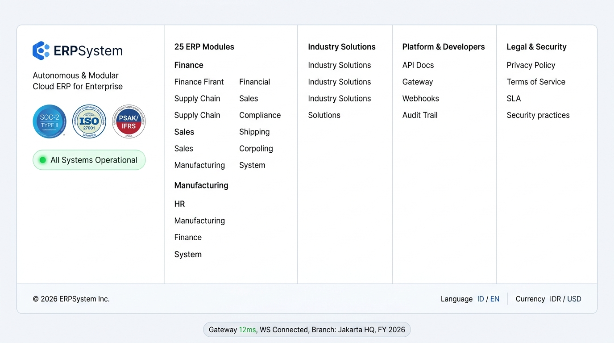
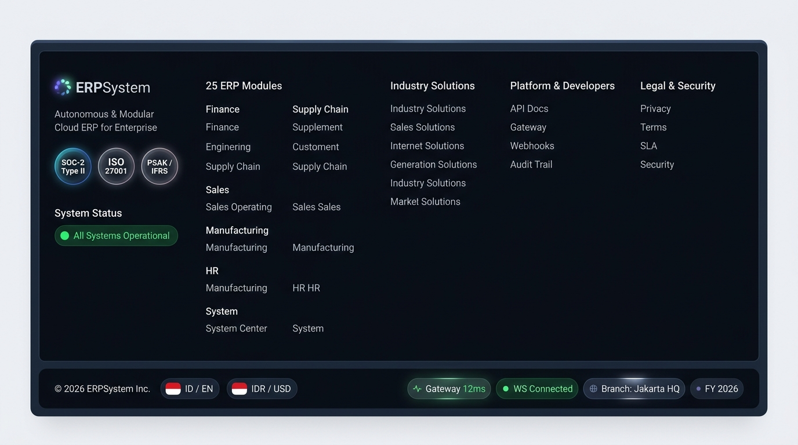
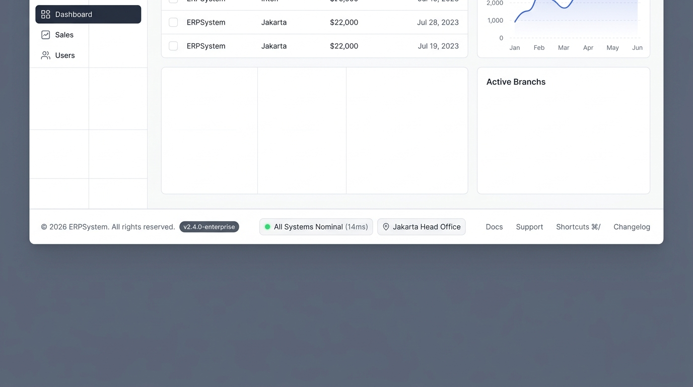

# 🎨 Design UI — Komponen Footer Enterprise & Status Bar Sistem (Global Footer)

> Mockup antarmuka **Komponen Footer Enterprise Lengkap (Public Multi-Column Portal Footer & Internal App Telemetry Bar)**: desain footer terpadu tingkat enterprise yang menyediakan peta navigasi komprehensif ke seluruh modul sistem, transparansi kepatuhan regulasi (*Compliance Badges: SOC-2 Type II, ISO 27001, PSAK/IFRS*), indikator kesehatan sistem real-time (*All Systems Operational*), selektor lokalisasi (*Bahasa & Multi-Currency*), serta bilah telemetri internal (*Live Telemetry Status Bar*) untuk memantau performa arsitektur microfrontend.

---

## Light Mode

---

## Dark Mode

---

## 🗂️ Struktur Peta Situs & Pengelompokan Kolom Footer

| Kolom | Kategori | Elemen & Navigasi Terkait |
|---|---|---|
| **1. Identitas & Kepatuhan** | Brand & Status | • Logo Brand `ERPSystem` + Slogan Enterprise • Badge Sertifikasi: `SOC-2 Type II`, `ISO 27001`, `PSAK / IFRS` • Status Sistem: Pill hijau aktif `All Systems Operational (99.99%)` |
| **2. Modul ERP (25 Modul)** | Solusi Modul | • **Keuangan**: `ACC`, `AP`, `AR`, `GL`, `FA`, `BUD`, `TAX` • **Rantai Pasok**: `PUR`, `INV` • **Penjualan & CRM**: `SAL`, `CRM`, `POS` • **Operasional**: `MFG`, `PRJ` • **SDM**: `HRM`, `PAY`, `ATT`, `REC` • **Sistem**: `USR`, `RPT`, `ADM`, `WFL`, `DOC`, `MSG`, `AUD` |
| **3. Solusi Industri** | Use Cases | • Enterprise Holdings & Multi-Company • Pabrikasi & Manufaktur Terintegrasi • Perdagangan & Distribusi Rantai Pasok • Kontraktor & Manajemen Proyek Berjalan • Retail Chain & Point of Sale Terdistribusi |
| **4. Pengembang & Platform** | Developer Hub | • Dokumentasi REST & GraphQL API • Arsitektur Microfrontend Gateway (`Kong / Vite`) • Event Streaming & Webhook Docs (`Kafka / WS`) • Log Audit Keamanan & OpenTelemetry Tracing |
| **5. Keamanan & Legal** | Kebijakan & Bantuan | • Kebijakan Privasi (Privacy Policy) • Syarat & Ketentuan Layanan (Terms of Service) • Jaminan Ketersediaan Layanan (Service Level Agreement / SLA) • Praktik Keamanan Siber & Kontak Konsultan 24/7 |

---

## 📝 Komponen & Elemen Lengkap Footer

### 1. Sisi Utama (Multi-Column Sitemap & Trust Badges):
- **Brand Identity & Value Proposition**: Menampilkan identitas resmi sistem *ERPSystem* dengan pernyataan misi otomasi ERP modular modern.
- **Trust & Compliance Badges**: 3 lencana kepatuhan berstandar internasional:
  - `SOC-2 Type II` untuk keamanan tata kelola data cloud.
  - `ISO 27001` untuk sistem manajemen keamanan informasi.
  - `PSAK / IFRS Compliant` untuk jaminan kesesuaian modul pembukuan akuntansi.
- **Real-Time Uptime Status Pill**: Indikator interaktif yang terhubung dengan gateway pemantauan layanan (`All Systems Operational`).

### 2. Bilah Bawah (Bottom Legal Bar):
- **Copyright Statement**: Label resmi `© 2026 ERPSystem Inc. All rights reserved.`
- **Localization Switchers**:
  - **Language Selector**: Pilihan instan bahasa sistem (`ID` Bahasa Indonesia / `EN` English).
  - **Currency Selector**: Pemilihan mata uang dasar laporan (`IDR` Rupiah / `USD` Dollar AS).

### 3. Bilah Telemetri Aplikasi Internal (Embedded Dashboard Status Bar):
- **Gateway Latency Indicator**: Indikator kecepatan respon API gateway (contoh: `Gateway 12ms`).
- **WebSocket Real-Time Status**: Indikator koneksi sinkronisasi live messaging & workflow approval (`WS Connected`).
- **Active Branch Indicator**: Menampilkan cabang operasional yang sedang aktif (`Branch: Jakarta HQ`).
- **Active Fiscal Period**: Indikator tahun buku aktif yang sedang dibuka (`FY 2026`).

---

## 🖥️ Admin Template Footer (Simple / Minimal Dashboard Bar)

Desain footer sederhana dan ramping (*single-row horizontal bar*) yang dirancang khusus untuk antarmuka dashboard admin template ERP. Footer ini ditempatkan di bagian paling bawah area konten utama (bawah tabel/grafik dashboard), menjaga tampilan tetap bersih, tidak memakan ruang vertikal (*height: 48px*), dan memberikan akses informasi teknis secara sekilas.

### Elemen Utama Admin Template Footer:
1. **Sisi Kiri — Hak Cipta & Versi Sistem**:
   - Copyright label: `© 2026 ERPSystem. All rights reserved.`
   - Version badge pill: `v2.4.0-enterprise` (menampilkan versi build produksi aktif).
2. **Sisi Tengah — Status & Cabang Aktif**:
   - Status server real-time: `● All Systems Nominal (14ms)` dengan indikator hijau stabil.
   - Lokasi entitas aktif: `📍 Jakarta Head Office`.
3. **Sisi Kanan — Link Bantuan & Pintasan**:
   - `Docs`: Menuju ke dokumentasi modul admin.
   - `Support`: Membuka formulir tiket bantuan teknis instan.
   - `Shortcuts ⌘/`: Menampilkan modal panduan tombol pintas keyboard.
   - `Changelog`: Catatan rilis dan update fitur sistem terbaru.

