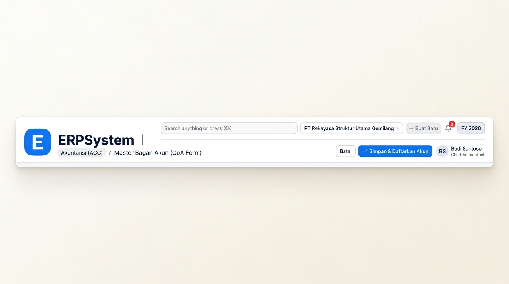
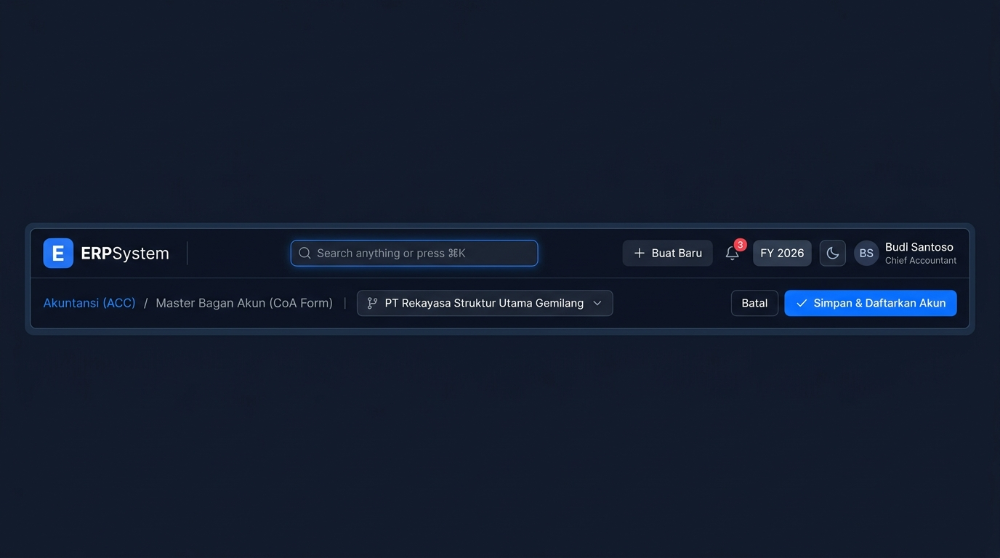
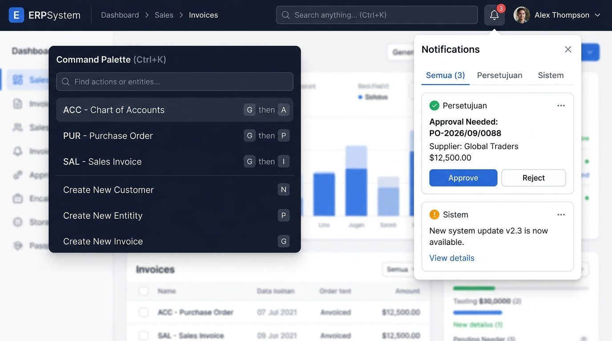

# 🎨 Design UI — Komponen Header Navigasi Lengkap (Top Navigation Bar)

> Mockup antarmuka **Komponen Header Navigasi Lengkap (Complete Topbar & Global Navigation Bar)**: desain header terpadu tingkat enterprise yang mencakup identitas brand (`E ERPSystem`), *Breadcrumbs Path Navigation* kontekstual, *Global Search Bar & Command Palette* (`⌘K`), *Multi-Entity & Branch Selector* (`PT Rekayasa Struktur Utama Gemilang`), *Quick Actions* (`+ Buat Baru`), *Real-time Notification Bell* (integrasi WebSocket modul `MSG` dengan badge unread counter), *Workflow Approval Counter* (`WFL`), *Fiscal Year & Currency Indicator* (`FY 2026 | IDR`), *Theme Toggle (Dark/Light Mode)*, *Action Buttons (Batal & Simpan)*, serta *User Profile Status Pill* (`BS - Budi Santoso / Chief Accountant`).

---

## Light Mode

---

## Dark Mode

---

## Interactive Popovers & Dropdowns (Command Palette & Notification Panel)

---

## 📝 Komponen & Elemen Lengkap Header

1. **Sisi Kiri — Identitas & Navigasi**:
   - **Brand Logo**: Icon kotak biru dengan huruf "**E**" putih tebal + label teks "**ERPSystem**".
   - **Separator & Breadcrumbs**: Menampilkan hierarki modul dan halaman aktif (contoh: `Akuntansi (ACC) / Master Bagan Akun (CoA Form)`).
   - **Branch / Company Selector**: Dropdown pemilihan entitas aktif (misal: `PT Rekayasa Struktur Utama Gemilang - Head Office`).

2. **Sisi Tengah — Pencarian Cepat & Filter**:
   - **Global Search (`⌘K` / `Ctrl+K`)**: Input pencarian global untuk menjangkau 25 modul, transaksi, dokumen, dan vendor secara instan melalui Command Palette.

3. **Sisi Kanan — Aksi, Notifikasi & Profil Pengguna**:
   - **Quick Action (`+ Buat Baru`)**: Tombol cepat untuk membuat transaksi baru (Jurnal, PO, Invoice, Ticket).
   - **Real-time Notifications & Approvals**: Ikon bel dengan badge counter merah `3` dan tab persetujuan instan (*One-Click Approve/Reject*).
   - **Tahun Fiskal & Mata Uang**: Indikator periode pembukuan (`FY 2026`) & mata uang aktif (`IDR`).
   - **Theme Switcher**: Tombol pergantian instan antara tema *Light Mode* dan *Dark Mode*.
   - **Contextual Action Buttons**: Tombol sekunder (`Batal`) dan tombol utama biru (`✓ Simpan & Daftarkan Akun`).
   - **User Profile Pill**: Avatar inisial (`BS`), nama (`Budi Santoso`), jabatan (`Chief Accountant`), serta indikator status online aktif.
