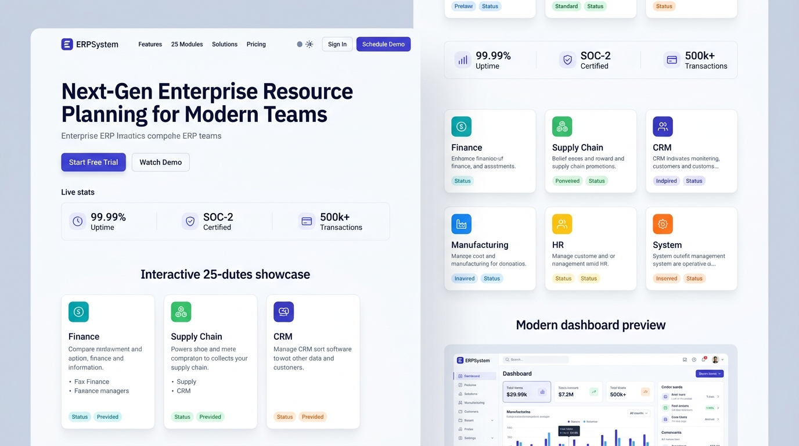
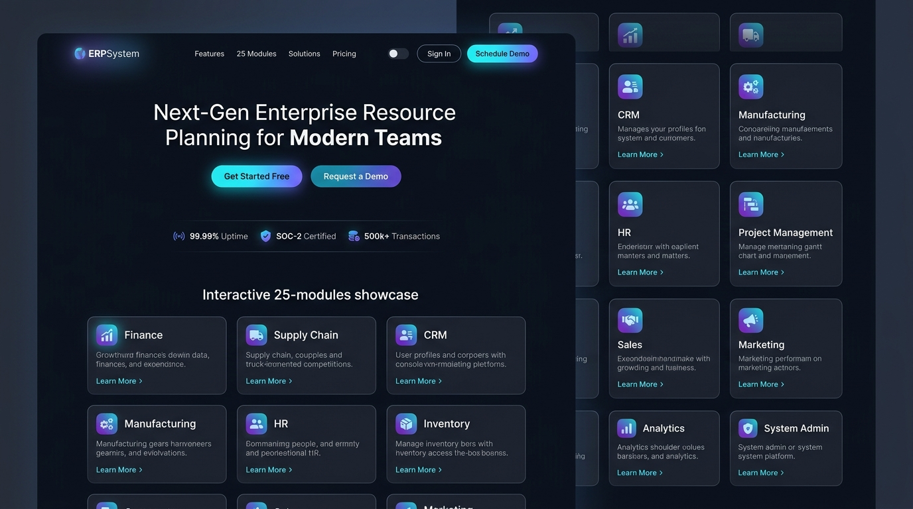

# 🎨 Design UI — Halaman Landing Page Publik ERP (Enterprise Public Portal)

> Mockup antarmuka **Halaman Landing Page Publik ERP (Enterprise Public Marketing & Onboarding Portal)**: gerbang utama publik dan calon pengguna korporasi yang menampilkan proposisi nilai sistem ERP generasi baru berbasis arsitektur *Decoupled Microfrontend*. Halaman ini menyajikan etalase interaktif seluruh **25 Modul ERP**, pembuktian keandalan sistem tingkat tinggi (*99.99% Uptime SLA, SOC-2 Type II, 500k+ Transaksi Harian*), cuplikan antarmuka dashboard eksekutif, serta navigasi pendaftaran & masuk portal (*Single Sign-On / MFA Onboarding*).

---

## Light Mode

---

## Dark Mode

---

## 🏛️ Struktur Bagian (Sections) Landing Page

| No | Bagian Halaman | Fungsi & Elemen Kunci |
|---|---|---|
| **1** | **Top Navigation Bar (Public Header)** | • Brand Logo `E ERPSystem` • Link Navigasi: *Features*, *25 Modules*, *Solutions*, *Pricing* • Theme Toggle (*Light/Dark Mode*) • Tombol Aksi: `Sign In` (ke modul `19_USR`) & `Schedule Demo` |
| **2** | **Hero Banner & Value Proposition** | • Headline: *"Next-Gen Enterprise Resource Planning for Modern Teams"* • Subtitle penjelasan arsitektur cloud-native & otomasi alur kerja • Dual CTA: `Start Free Trial` (Primary Blue) & `Watch Demo` (Secondary Ghost) |
| **3** | **Live Metrics & Trust Banner** | • `99.99%` Ketersediaan Layanan (Uptime SLA) • `SOC-2 Type II` Keamanan & Kepatuhan Tersertifikasi • `500k+` Transaksi Bisnis Harian Terproses Tanpa Kendala |
| **4** | **Interactive 25-Modules Showcase** | • Kartu preview 6 pilar bisnis ERP (Finance, Supply Chain, CRM, Manufacturing, HR, System) • Status modul aktif, badge fitur terpadu, dan tautan eksplorasi modul |
| **5** | **Modern Dashboard Preview** | • Cuplikan visual antarmuka sistem: analitik omset, grafik arus kas, tren pesanan, serta integrasi modul secara real-time |
| **6** | **Microfrontend & Enterprise Security** | • Penjelasan modularitas decoupled: deployment mandiri tanpa downtime lintas tim teknis • Keamanan enterprise: Granular RBAC, Audit Logging PSAK/IFRS, dan Biometric MFA |
| **7** | **Closing Action Banner & Global Footer** | • Banner ajakan bertindak konversi tinggi (*Transform Your Enterprise Operations*) • Navigasi lengkap *Global Footer* (Peta situs 25 modul, legalitas, switch bahasa & mata uang) |

---

## 📝 Detail Komponen & Fitur Interaktif

### 1. Header Navigasi Publik:
- **Logo & Identitas Brand**: Ikon kotak `E` biru dengan teks tegas **ERPSystem**.
- **Menu Navigasi Responsif**: Mengarahkan pengunjung ke anchor bagian halaman (*#features*, *#modules*, *#solutions*, *#pricing*).
- **Pengalih Tema Instan**: Switcher animasi halus untuk berganti antara *Light Mode* yang bersih dan *Dark Mode* bernuansa slate modern.
- **Akses Cepat Pengguna**:
  - `Sign In`: Mengarahkan pengguna langsung ke halaman masuk sistem di modul [`19_USR/login.md`](file:///Users/bsa/Documents/por/erp/design/ui/19_USR/login.md).
  - `Schedule Demo`: Membuka modal interaktif reservasi konsultasi produk.

### 2. Pameran Interaktif 25 Modul ERP (Showcase Grid):
Menampilkan ringkasan modular yang terhubung langsung dengan dokumen spesifikasi desain di repositori ini:
- 💼 **Finance & Accounting**: [`1_ACC`](file:///Users/bsa/Documents/por/erp/design/ui/1_ACC), [`2_AP`](file:///Users/bsa/Documents/por/erp/design/ui/2_AP), [`3_AR`](file:///Users/bsa/Documents/por/erp/design/ui/3_AR), [`4_GL`](file:///Users/bsa/Documents/por/erp/design/ui/4_GL), [`5_FA`](file:///Users/bsa/Documents/por/erp/design/ui/5_FA), [`6_BUD`](file:///Users/bsa/Documents/por/erp/design/ui/6_BUD), [`7_TAX`](file:///Users/bsa/Documents/por/erp/design/ui/7_TAX).
- 📦 **Supply Chain & Inventory**: [`8_PUR`](file:///Users/bsa/Documents/por/erp/design/ui/8_PUR), [`9_INV`](file:///Users/bsa/Documents/por/erp/design/ui/9_INV).
- 📈 **Sales, CRM & POS**: [`10_SAL`](file:///Users/bsa/Documents/por/erp/design/ui/10_SAL), [`11_CRM`](file:///Users/bsa/Documents/por/erp/design/ui/11_CRM), [`12_POS`](file:///Users/bsa/Documents/por/erp/design/ui/12_POS).
- ⚙️ **Manufacturing & Projects**: [`13_MFG`](file:///Users/bsa/Documents/por/erp/design/ui/13_MFG), [`14_PRJ`](file:///Users/bsa/Documents/por/erp/design/ui/14_PRJ).
- 👥 **Human Resources & Payroll**: [`15_HRM`](file:///Users/bsa/Documents/por/erp/design/ui/15_HRM), [`16_PAY`](file:///Users/bsa/Documents/por/erp/design/ui/16_PAY), [`17_ATT`](file:///Users/bsa/Documents/por/erp/design/ui/17_ATT), [`18_REC`](file:///Users/bsa/Documents/por/erp/design/ui/18_REC).
- 🛡️ **System, Security & Intelligence**: [`19_USR`](file:///Users/bsa/Documents/por/erp/design/ui/19_USR), [`20_RPT`](file:///Users/bsa/Documents/por/erp/design/ui/20_RPT), [`21_ADM`](file:///Users/bsa/Documents/por/erp/design/ui/21_ADM), [`22_WFL`](file:///Users/bsa/Documents/por/erp/design/ui/22_WFL), [`23_DOC`](file:///Users/bsa/Documents/por/erp/design/ui/23_DOC), [`24_MSG`](file:///Users/bsa/Documents/por/erp/design/ui/24_MSG), [`25_AUD`](file:///Users/bsa/Documents/por/erp/design/ui/25_AUD).

### 3. Keterkaitan dengan Implementasi Microfrontend:
Halaman desain ini merupakan cetak biru UI untuk implementasi kode micro-frontend landing page pada:
- **Komponen Svelte**: `erp/landingpage/svelte/src/components/LandingPage.svelte`
- **Komponen Frontend Webpack**: `erp/landingpage/frontend/src/App.js`
