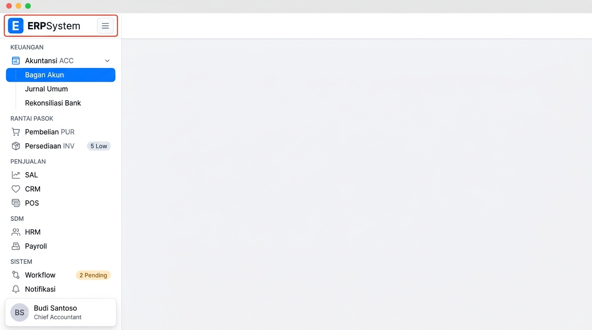
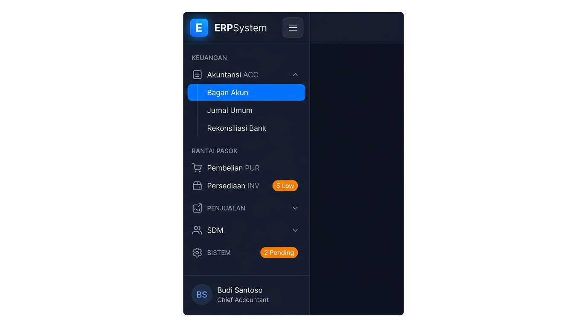
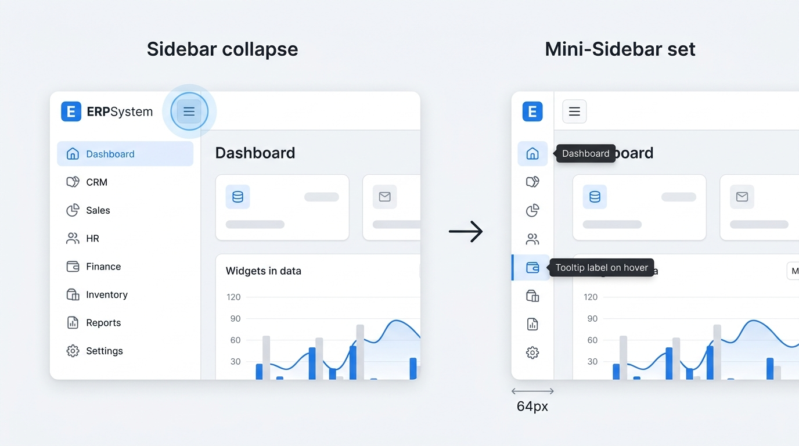

# 🎨 Design UI — Komponen Sidebar Navigasi Lengkap (Left Sidebar Navigation)

> Mockup antarmuka **Komponen Sidebar Navigasi Lengkap (Complete Left Sidebar Drawer & Mini-Rail Navigation)**: desain panel navigasi vertikal tingkat enterprise yang mengorganisasi seluruh **25 Modul ERP** ke dalam 6 kelompok kategori bisnis utama (Keuangan, Rantai Pasok, Penjualan & CRM, Operasional, SDM, dan Sistem). Di bagian atas sidebar terdapat **Header Bar Sidebar** yang memuat logo aplikasi (`E ERPSystem`) dan **Tombol Hamburger Toggle (☰)** di sebelah kanannya untuk mengecilkan (*collapse*) sidebar menjadi *Mini-Sidebar (64px)* atau menyembunyikannya (*hide*), lengkap dengan *Accordion Submenu*, *Real-time Badge Alerts*, dan *User Profile Card* di bagian bawah.

---

## Light Mode (dengan Tombol Hamburger di Kanan Logo)

---

## Dark Mode (dengan Tombol Hamburger di Kanan Logo)

---

## Interaksi Collapse / Expand via Tombol Hamburger (64px Mini-Sidebar)

---

## 🗂️ Struktur Pengelompokan 25 Modul dalam Sidebar

| Kategori | Modul & Kode | Fitur Utama / Submenu dalam Sidebar |
|---|---|---|
| **1. KEUANGAN** | • `ACC` Akuntansi • `AP` Hutang Usaha • `AR` Piutang Usaha • `GL` Buku Besar • `FA` Aset Tetap • `BUD` Anggaran • `TAX` Perpajakan | Bagan Akun (CoA), Jurnal Umum, Rekonsiliasi Bank, Laporan Keuangan, Multi-Mata Uang, Penutupan Periode, Faktur Pajak. |
| **2. RANTAI PASOK** | • `PUR` Pembelian • `INV` Persediaan & Gudang | Purchase Order, Permintaan Barang (PR), Penerimaan (GR), Master Item, Mutasi Stok, Stock Opname, Reorder Point *(Badge: 5 Low)*. |
| **3. PENJUALAN & CRM** | • `SAL` Penjualan • `CRM` Customer Relation • `POS` Point of Sale | Penawaran (Quotation), Sales Order, Pengiriman (DO), Pipeline Leads, Tiket Pelanggan, Kasir Retail POS. |
| **4. OPERASIONAL** | • `MFG` Manufaktur / Produksi • `PRJ` Manajemen Proyek | Work Order (SPK), Bill of Materials (BOM), Jadwal Produksi, Timeline Proyek & WBS, Cost Tracking. |
| **5. SDM** | • `HRM` Sumber Daya Manusia • `PAY` Penggajian • `ATT` Absensi & Presensi • `REC` Rekrutmen | Data Karyawan, Slip Gaji Digital, Kalkulasi PPh 21, Rekap Kehadiran Mesin Fingerprint, Job Portal & Interview. |
| **6. SISTEM** | • `USR` User Management • `RPT` Laporan & Analitik • `ADM` Administrasi • `WFL` Workflow *(2 Pending)* • `DOC` Manajemen Dokumen • `MSG` Pesan & Notifikasi • `AUD` Audit Trail | Hak Akses Role RBAC, Executive Dashboard KPI, Konfigurasi Entitas/Cabang, Approval Engine, OCR Dokumen, Log Aktivitas Keamanan. |

---

## 📝 Komponen & Elemen Utama Sidebar

1. **Header Bar Sidebar (Logo + Burger Toggle)**:
   - **Kiri**: Ikon kotak biru `E` + teks nama aplikasi **ERPSystem**.
   - **Kanan**: **Tombol Ikon Hamburger (☰)** / *Sidebar Collapse Toggle* yang berfungsi mengecilkan sidebar menjadi *Mini-Sidebar (64px)* atau memperluasnya kembali.

2. **Menu Navigasi Accordion**:
   - Label kategori berhuruf kapital halus (`KEUANGAN`, `RANTAI PASOK`, dll).
   - Ikon modul representatif dengan status aktif berwarna biru tegas (*Blue Pill Selection*).
   - Dynamic Badges: Alert perhatian stok (`5 Low`) & persetujuan workflow (`2 Pending`).

3. **Status Mini-Sidebar (64px Rail State)**:
   - Ketika tombol hamburger ditekan, sidebar menciut menjadi 64px dengan hanya menampilkan ikon modul.
   - Dilengkapi *Tooltip / Hover Popover Flyout* otomatis saat kursor diarahkan ke ikon modul.

4. **Footer Sidebar (User Profile Card)**:
   - Avatar inisial (`BS`), nama (`Budi Santoso`), jabatan (`Chief Accountant`), serta tombol Logout/Pengaturan.
