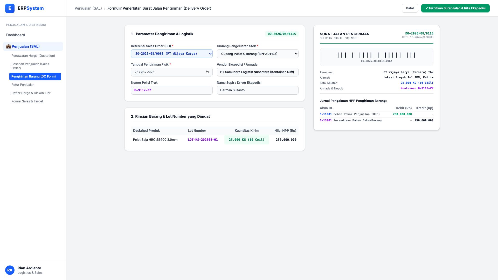
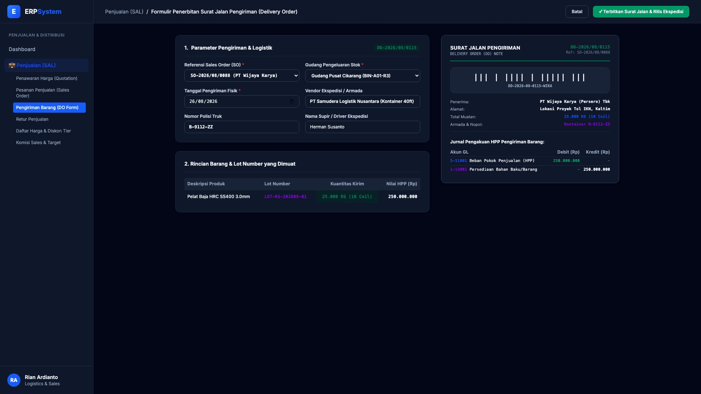

# 🎨 Design UI — Formulir Surat Jalan Pengiriman / Delivery Order (Data Entry Screen)

> Mockup antarmuka **Formulir Penerbitan Surat Jalan Pengiriman (Delivery Order Data Entry)**: desain *Split-Screen Form* dengan formulir input DO di sebelah kiri (Nomor DO `DO-2026/08/0115`, referensi SO `SO-2026/08/0088`, pengeluaran Gudang Pusat Cikarang Rak BIN-A01-R3, ekspedisi Samudera Logistik Truk Kontainer B-9112-ZZ, supir Herman Susanto, pemuatan 25.000 KG / 10 Coil pelat baja lot `LOT-KS-202608-01` nilai HPP Rp 250 Jt) dan *Live Pratinjau Dokumen Surat Jalan Pengiriman Berbarcode (Delivery Order Note) & Jurnal GL Pengakuan HPP Penjualan* di sebelah kanan pada modul `SAL` (Penjualan / Sales) dalam ERP System.

---

## Light Mode

---

## Dark Mode

---

## 📝 Komponen & Fitur Formulir Input

1. **Panel Kiri — Formulir Parameter Pengiriman & Logistik**:
   - Nomor DO: `DO-2026/08/0115` &bull; Ref SO: `SO-2026/08/0088`.
   - Gudang Sumber: `Gudang Pusat Cikarang (BIN-A01-R3)`.
   - Ekspedisi: *PT Samudera Logistik Nusantara (Kontainer 40ft)* &bull; Nopol: `B-9112-ZZ`.
   - Rincian Muatan: **25.000 KG (10 Coil)** dari Lot `LOT-KS-202608-01`.

2. **Panel Kanan — Surat Jalan Berbarcode & Jurnal HPP**:
   - Barcode Scanner Pengiriman: `DO-2026-08-0115-WIKA`.
   - Jurnal Akuntansi HPP Pengiriman:
     - Debit `5-11001 Beban Pokok Penjualan (HPP)`: Rp 250.000.000
     - Kredit `1-13001 Persediaan Barang`: Rp 250.000.000
