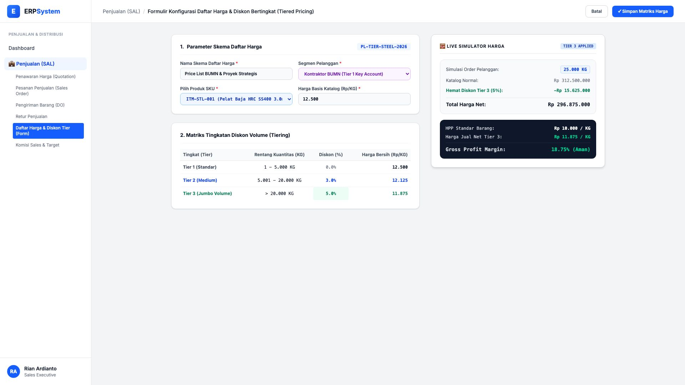
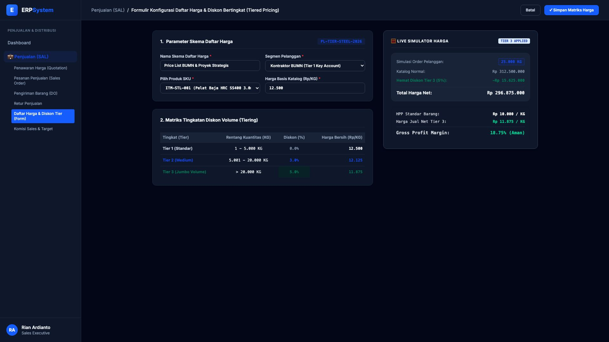

# 🎨 Design UI — Formulir Daftar Harga & Diskon Bertingkat (Data Entry Screen)

> Mockup antarmuka **Formulir Konfigurasi Daftar Harga & Diskon Bertingkat (Price List & Tiered Pricing Data Entry)**: desain *Split-Screen Form* dengan formulir input matriks diskon volume di sebelah kiri (Skema `PL-TIER-STEEL-2026`, segmen Kontraktor BUMN, SKU Pelat Baja `ITM-STL-001`, harga basis katalog Rp 12.500/Kg, Tier 1: 1-5.000 KG diskon 0% Rp 12.500, Tier 2: 5.001-20.000 KG diskon 3% Rp 12.125, Tier 3: > 20.000 KG diskon 5% Rp 11.875) dan *Live Simulator Perhitungan Diskon Otomatis (Order 25.000 KG &rarr; Hemat Rp 15.625.000) & Kartu Rekapitulasi Margin Penjualan (Gross Margin 18.75%)* di sebelah kanan pada modul `SAL` (Penjualan / Sales) dalam ERP System.

---

## Light Mode

---

## Dark Mode

---

## 📝 Komponen & Fitur Formulir Input

1. **Panel Kiri — Formulir Parameter Skema & Tingkatan Diskon**:
   - Kode Skema: `PL-TIER-STEEL-2026` &bull; Segmen: **Kontraktor BUMN (Key Account)**.
   - Produk: `ITM-STL-001 (Pelat Baja HRC SS400 3.0mm)`.
   - Harga Basis Katalog: **Rp 12.500 / KG**.
   - Matriks Tier:
     - Tier 1 (1 - 5.000 KG): **Diskon 0.0% (Rp 12.500/Kg)**
     - Tier 2 (5.001 - 20.000 KG): **Diskon 3.0% (Rp 12.125/Kg)**
     - Tier 3 (> 20.000 KG): **Diskon 5.0% (Rp 11.875/Kg)**

2. **Panel Kanan — Simulator Diskon & Analisis Margin**:
   - Simulasi Pembelian: **25.000 KG &rarr; Hemat Rp 15.625.000**.
   - Total Pembayaran Net: **Rp 296.875.000**.
   - Analisis Profitabilitas: HPP Rp 10.000/Kg &rarr; Jual Net Rp 11.875/Kg (**Gross Profit Margin 18.75% / Aman**).
