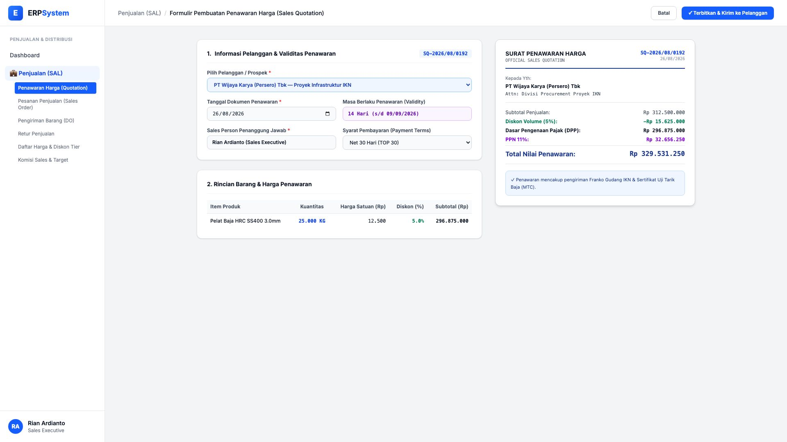
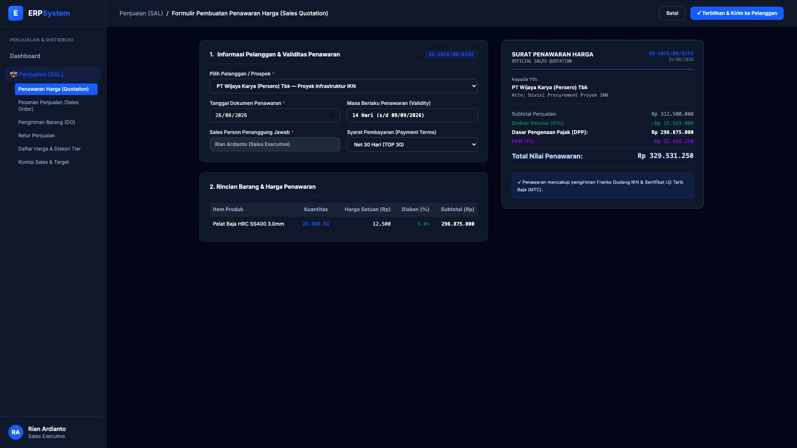

# 🎨 Design UI — Formulir Penawaran Harga / Sales Quotation (Data Entry Screen)

> Mockup antarmuka **Formulir Pembuatan Surat Penawaran Harga (Sales Quotation Data Entry)**: desain *Split-Screen Form* dengan formulir input penawaran di sebelah kiri (Pelanggan PT Wijaya Karya (Persero) Tbk, tanggal 26/08/2026, validitas 14 hari, TOP 30 hari, produk Pelat Baja HRC SS400 3.0mm Qty 25.000 KG @ Rp 12.500, diskon volume 5%, PPN 11% Rp 32.656.250, total penawaran Rp 329.531.250) dan *Live Pratinjau Surat Penawaran Resmi Berkop (Official Sales Quotation Letter) & Rincian Finansial Lengkap* di sebelah kanan pada modul `SAL` (Penjualan / Sales) dalam ERP System.

---

## Light Mode

---

## Dark Mode

---

## 📝 Komponen & Fitur Formulir Input

1. **Panel Kiri — Formulir Parameter Penawaran**:
   - Nomor Penawaran: `SQ-2026/08/0192` &bull; Pelanggan: `PT Wijaya Karya (Persero) Tbk`.
   - Masa Berlaku (*Validity*): **14 Hari (s/d 09/09/2026)** &bull; Syarat Bayar: **TOP 30 Hari**.
   - Sales Person: *Rian Ardianto (Sales Executive)*.
   - Item Penawaran: **25.000 KG @ Rp 12.500/Kg** (Diskon 5% = -Rp 15.625.000).

2. **Panel Kanan — Dokumen Surat Penawaran Resmi**:
   - Subtotal: **Rp 312.500.000** &bull; Diskon: **-Rp 15.625.000**.
   - DPP: **Rp 296.875.000** &bull; PPN 11%: **Rp 32.656.250**.
   - **Total Nilai Penawaran: Rp 329.531.250**.
   - Dilengkapi klausul pengiriman Franko IKN & Sertifikat Uji Tarik Baja (MTC).
