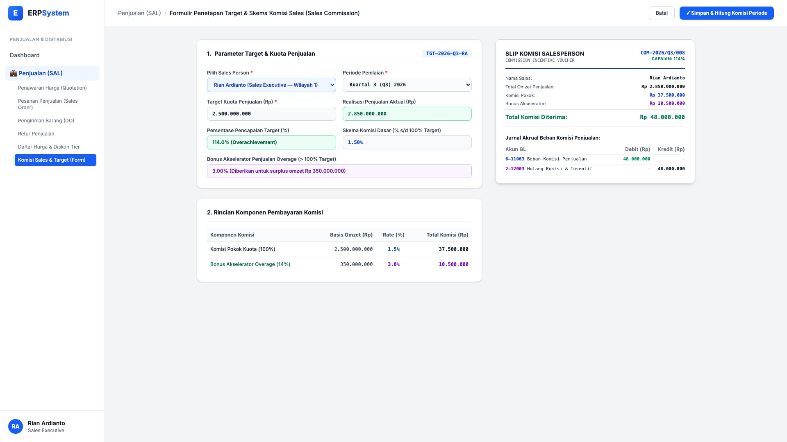
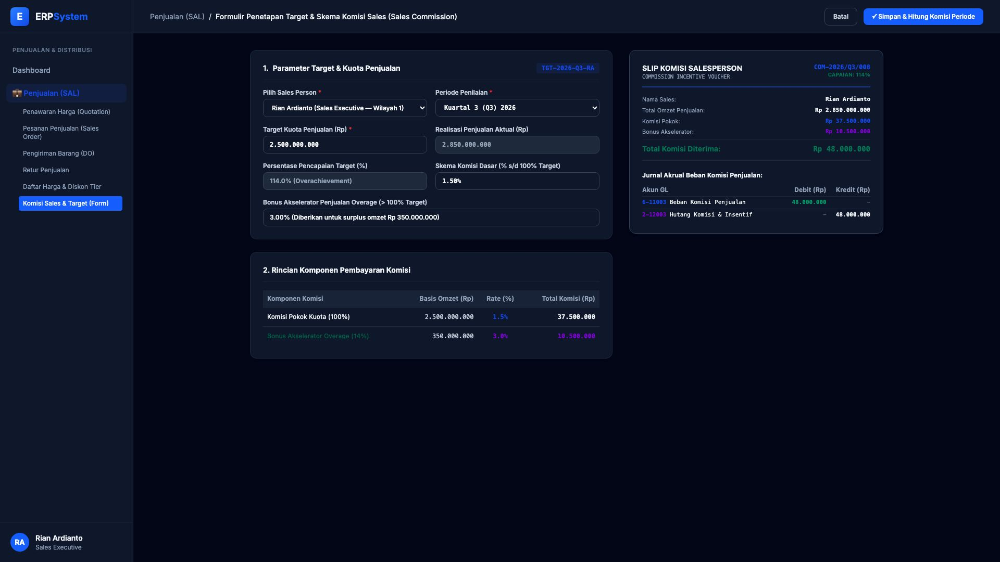

# 🎨 Design UI — Formulir Penetapan Target & Skema Komisi Sales (Data Entry Screen)

> Mockup antarmuka **Formulir Penetapan Target & Skema Komisi Salesperson (Sales Commission & Target Data Entry)**: desain *Split-Screen Form* dengan formulir input skema komisi di sebelah kiri (Sales Executive Rian Ardianto, periode Q3 2026, target kuota Rp 2,5 Miliar, realisasi aktual Rp 2,85 Miliar / 114% overachievement, komisi dasar 1.5% = Rp 37.500.000, bonus akselerator surplus 3.0% = Rp 10.500.000) dan *Live Slip Komisi Salesperson & Jurnal GL Akrual Beban Komisi (Debit Beban Komisi Penjualan Rp 48.000.000 vs Kredit Hutang Komisi & Insentif Rp 48.000.000)* di sebelah kanan pada modul `SAL` (Penjualan / Sales) dalam ERP System.

---

## Light Mode

---

## Dark Mode

---

## 📝 Komponen & Fitur Formulir Input

1. **Panel Kiri — Formulir Parameter Target & Tingkat Komisi**:
   - Sales Person: `Rian Ardianto (Sales Executive)`.
   - Target Kuota: **Rp 2.500.000.000** &bull; Realisasi: **Rp 2.850.000.000 (114% Capaian)**.
   - Skema Komisi:
     - Komisi Pokok (1.5% dari target): **Rp 37.500.000**
     - Bonus Akselerator Overage (3.0% dari surplus Rp 350 Jt): **Rp 10.500.000**

2. **Panel Kanan — Slip Komisi & Jurnal Akuntansi GL**:
   - Total Komisi Diterima: **Rp 48.000.000**.
   - Jurnal Akrual Otomatis:
     - Debit `6-11003 Beban Komisi Penjualan`: Rp 48.000.000
     - Kredit `2-12003 Hutang Komisi & Insentif`: Rp 48.000.000
