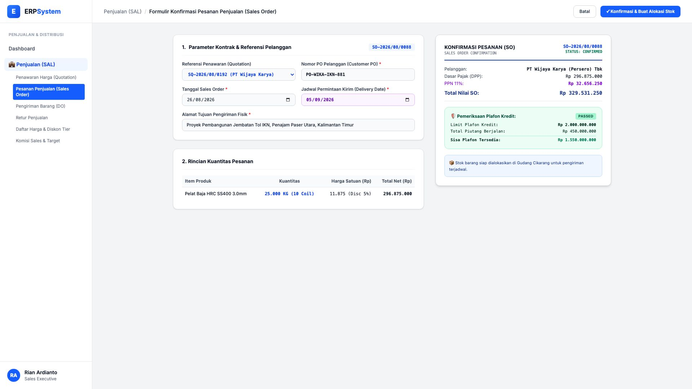
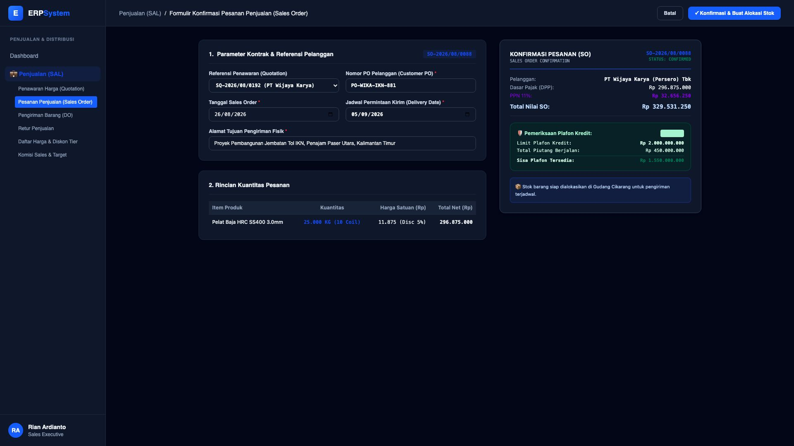

# 🎨 Design UI — Formulir Konfirmasi Pesanan Penjualan / Sales Order (Data Entry Screen)

> Mockup antarmuka **Formulir Konfirmasi Pesanan Penjualan (Sales Order Data Entry)**: desain *Split-Screen Form* dengan formulir input SO di sebelah kiri (Nomor SO `SO-2026/08/0088`, referensi penawaran `SQ-2026/08/0192`, nomor PO Pelanggan `PO-WIKA-IKN-881`, tanggal SO 26/08/2026, permintaan kirim 05/09/2026, tujuan Proyek Jembatan Tol IKN, produk Pelat Baja 25.000 KG @ Rp 11.875 net = Rp 296.875.000 + PPN 11% Rp 32.656.250 = Rp 329.531.250) dan *Live Pratinjau Dokumen Sales Order Confirmation & Widget Pemeriksaan Plafon Kredit Pelanggan (Limit Rp 2 Miliar, Sisa Plafon Rp 1,55 Miliar / Status Passed)* di sebelah kanan pada modul `SAL` (Penjualan / Sales) dalam ERP System.

---

## Light Mode

---

## Dark Mode

---

## 📝 Komponen & Fitur Formulir Input

1. **Panel Kiri — Formulir Parameter SO & Kontrak Proyek**:
   - Ref Quotation: `SQ-2026/08/0192` &bull; No. Customer PO: `PO-WIKA-IKN-881`.
   - Tanggal SO: **26/08/2026** &bull; Jadwal Kirim: **05/09/2026**.
   - Lokasi Pengiriman: *Proyek Jembatan Tol IKN, Penajam Paser Utara, Kaltim*.
   - Kuantitas Pesanan: **25.000 KG (10 Coil)** @ Rp 11.875/Kg Net.

2. **Panel Kanan — Dokumen Konfirmasi SO & Cek Plafon Kredit**:
   - Status Dokumen: `SO-2026/08/0088 (STATUS: CONFIRMED)`.
   - Total Nilai SO: **Rp 329.531.250 (Termasuk PPN 11%)**.
   - Pemeriksaan Plafon Kredit (*Credit Limit Guard*):
     - Plafon Kredit: **Rp 2.000.000.000**
     - Piutang Berjalan: **Rp 450.000.000**
     - Sisa Plafon: **Rp 1.550.000.000 (🟢 PASSED / AMAN)**.
