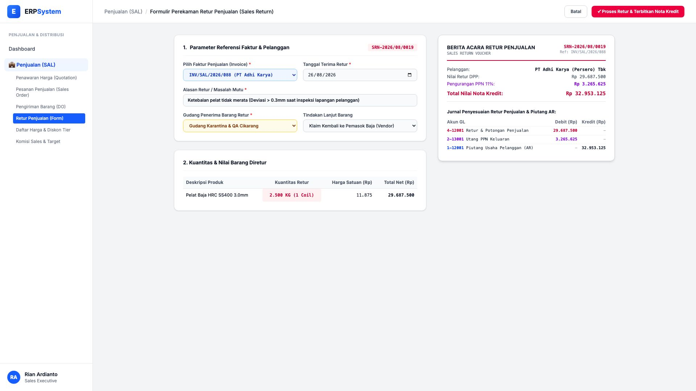
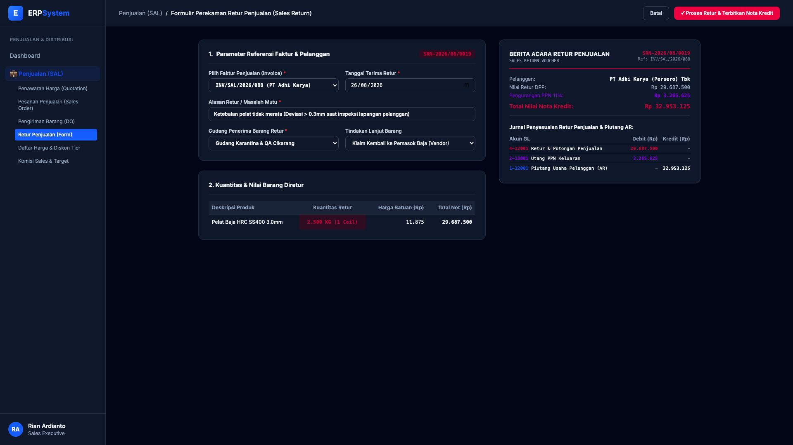

# 🎨 Design UI — Formulir Retur Penjualan / Sales Return (Data Entry Screen)

> Mockup antarmuka **Formulir Perekaman Retur Penjualan (Sales Return Data Entry)**: desain *Split-Screen Form* dengan formulir input retur di sebelah kiri (Nomor Retur `SRN-2026/08/0019`, referensi faktur `INV/SAL/2026/088`, pelanggan PT Adhi Karya (Persero) Tbk, tanggal terima retur 26/08/2026, alasan cacat dimensi ketebalan plat di luar toleransi inspeksi pelanggan, kuantitas retur 2.500 KG / 1 Coil nilai DPP Rp 29.687.500 + PPN 11% Rp 3.265.625 = Total Nota Kredit Rp 32.953.125, gudang karantina Cikarang) dan *Live Berita Acara Retur Penjualan & Jurnal Penyesuaian Retur GL (Debit Retur Penjualan & Utang PPN Keluaran vs Kredit Piutang Usaha AR)* di sebelah kanan pada modul `SAL` (Penjualan / Sales) dalam ERP System.

---

## Light Mode

---

## Dark Mode

---

## 📝 Komponen & Fitur Formulir Input

1. **Panel Kiri — Formulir Parameter Retur & Investigasi**:
   - Nomor Retur: `SRN-2026/08/0019` &bull; Ref Faktur: `INV/SAL/2026/088`.
   - Pelanggan: `PT Adhi Karya (Persero) Tbk`.
   - Alasan: *Ketebalan pelat tidak merata (Deviasi > 0.3mm saat inspeksi)*.
   - Gudang Penerima: `Gudang Karantina & QA Cikarang`.
   - Kuantitas Retur: **2.500 KG (1 Coil)**.

2. **Panel Kanan — Berita Acara & Jurnal Nota Kredit GL**:
   - Nilai DPP Retur: **Rp 29.687.500** &bull; Pengurangan PPN 11%: **Rp 3.265.625**.
   - **Total Nilai Nota Kredit Pengurang Piutang: Rp 32.953.125**.
   - Jurnal Akuntansi Retur Penjualan:
     - Debit `4-12001 Retur & Potongan Penjualan`: Rp 29.687.500
     - Debit `2-13001 Utang PPN Keluaran`: Rp 3.265.625
     - Kredit `1-12001 Piutang Usaha Pelanggan (AR)`: Rp 32.953.125
