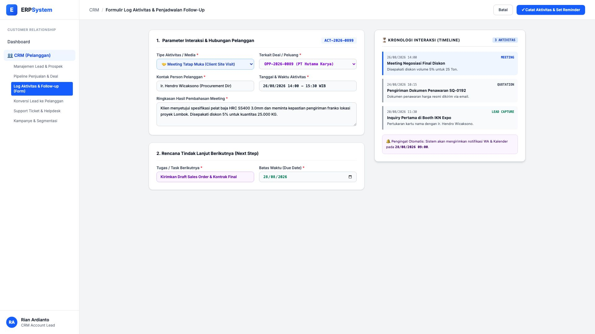
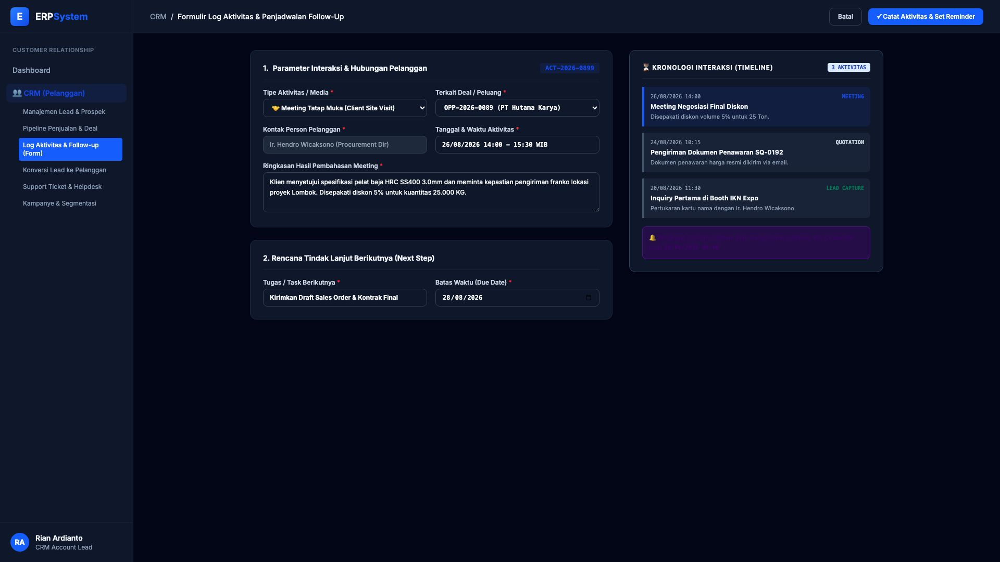

# 🎨 Design UI — Formulir Log Aktivitas & Penjadwalan Follow-Up (Data Entry Screen)

> Mockup antarmuka **Formulir Log Aktivitas & Penjadwalan Follow-Up (CRM Activity Log & Reminder Data Entry)**: desain *Split-Screen Form* dengan formulir input interaksi di sebelah kiri (Tipe meeting tatap muka, deal terkait `OPP-2026-0089 PT Hutama Karya`, kontak Ir. Hendro Wicaksono, tanggal 26/08/2026, ringkasan negosiasi diskon 5% untuk 25 Ton, task follow-up pengiriman draft SO final batas 28/08/2026) dan *Live Customer Interaction Timeline (Kronologi 3 Aktivitas: Meeting &rarr; Quotation &rarr; Lead Capture) & Notifikasi Reminder Kalender* di sebelah kanan pada modul `CRM` (Customer Relationship Management) dalam ERP System.

---

## Light Mode

---

## Dark Mode

---

## 📝 Komponen & Fitur Formulir Input

1. **Panel Kiri — Formulir Parameter Aktivitas & Hasil Pembahasan**:
   - Kode Aktivitas: `ACT-2026-0899` &bull; Media: **🤝 Meeting Tatap Muka**.
   - Pelanggan: `PT Hutama Karya Infrastruktur` &bull; Kontak: `Ir. Hendro Wicaksono`.
   - Ringkasan: Disepakati kuantitas 25.000 KG dengan diskon volume 5%.
   - Tugas Lanjutan (*Next Task*): *Kirimkan Draft Sales Order Final* &bull; Deadline: **28/08/2026**.

2. **Panel Kanan — Kronologi Timeline & Notifikasi Reminder**:
   - Kronologi Riwayat Interaksi:
     - 26/08: *Meeting Negosiasi Final Diskon*
     - 24/08: *Pengiriman Dokumen Penawaran SQ-0192*
     - 20/08: *Inquiry Pertama di Booth IKN Expo*
   - Notifikasi Pengingat Otomatis via WhatsApp & Kalender Google.
