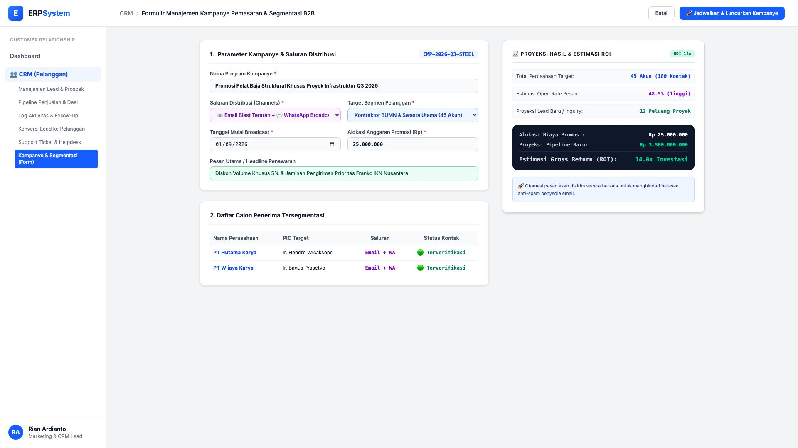
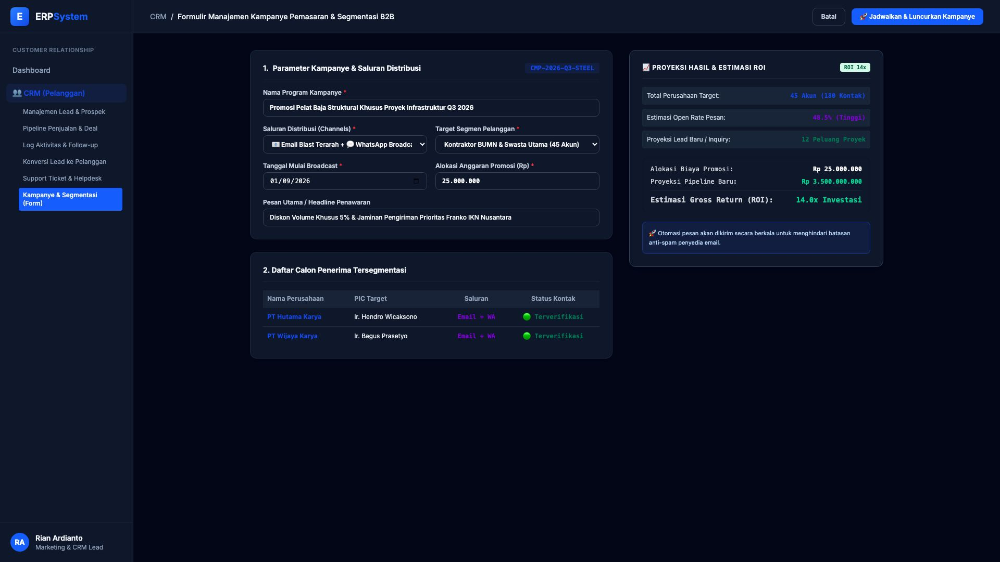

# 🎨 Design UI — Formulir Manajemen Kampanye Pemasaran & Segmentasi (Data Entry Screen)

> Mockup antarmuka **Formulir Manajemen Kampanye Pemasaran & Segmentasi B2B (CRM Campaign Management Data Entry)**: desain *Split-Screen Form* dengan formulir input kampanye di sebelah kiri (Kode Kampanye `CMP-2026-Q3-STEEL`, nama program Promosi Pelat Baja Struktural Khusus Proyek Infrastruktur, saluran Email Blast & WhatsApp Broadcast B2B, target 45 akun kontraktor BUMN/Swasta, tanggal mulai 01/09/2026, anggaran promosi Rp 25.000.000, headline diskon 5% franko IKN) dan *Live Proyeksi Hasil & Estimasi ROI (Jangkauan 45 Perusahaan / 180 Kontak PIC, Estimasi Open Rate 48.5%, Proyeksi Pipeline Baru Rp 3,5 Miliar / ROI 14x)* di sebelah kanan pada modul `CRM` (Customer Relationship Management) dalam ERP System.

---

## Light Mode

---

## Dark Mode

---

## 📝 Komponen & Fitur Formulir Input

1. **Panel Kiri — Formulir Parameter Kampanye & Saluran**:
   - Kode Program: `CMP-2026-Q3-STEEL`.
   - Nama Kampanye: *Promosi Pelat Baja Struktural Khusus Proyek Infrastruktur Q3 2026*.
   - Saluran: **📧 Email Blast Terarah + 💬 WhatsApp Broadcast**.
   - Segmen Target: **Kontraktor BUMN & Swasta Utama (45 Akun Terverifikasi)**.
   - Anggaran: **Rp 25.000.000** &bull; Mulai: **01/09/2026**.

2. **Panel Kanan — Proyeksi Hasil & Estimasi ROI**:
   - Target Audiens: **45 Akun Bisnis (180 Kontak PIC)**.
   - Estimasi Open Rate: **48.5%**.
   - Proyeksi Pipeline Baru: **Rp 3.500.000.000 (12 Peluang Proyek)**.
   - **Estimasi Return on Investment (ROI): 14.0x Investasi**.
