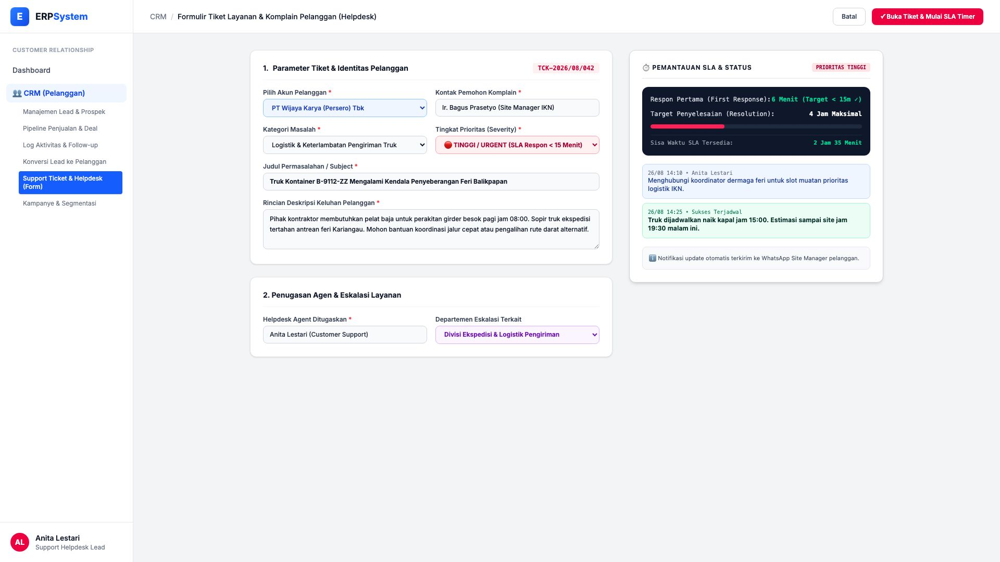
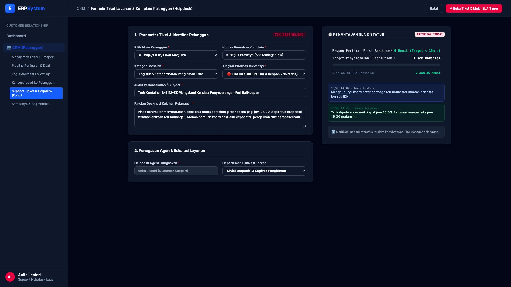

# 🎨 Design UI — Formulir Tiket Layanan & Helpdesk Pelanggan (Data Entry Screen)

> Mockup antarmuka **Formulir Tiket Layanan & Komplain Pelanggan (CRM Customer Support & Helpdesk Data Entry)**: desain *Split-Screen Form* dengan formulir input keluhan di sebelah kiri (Nomor Tiket `TCK-2026/08/042`, pelanggan PT Wijaya Karya, kontak Site Manager IKN Ir. Bagus Prasetyo, kategori kendala penyeberangan feri logistik pengiriman baja, prioritas 🔴 Tinggi/Urgent, deskripsi keluhan pelanggan, agen support Anita Lestari) dan *Live Pemantauan SLA Respon & Resolusi (First response 6 menit ✓, target resolusi 4 jam, sisa waktu 2 jam 35 menit) & Timeline Tindakan Cepat Eskalasi* di sebelah kanan pada modul `CRM` (Customer Relationship Management) dalam ERP System.

---

## Light Mode

---

## Dark Mode

---

## 📝 Komponen & Fitur Formulir Input

1. **Panel Kiri — Formulir Parameter Tiket & Penugasan**:
   - Nomor Tiket: `TCK-2026/08/042` &bull; Pelanggan: `PT Wijaya Karya (Persero) Tbk`.
   - Pemohon: `Ir. Bagus Prasetyo (Site Manager IKN)`.
   - Kategori: *Logistik & Keterlambatan Pengiriman Truk* &bull; Tingkat: **🔴 TINGGI / URGENT**.
   - Judul Masalah: *Truk Kontainer B-9112-ZZ Mengalami Kendala Penyeberangan Feri Balikpapan*.
   - Agen Helpdesk: *Anita Lestari*.

2. **Panel Kanan — Pemantauan SLA & Kronologi Solusi**:
   - Respon Pertama (*First Response*): **6 Menit (Target &lt; 15m ✓ Passed)**.
   - Target Resolusi: **4 Jam (Sisa Waktu: 2 Jam 35 Menit)**.
   - Kronologi Tindakan Cepat:
     - Koordinasi dengan otoritas dermaga penyeberangan feri
     - Truk berhasil dialokasikan slot penyeberangan prioritas
   - Notifikasi update otomatis ke WhatsApp Site Manager klien.
