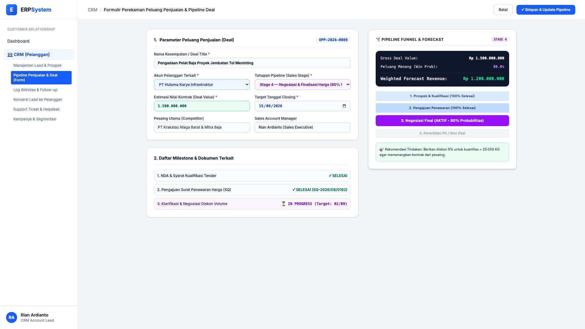
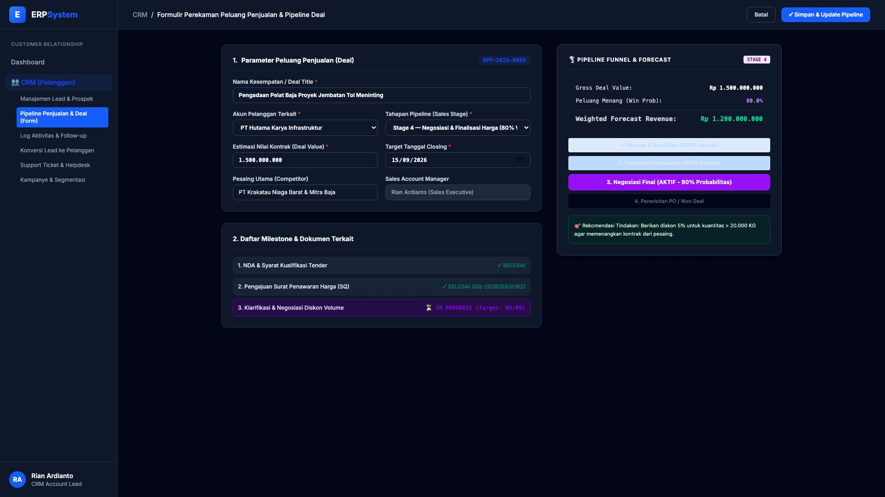

# 🎨 Design UI — Formulir Peluang Penjualan & Pipeline Funnel (Data Entry Screen)

> Mockup antarmuka **Formulir Perekaman Peluang Penjualan & Pipeline Funnel (CRM Deal & Pipeline Opportunity Data Entry)**: desain *Split-Screen Form* dengan formulir input deal di sebelah kiri (Nama deal Pengadaan Pelat Baja Proyek Jembatan Tol Meninting, akun PT Hutama Karya Infrastruktur, tahapan Stage 4 Negosiasi Final win probability 80%, nilai deal Rp 1.500.000.000, target closing 15/09/2026, kompetitor Krakatau Niaga Barat, milestone tender) dan *Live Pipeline Funnel Visualization (Tahapan 1-4) & Weighted Forecast Revenue Card (Gross Rp 1,5 M &times; 80% = Rp 1.200.000.000)* di sebelah kanan pada modul `CRM` (Customer Relationship Management) dalam ERP System.

---

## Light Mode

---

## Dark Mode

---

## 📝 Komponen & Fitur Formulir Input

1. **Panel Kiri — Formulir Parameter Peluang & Milestone**:
   - Kode Kesempatan: `OPP-2026-0089`.
   - Judul Deal: *Pengadaan Pelat Baja Proyek Jembatan Tol Meninting*.
   - Pelanggan: `PT Hutama Karya Infrastruktur` &bull; Target Closing: **15/09/2026**.
   - Tahapan: **Stage 4 — Negosiasi & Finalisasi Harga (80% Win Probability)**.
   - Nilai Deal: **Rp 1.500.000.000**.

2. **Panel Kanan — Visualisasi Funnel & Weighted Forecast**:
   - Nilai Bruto (*Gross Value*): **Rp 1.500.000.000**.
   - Peluang Menang (*Win Probability*): **80.0%**.
   - **Weighted Forecast Revenue: Rp 1.200.000.000**.
   - Rekomendasi Tindakan: Berikan diskon 5% untuk kuantitas &gt; 20.000 KG agar memenangkan kontrak.
