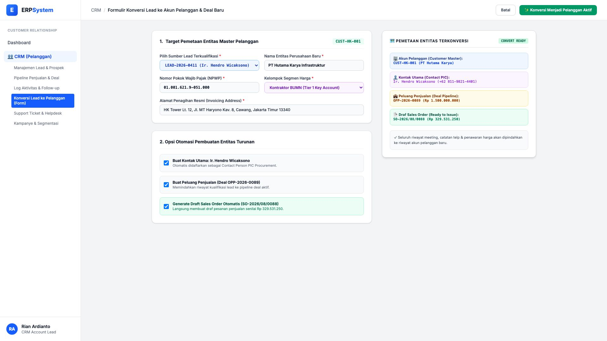
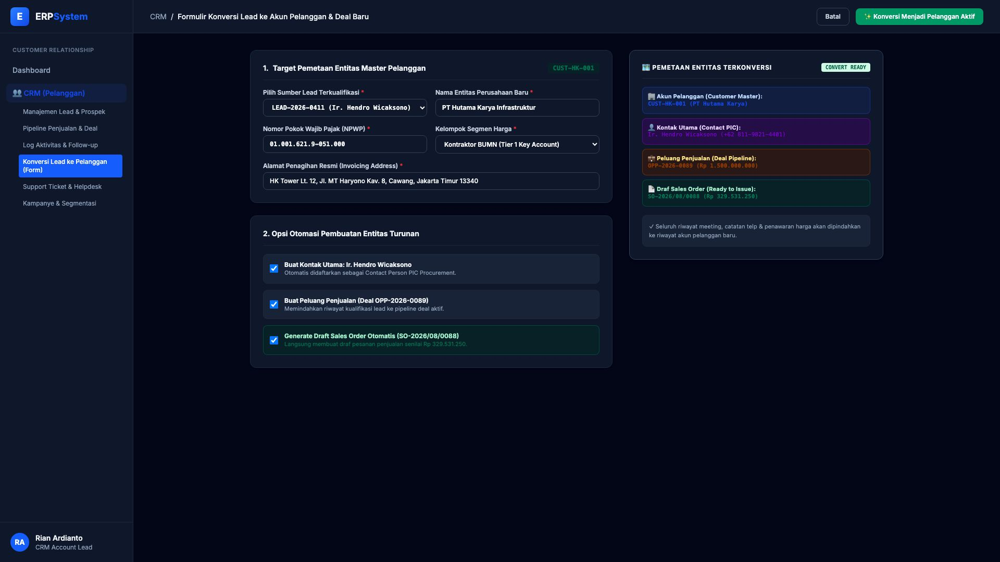

# 🎨 Design UI — Formulir Konversi Lead ke Pelanggan & Deal (Data Entry Screen)

> Mockup antarmuka **Formulir Konversi Lead ke Akun Pelanggan & Deal Baru (CRM Lead-to-Customer Conversion Data Entry)**: desain *Split-Screen Form* dengan formulir eksekusi konversi di sebelah kiri (Sumber `LEAD-2026-0411 Ir. Hendro Wicaksono`, entitas perusahaan baru PT Hutama Karya Infrastruktur, NPWP `01.001.621.9-051.000`, segmen Kontraktor BUMN, opsi otomatis: buat akun `CUST-HK-001`, buat kontak utama, buat deal `OPP-2026-0089`, buat draf SO `SO-2026/08/0088` senilai Rp 329 Jt) dan *Live Pemetaan Diagram Entitas Terkonversi (Customer &rarr; Contact &rarr; Deal &rarr; Sales Order)* di sebelah kanan pada modul `CRM` (Customer Relationship Management) dalam ERP System.

---

## Light Mode

---

## Dark Mode

---

## 📝 Komponen & Fitur Formulir Input

1. **Panel Kiri — Formulir Parameter Konversi & Entitas Target**:
   - Sumber Lead: `LEAD-2026-0411 (Ir. Hendro Wicaksono)`.
   - Nama Entitas: `PT Hutama Karya Infrastruktur`.
   - NPWP: `01.001.621.9-051.000` &bull; Segmen: **Kontraktor BUMN (Tier 1 Key Account)**.
   - Opsi Otomasi Pembuatan:
     - Kontak Person Utama PIC Procurement
     - Peluang Penjualan Deal Pipeline (`OPP-2026-0089`)
     - Draf Sales Order Otomatis (`SO-2026/08/0088` Rp 329.531.250).

2. **Panel Kanan — Pemetaan Diagram Entitas CRM**:
   - Akun Pelanggan: `CUST-HK-001 (PT Hutama Karya)`.
   - Kontak Utama: `Ir. Hendro Wicaksono`.
   - Deal Pipeline: `OPP-2026-0089 (Rp 1.500.000.000)`.
   - Integrasi Otomatis ke Modul `10_SAL` dan `3_AR`.
