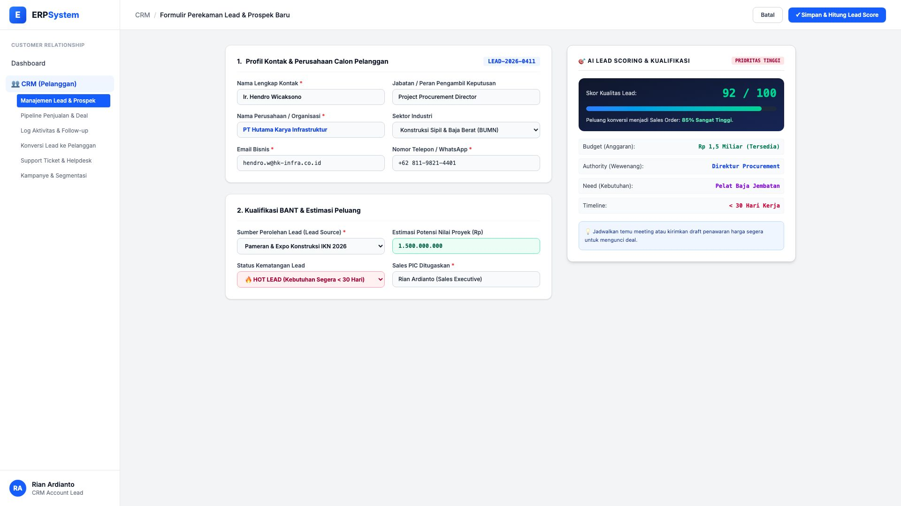
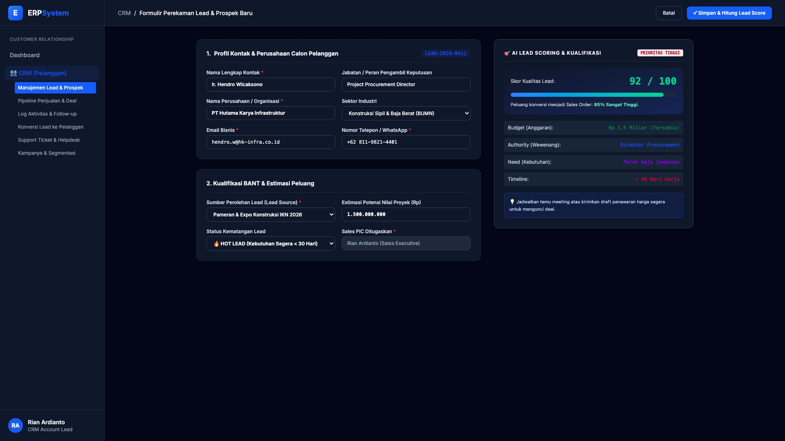

# 🎨 Design UI — Formulir Manajemen Lead & Prospek (Data Entry Screen)

> Mockup antarmuka **Formulir Perekaman Lead & Prospek Baru (CRM Lead Management Data Entry)**: desain *Split-Screen Form* dengan formulir input profil lead di sebelah kiri (Nama kontak Ir. Hendro Wicaksono, jabatan Project Procurement Director, perusahaan PT Hutama Karya Infrastruktur, sektor BUMN Konstruksi, sumber pameran IKN Expo 2026, potensi nilai proyek Rp 1.500.000.000, status Hot Lead, PIC Rian Ardianto) dan *Live AI Lead Scoring Card (Skor 92/100 🔥 Sangat Berkualitas Tinggi, Peluang Konversi 85%, Matriks Kualifikasi BANT: Budget Rp 1,5 M, Authority Direktur, Need Pelat Baja, Timeline < 30 Hari)* di sebelah kanan pada modul `CRM` (Customer Relationship Management) dalam ERP System.

---

## Light Mode

---

## Dark Mode

---

## 📝 Komponen & Fitur Formulir Input

1. **Panel Kiri — Formulir Parameter Kontak & Kualifikasi**:
   - Kode Lead: `LEAD-2026-0411` &bull; Kontak: `Ir. Hendro Wicaksono`.
   - Organisasi: **PT Hutama Karya Infrastruktur (BUMN Konstruksi)**.
   - Sumber: *Pameran & Expo Konstruksi IKN 2026*.
   - Estimasi Nilai: **Rp 1.500.000.000** &bull; Status: **🔥 HOT LEAD**.
   - Sales Person: *Rian Ardianto*.

2. **Panel Kanan — AI Lead Scoring & Analisis BANT**:
   - Skor Kualitas Lead: **92 / 100 (Prioritas Tinggi)**.
   - Peluang Konversi ke SO: **85%**.
   - Validasi BANT:
     - **Budget**: Rp 1,5 Miliar Tersedia
     - **Authority**: Direktur Procurement Pengambil Keputusan
     - **Need**: Pelat Baja Proyek Jembatan
     - **Timeline**: Kebutuhan Mendesak &lt; 30 Hari Kerja
