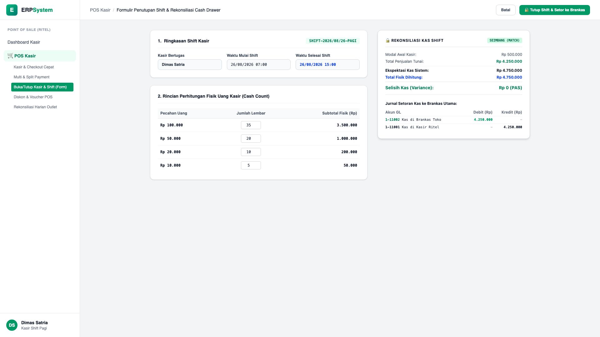
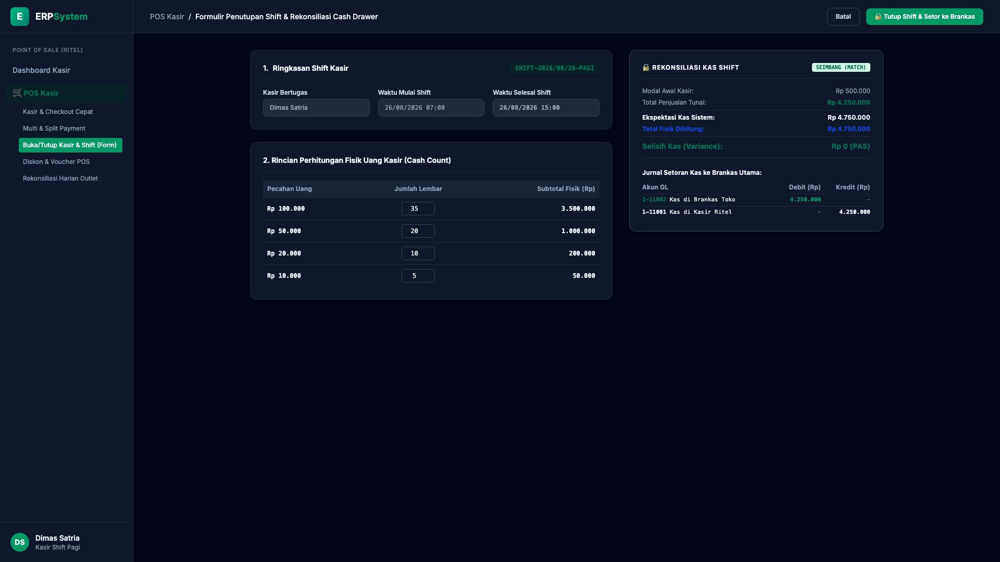

# 🎨 Design UI — Formulir Penutupan Shift & Rekonsiliasi Cash Drawer (Data Entry Screen)

> Mockup antarmuka **Formulir Penutupan Shift & Rekonsiliasi Cash Drawer (POS Shift Closing Data Entry)**: desain *Split-Screen Form* dengan formulir input cash count di sebelah kiri (Shift Pagi 07:00 - 15:00 Kasir Dimas Satria, Modal Awal Rp 500.000, Total Penjualan Tunai Rp 4.250.000, Rincian Uang Fisik Lembaran Rp 100k 35 lbr = Rp 3,5 Jt, Rp 50k 20 lbr = Rp 1 Jt, Rp 20k 10 lbr = Rp 200rb, Rp 10k 5 lbr = Rp 50rb, Total Fisik Rp 4.750.000) dan *Live Rekonsiliasi Kas Shift (Ekspektasi Kas Rp 4.750.000 vs Fisik Rp 4.750.000 / Variance Rp 0 PAS) & Jurnal GL Pemindahan Kas Kasir ke Brankas Utama Toko (Debit Kas Brankas Toko Rp 4.250.000 vs Kredit Kas di Kasir Ritel Rp 4.250.000)* di sebelah kanan pada modul `POS` (Point of Sale) dalam ERP System.

---

## Light Mode

---

## Dark Mode

---

## 📝 Komponen & Fitur Formulir Input

1. **Panel Kiri — Formulir Parameter Shift & Perhitungan Fisik (Cash Count)**:
   - Nomor Shift: `SHIFT-2026/08/26-PAGI` &bull; Kasir: `Dimas Satria`.
   - Waktu Shift: **07:00 - 15:00 WIB**.
   - Input Pecahan Lembar Uang Tunai Kasir:
     - 35 Lembar Rp 100.000 (Rp 3.500.000)
     - 20 Lembar Rp 50.000 (Rp 1.000.000)
     - 10 Lembar Rp 20.000 (Rp 200.000)
     - 5 Lembar Rp 10.000 (Rp 50.000)
     - Total Fisik Terhitung: **Rp 4.750.000**

2. **Panel Kanan — Rekonsiliasi Kas & Jurnal Akuntansi GL**:
   - Modal Awal: Rp 500.000 + Penjualan Tunai: Rp 4.250.000 = **Ekspektasi Kas Rp 4.750.000**.
   - **Selisih Kas (Variance): Rp 0 (PAS / Match)**.
   - Jurnal Akuntansi Setoran ke Brankas:
     - Debit `1-11002 Kas di Brankas Toko`: Rp 4.250.000
     - Kredit `1-11001 Kas di Kasir Ritel`: Rp 4.250.000
