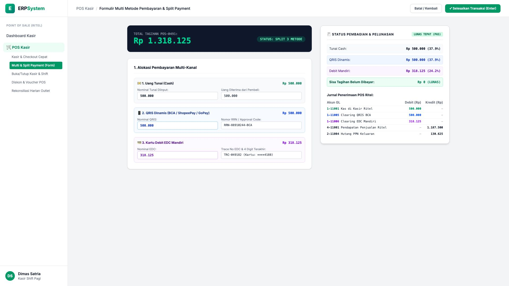
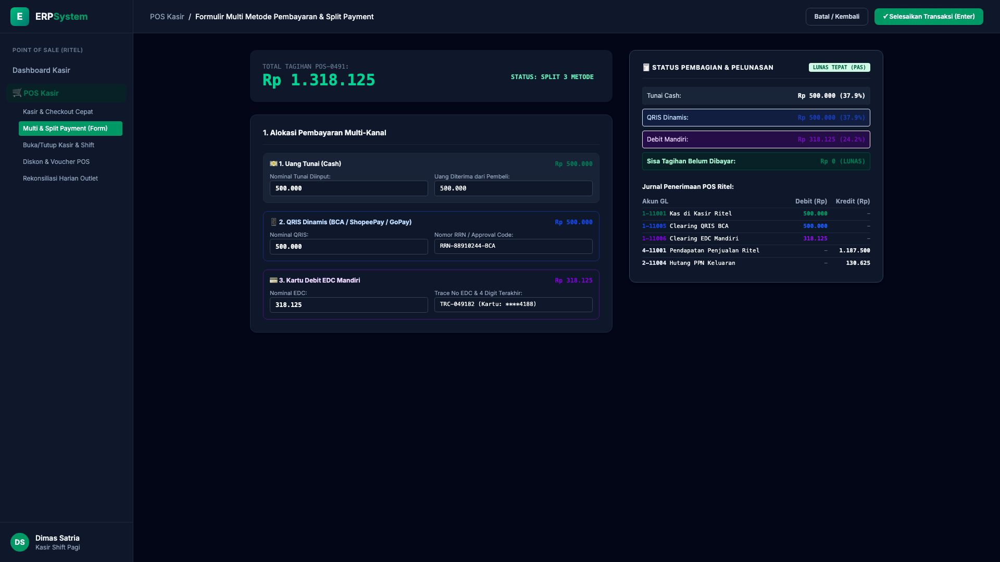

# 🎨 Design UI — Formulir Multi Metode Pembayaran & Split Payment (Data Entry Screen)

> Mockup antarmuka **Formulir Multi Metode Pembayaran & Split Payment (POS Multi-Payment Data Entry)**: desain *Split-Screen Form* dengan formulir alokasi pembayaran multi-kanal di sebelah kiri (Total Tagihan Rp 1.318.125, Metode 1 Tunai Rp 500.000, Metode 2 QRIS Dinamis BCA Rp 500.000 RRN `QR-88910244-BCA`, Metode 3 Kartu Debit EDC Mandiri Rp 318.125 Trace `TRC-049182`) dan *Live Status Pelunasan Transaksi & Jurnal GL Multi-Kanal Penerimaan Kasir (Debit Kas Kasir Rp 500rb, Debit Clearing QRIS Rp 500rb, Debit Clearing EDC Rp 318rb vs Kredit Pendapatan Ritel Rp 1,18 Jt & Hutang PPN Rp 130rb)* di sebelah kanan pada modul `POS` (Point of Sale) dalam ERP System.

---

## Light Mode

---

## Dark Mode

---

## 📝 Komponen & Fitur Formulir Input

1. **Panel Kiri — Formulir Alokasi Pembayaran Multi-Kanal**:
   - Total Tagihan Transaksi: **Rp 1.318.125**.
   - Kanal 1 (Cash): **Rp 500.000**.
   - Kanal 2 (QRIS Dinamis BCA): **Rp 500.000 (RRN: QR-88910244-BCA)**.
   - Kanal 3 (Debit EDC Mandiri): **Rp 318.125 (Trace No: TRC-049182)**.

2. **Panel Kanan — Ringkasan Pelunasan & Jurnal Akuntansi GL**:
   - Status Tagihan: **Lunas Pas (Sisa Tagihan: Rp 0)**.
   - Jurnal Kas & Bank Otomatis:
     - Debit `1-11001 Kas di Kasir Ritel`: Rp 500.000
     - Debit `1-11005 Clearing QRIS BCA`: Rp 500.000
     - Debit `1-11006 Clearing EDC Mandiri`: Rp 318.125
     - Kredit `4-11001 Pendapatan Penjualan Ritel`: Rp 1.187.500
     - Kredit `2-11004 Hutang PPN Keluaran`: Rp 130.625
