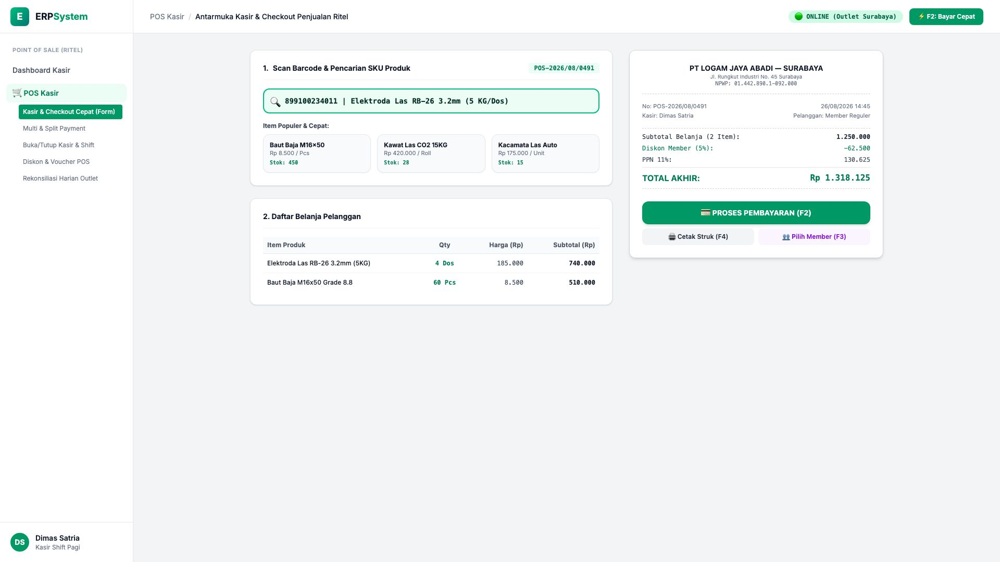
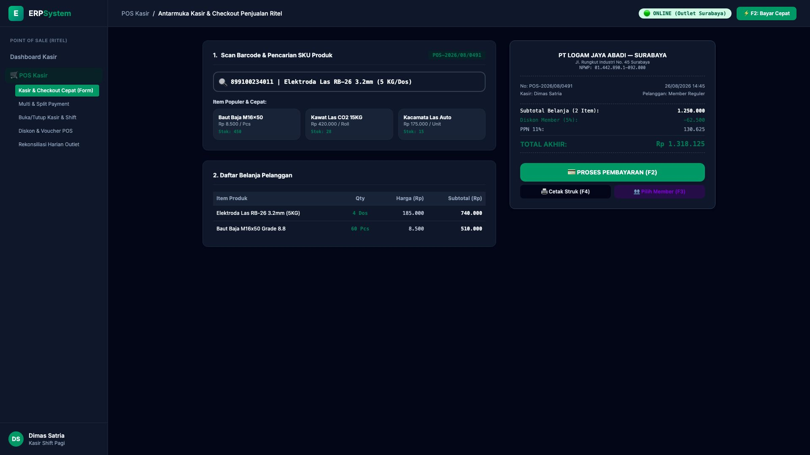

# 🎨 Design UI — Formulir Kasir & Checkout Cepat Penjualan Ritel (Data Entry Screen)

> Mockup antarmuka **Formulir Kasir & Checkout Penjualan Ritel (POS Cashier Checkout Data Entry)**: desain *Split-Screen Form* dengan input kasir di sebelah kiri (Nomor transaksi `POS-2026/08/0491`, Kasir Dimas Satria di Outlet Surabaya, scan barcode `899100234011` Elektroda Las RB-26 5KG 4 Dos, Baut Baja M16 60 Pcs, grid tombol item cepat) dan *Live Struk Thermal Penjualan Ritel & Rincian Total Bayar (Subtotal Rp 1.250.000, Diskon Member 5% Rp 62.500, PPN 11% Rp 130.625, Grand Total Rp 1.318.125, Tombol Shortcut F2 Bayar Cepat & F4 Cetak Struk)* di sebelah kanan pada modul `POS` (Point of Sale) dalam ERP System.

---

## Light Mode

---

## Dark Mode

---

## 📝 Komponen & Fitur Formulir Input

1. **Panel Kiri — Formulir Scan Barcode & Grid Item Cepat**:
   - Nomor Transaksi: `POS-2026/08/0491` &bull; Kasir: `Dimas Satria`.
   - Outlet: **Cabang Toko Ritel Surabaya (Online Sync)**.
   - Input Barcode Scanner & SKU Finder.
   - Grid Item Populer: *Baut Baja M16, Kawat Las CO2, Kacamata Las Auto*.
   - Keranjang Belanja: 4 Dos Elektroda Las + 60 Pcs Baut Baja.

2. **Panel Kanan — Struk Thermal & Panel Pembayaran Cepat**:
   - Subtotal Belanja: **Rp 1.250.000**.
   - Diskon Member: **-Rp 62.500 (5%)**.
   - PPN 11%: **Rp 130.625**.
   - **Grand Total Akhir: Rp 1.318.125**.
   - Tombol Shortcut Kasir: `F2: Bayar`, `F3: Member`, `F4: Cetak Struk`.
