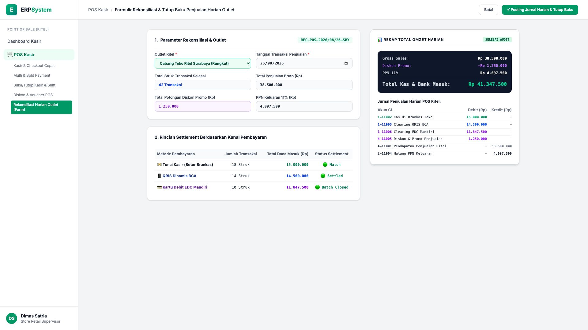
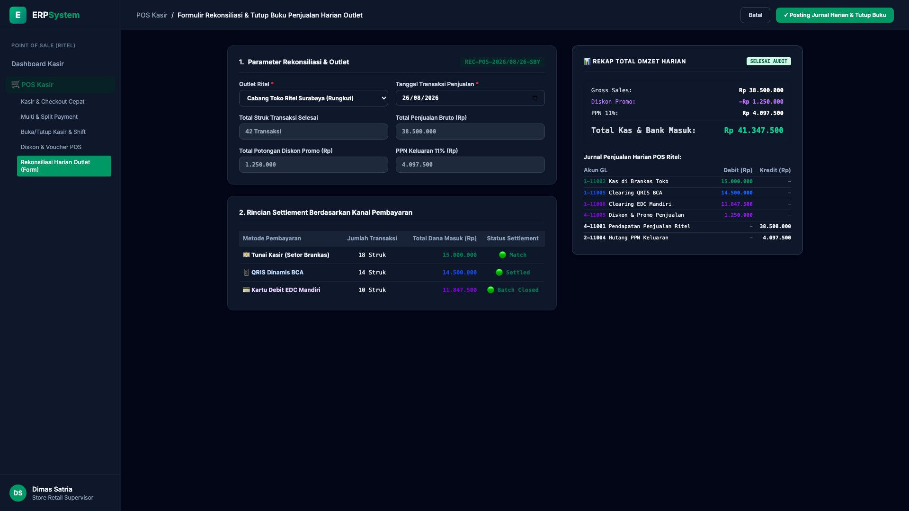

# 🎨 Design UI — Formulir Rekonsiliasi & Tutup Buku Penjualan Harian Outlet (Data Entry Screen)

> Mockup antarmuka **Formulir Rekonsiliasi Penjualan Harian Outlet (POS Daily Sales Reconciliation Data Entry)**: desain *Split-Screen Form* dengan formulir verifikasi settlement harian di sebelah kiri (Outlet Cabang Surabaya Rungkut, tanggal 26/08/2026, 42 transaksi selesai, penjualan bruto Rp 38.500.000, diskon promo Rp 1.250.000, PPN 11% Rp 4.097.500, rincian settlement: Tunai Rp 15 Jt, QRIS BCA Rp 14,5 Jt, EDC Mandiri Rp 11,84 Jt) dan *Live Rekap Total Omzet Harian (Total Kas & Bank Rp 41.347.500) & Jurnal GL Penjualan Ritel Harian Terkonsolidasi* di sebelah kanan pada modul `POS` (Point of Sale) dalam ERP System.

---

## Light Mode

---

## Dark Mode

---

## 📝 Komponen & Fitur Formulir Input

1. **Panel Kiri — Formulir Parameter Rekonsiliasi & Multi-Kanal Settlement**:
   - Kode Rekonsiliasi: `REC-POS-2026/08/26-SBY`.
   - Outlet: **Cabang Toko Ritel Surabaya (Rungkut)** &bull; Tanggal: **26/08/2026**.
   - Volume: **42 Struk Transaksi Selesai**.
   - Rincian Kanal Settlement:
     - 💵 Tunai Kasir: Rp 15.000.000 (18 Struk)
     - 📱 QRIS Dinamis BCA: Rp 14.500.000 (14 Struk)
     - 💳 Kartu Debit EDC Mandiri: Rp 11.847.500 (10 Struk)

2. **Panel Kanan — Rekapitulasi Omzet & Jurnal Akuntansi GL**:
   - Gross Sales: Rp 38.500.000 &bull; Diskon Promo: -Rp 1.250.000.
   - PPN Keluaran 11%: Rp 4.097.500.
   - **Total Penerimaan Kas & Bank: Rp 41.347.500**.
   - Jurnal Akuntansi Konsolidasi Harian:
     - Debit `1-11002 Kas di Brankas Toko`: Rp 15.000.000
     - Debit `1-11005 Clearing QRIS BCA`: Rp 14.500.000
     - Debit `1-11006 Clearing EDC Mandiri`: Rp 11.847.500
     - Debit `4-11005 Diskon & Promo Penjualan`: Rp 1.250.000
     - Kredit `4-11001 Pendapatan Penjualan Ritel`: Rp 38.500.000
     - Kredit `2-11004 Hutang PPN Keluaran`: Rp 4.097.500
