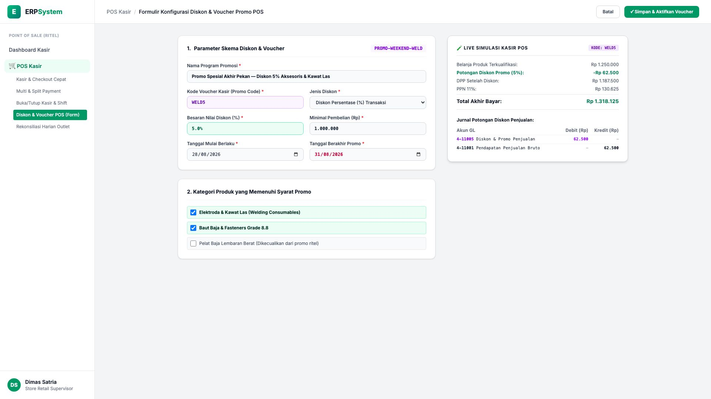
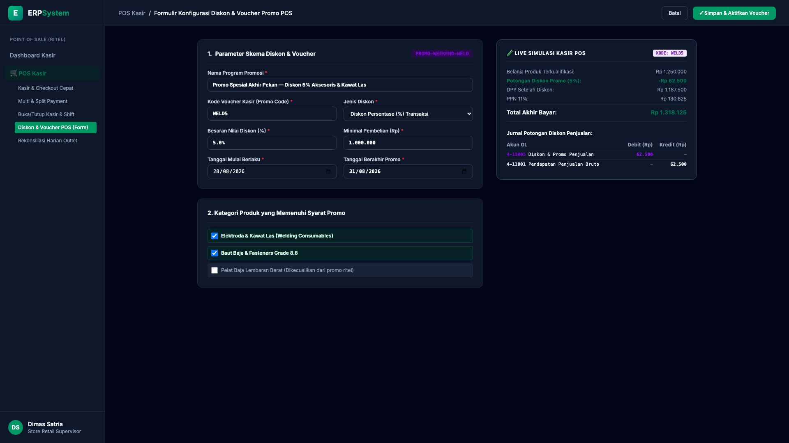

# 🎨 Design UI — Formulir Konfigurasi Diskon & Voucher Promo POS (Data Entry Screen)

> Mockup antarmuka **Formulir Konfigurasi Diskon & Voucher Promo POS (POS Promotion Data Entry)**: desain *Split-Screen Form* dengan formulir konfigurasi diskon di sebelah kiri (Kode promo `PROMO-WEEKEND-WELD`, Nama Promo Diskon 5% Aksesoris & Kawat Las, Kode Voucher `WELD5`, Tipe Diskon Persentase 5%, Minimal Belanja Rp 1.000.000, Masa Berlaku 28/08/2026 - 31/08/2026, Kategori Memenuhi Syarat: Kawat Las & Baut Baja Fasteners) dan *Live Simulator Keranjang Belanja Kasir POS (Belanja Rp 1.250.000 &rarr; Potongan Voucher Rp 62.500) & Jurnal GL Potongan Diskon Penjualan (Debit Diskon Promo Rp 62.500 vs Kredit Pendapatan Bruto Rp 62.500)* di sebelah kanan pada modul `POS` (Point of Sale) dalam ERP System.

---

## Light Mode

---

## Dark Mode

---

## 📝 Komponen & Fitur Formulir Input

1. **Panel Kiri — Formulir Parameter Diskon & Lingkup Produk**:
   - Kode Promo: `PROMO-WEEKEND-WELD` &bull; Voucher Code: `WELD5`.
   - Nama: *Promo Spesial Akhir Pekan &mdash; Diskon 5% Aksesoris & Kawat Las*.
   - Nilai Diskon: **5.0%** &bull; Minimum Belanja: **Rp 1.000.000**.
   - Masa Berlaku: **28/08/2026 s/d 31/08/2026**.
   - Lingkup Produk: *Elektroda/Kawat Las & Fasteners Baut Baja*.

2. **Panel Kanan — Simulator Kasir & Jurnal Akuntansi GL**:
   - Simulasi Belanja: Rp 1.250.000 &rarr; **Hemat Rp 62.500 (Voucher WELD5)**.
   - Total Akhir Bayar: **Rp 1.318.125 (Termasuk PPN 11%)**.
   - Jurnal Akuntansi Otomatis:
     - Debit `4-11005 Diskon & Promo Penjualan`: Rp 62.500
     - Kredit `4-11001 Pendapatan Penjualan Bruto`: Rp 62.500
