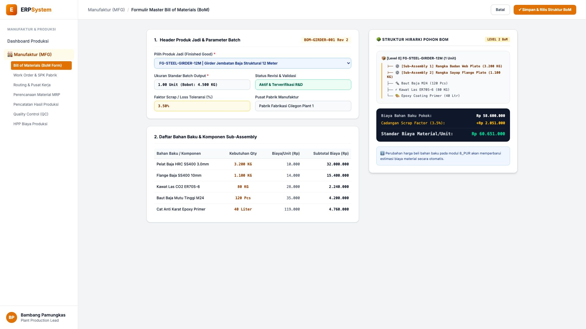
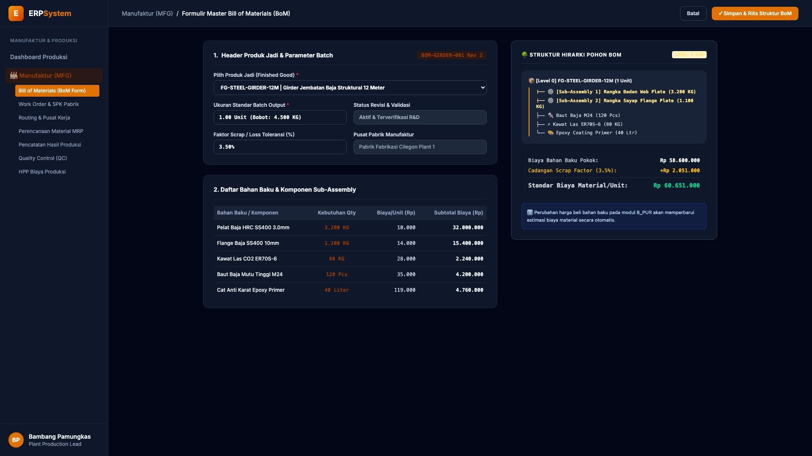

# 🎨 Design UI — Formulir Master Bill of Materials (BoM) (Data Entry Screen)

> Mockup antarmuka **Formulir Master Bill of Materials (BoM Data Entry)**: desain *Split-Screen Form* dengan formulir input rincian material di sebelah kiri (Kode `BOM-GIRDER-001 Rev 2`, produk jadi `FG-STEEL-GIRDER-12M` Girder Jembatan Baja 12 Meter 4.500 KG, toleransi scrap 3.5%, rincian komponen: Pelat Baja HRC SS400 3.200 KG, Flange Baja 1.100 KG, Kawat Las 80 KG, Baut Baja M24 120 Pcs, Cat Epoxy Primer 40 Liter) dan *Live Struktur Pohon Komponen Multi-Level BoM Tree & Standar Biaya Material HPP (Rp 60.651.000 / Unit)* di sebelah kanan pada modul `MFG` (Manufaktur / Produksi) dalam ERP System.

---

## Light Mode

---

## Dark Mode

---

## 📝 Komponen & Fitur Formulir Input

1. **Panel Kiri — Formulir Parameter Master BoM & Komponen**:
   - Kode BoM: `BOM-GIRDER-001 Rev 2` &bull; Status: **Aktif & Terverifikasi R&D**.
   - Produk Target: `FG-STEEL-GIRDER-12M (Girder Jembatan Baja 12M)`.
   - Batch Output: **1.00 Unit (Bobot Total: 4.500 KG)**.
   - Scrap Factor: **3.50%**.
   - Pabrik: *Pabrik Fabrikasi Cilegon Plant 1*.

2. **Panel Kanan — Visualisasi Pohon Hirarki & Kalkulasi Biaya**:
   - Pohon Multi-Level BoM:
     - Level 0: Produk Jadi Girder 12M
     - Level 1: Sub-Assembly Rangka Badan & Rangka Sayap
     - Level 2: Komponen Baut M24, Kawat Las CO2 & Cat Epoxy Primer
   - Standar Biaya Material Pokok: **Rp 58.600.000**.
   - Cadangan Scrap Toleransi: **Rp 2.051.000**.
   - **Total Standar Biaya Material/Unit: Rp 60.651.000**.
