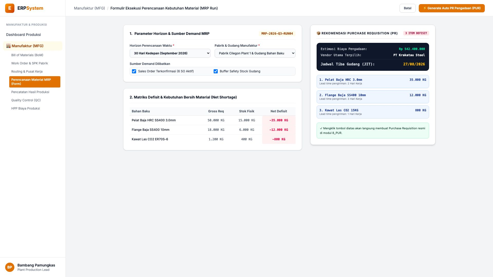
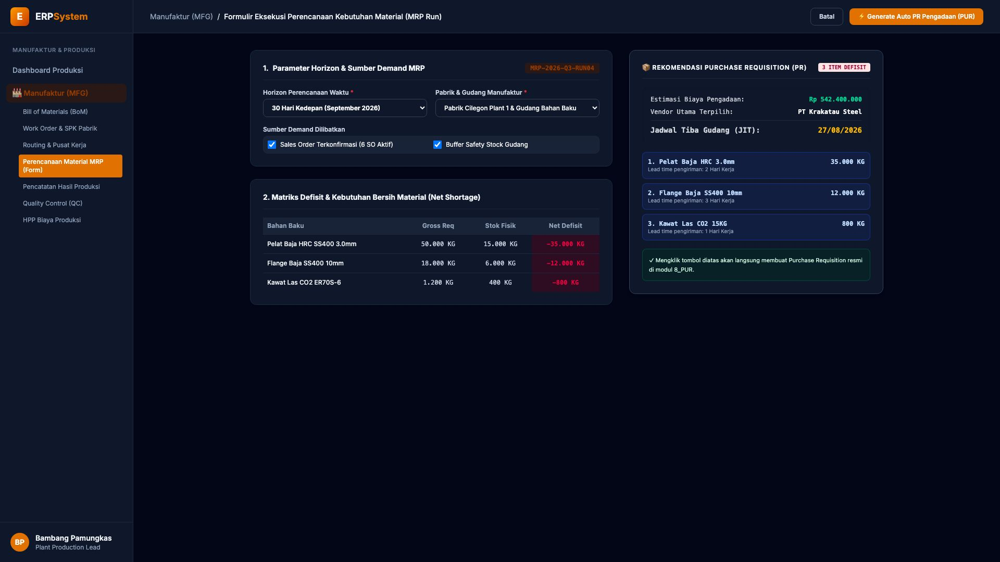

# 🎨 Design UI — Formulir Perencanaan Kebutuhan Material (MRP Run) (Data Entry Screen)

> Mockup antarmuka **Formulir Eksekusi Perencanaan Kebutuhan Material (MRP Material Planning Data Entry)**: desain *Split-Screen Form* dengan formulir input parameter MRP di sebelah kiri (Horizon perencanaan 30 hari kedepan September 2026, pabrik Cilegon Plant 1, sumber demand 6 Sales Order aktif, kalkulasi defisit net material: Pelat Baja HRC kurang 35.000 KG, Flange Baja kurang 12.000 KG, Kawat Las CO2 kurang 800 KG) dan *Live Rekomendasi Purchase Requisition (PR) Otomatis ke Modul 8_PUR (Estimasi Total Biaya Rp 542.400.000, Vendor Krakatau Steel & Jadwal Tiba JIT 27/08/2026)* di sebelah kanan pada modul `MFG` (Manufaktur / Produksi) dalam ERP System.

---

## Light Mode

---

## Dark Mode

---

## 📝 Komponen & Fitur Formulir Input

1. **Panel Kiri — Formulir Parameter Simulasi MRP & Matriks Defisit**:
   - Kode MRP Run: `MRP-2026-Q3-RUN04` &bull; Horizon: **30 Hari Kedepan**.
   - Pabrik: *Pabrik Cilegon Plant 1 & Gudang Bahan Baku*.
   - Sumber Permintaan: **6 Sales Order Terkonfirmasi + Safety Stock**.
   - Hasil Kalkulasi Kebutuhan Bersih (*Net Shortage*):
     - Pelat Baja HRC SS400 3.0mm: **Defisit -35.000 KG**
     - Flange Baja SS400 10mm: **Defisit -12.000 KG**
     - Kawat Las CO2 ER70S-6: **Defisit -800 KG**

2. **Panel Kanan — Rekomendasi Pengadaan & Jadwal Just-In-Time (JIT)**:
   - Estimasi Total Biaya Pengadaan: **Rp 542.400.000**.
   - Vendor Terpilih: `PT Krakatau Steel`.
   - Jadwal Kedatangan Bahan Baku JIT: **27/08/2026**.
   - Integrasi Otomatis: Generate Purchase Requisition (PR) langsung ke modul `8_PUR`.
