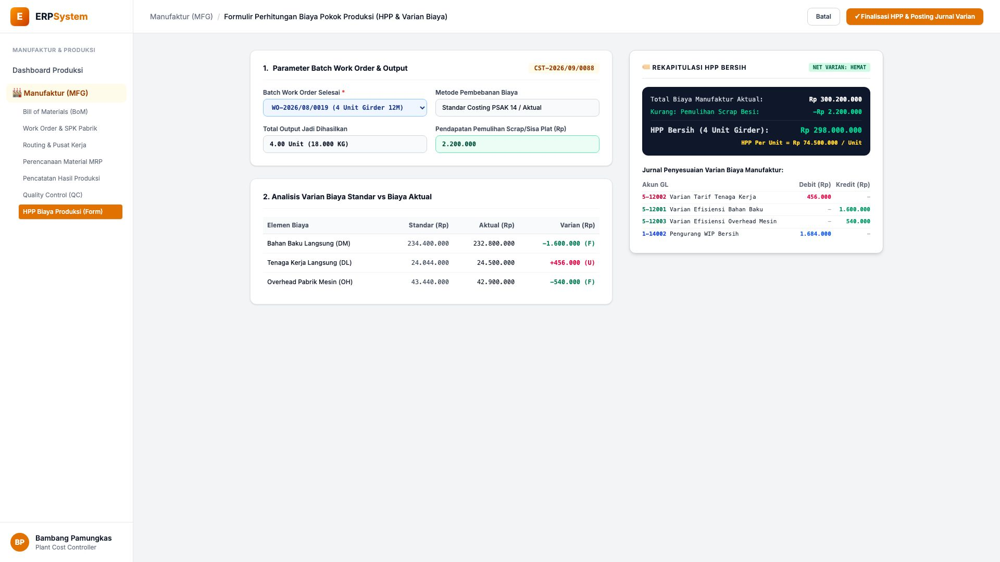
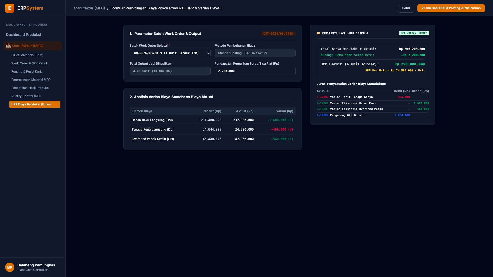

# 🎨 Design UI — Formulir Perhitungan Biaya Pokok Produksi (HPP & Varian) (Data Entry Screen)

> Mockup antarmuka **Formulir Perhitungan Biaya Pokok Produksi & Analisis Varian (Manufacturing Costing & Variance Data Entry)**: desain *Split-Screen Form* dengan formulir input varian biaya di sebelah kiri (Batch `WO-2026/08/0019` 4 Unit Girder 12M, pemulihan scrap besi Rp 2.200.000, analisis varian: Bahan Baku Langsung DM Standar Rp 234,4 Jt vs Aktual Rp 232,8 Jt hemat Rp 1,6 Jt, Tenaga Kerja Langsung DL selisih +Rp 456rb, Overhead Mesin OH hemat Rp 540rb) dan *Live Rekapitulasi HPP Bersih (HPP Aktual Rp 74.500.000 / Unit) & Jurnal GL Penyesuaian Varian Biaya Manufaktur* di sebelah kanan pada modul `MFG` (Manufaktur / Produksi) dalam ERP System.

---

## Light Mode

---

## Dark Mode

---

## 📝 Komponen & Fitur Formulir Input

1. **Panel Kiri — Formulir Parameter Biaya & Matriks Varian**:
   - Kode Dokumen: `CST-2026/09/0088` &bull; Ref WO: `WO-2026/08/0019`.
   - Output: **4.00 Unit Girder 12M (18.000 KG)**.
   - Pendapatan Pemulihan Sisa Besi Scrap: **Rp 2.200.000**.
   - Analisis Varian Biaya Standar vs Aktual:
     - Direct Material: Standar Rp 234,4 Jt vs Aktual Rp 232,8 Jt (**Hemat -Rp 1.600.000 Favorable**)
     - Direct Labor: Standar Rp 24,04 Jt vs Aktual Rp 24,5 Jt (**Lebih +Rp 456.000 Unfavorable**)
     - Factory Overhead: Standar Rp 43,44 Jt vs Aktual Rp 42,9 Jt (**Hemat -Rp 540.000 Favorable**)

2. **Panel Kanan — Rekapitulasi HPP Unit & Jurnal Akuntansi GL**:
   - Total Biaya Manufaktur Aktual: Rp 300.200.000.
   - Dikurangi Pemulihan Scrap: -Rp 2.200.000.
   - **HPP Bersih Aktual: Rp 298.000.000 (Rp 74.500.000 / Unit)**.
   - Jurnal Akuntansi Varian Biaya:
     - Debit `5-12002 Varian Tarif Tenaga Kerja`: Rp 456.000
     - Debit `1-14002 Pengurang WIP Bersih`: Rp 1.684.000
     - Kredit `5-12001 Varian Efisiensi Bahan Baku`: Rp 1.600.000
     - Kredit `5-12003 Varian Efisiensi Overhead Mesin`: Rp 540.000
