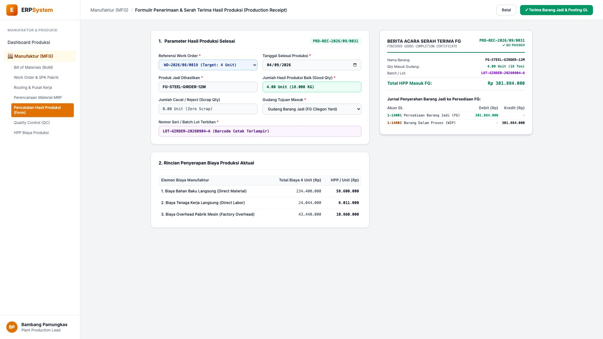
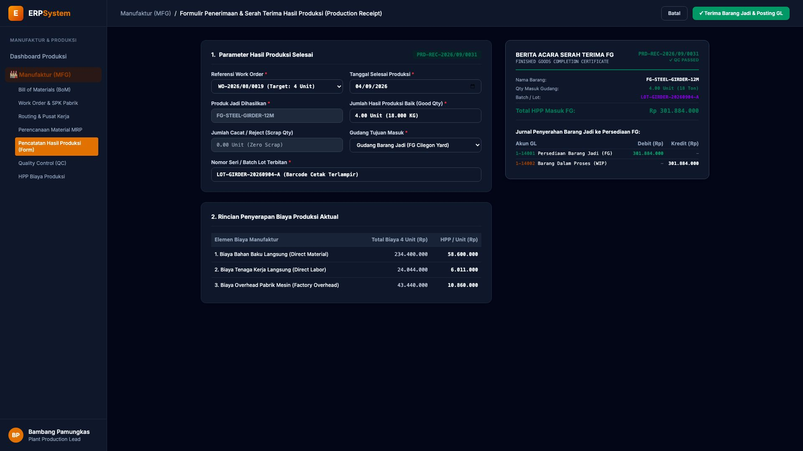

# 🎨 Design UI — Formulir Penerimaan Hasil Produksi & Serah Terima FG (Data Entry Screen)

> Mockup antarmuka **Formulir Penerimaan Hasil Produksi & Serah Terima Barang Jadi (Production Receipt & FG Output Data Entry)**: desain *Split-Screen Form* dengan formulir input penerimaan barang jadi di sebelah kiri (Nomor `PRD-REC-2026/09/0031`, Ref Work Order `WO-2026/08/0019`, produk jadi Girder Jembatan `FG-STEEL-GIRDER-12M`, Qty Baik 4.00 Unit / 18 Ton, Zero Scrap, Gudang Tujuan FG Cilegon, Lot `LOT-GIRDER-20260904-A`, serapan biaya: Bahan Baku Langsung Rp 234,4 Jt, Tenaga Kerja Langsung Rp 24 Jt, Overhead Mesin Rp 43,4 Jt) dan *Live Berita Acara Serah Terima Barang Jadi (Finished Goods Certificate QC Passed) & Jurnal GL Pemindahan WIP ke Persediaan FG (Debit Persediaan Barang Jadi FG Rp 301.884.000 vs Kredit Barang Dalam Proses WIP Rp 301.884.000)* di sebelah kanan pada modul `MFG` (Manufaktur / Produksi) dalam ERP System.

---

## Light Mode

---

## Dark Mode

---

## 📝 Komponen & Fitur Formulir Input

1. **Panel Kiri — Formulir Parameter Output Jadi & Serapan Biaya**:
   - Nomor Penerimaan: `PRD-REC-2026/09/0031` &bull; Ref WO: `WO-2026/08/0019`.
   - Produk: `FG-STEEL-GIRDER-12M` &bull; Tanggal Selesai: **04/09/2026**.
   - Output Diterima: **4.00 Unit (18.000 KG)** &bull; Scrap: **0.00 Unit**.
   - Gudang Masuk: *Gudang Barang Jadi (FG Cilegon Yard)*.
   - Batch / Lot: `LOT-GIRDER-20260904-A`.

2. **Panel Kanan — Sertifikat Selesai & Jurnal Akuntansi GL**:
   - Total Penyerapan Biaya Produksi: **Rp 301.884.000 (HPP Rp 75.471.000/Unit)**.
   - Status Inspeksi QC: **✓ QC PASSED**.
   - Jurnal Akuntansi Penyelesaian WIP:
     - Debit `1-14001 Persediaan Barang Jadi (FG)`: Rp 301.884.000
     - Kredit `1-14002 Barang Dalam Proses (WIP)`: Rp 301.884.000
