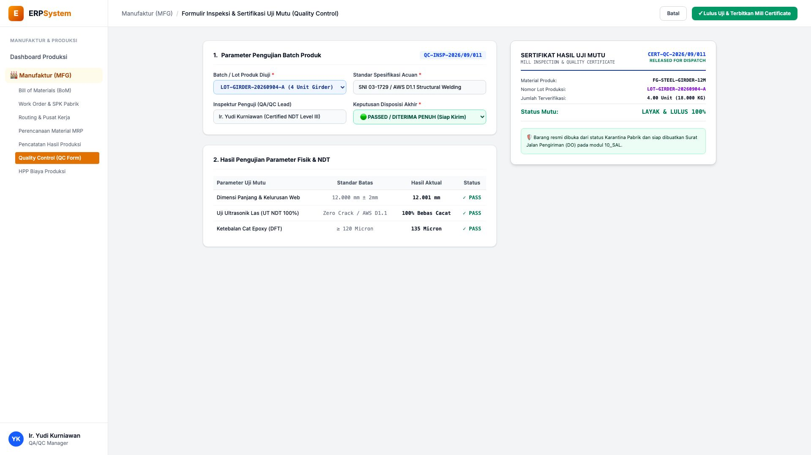
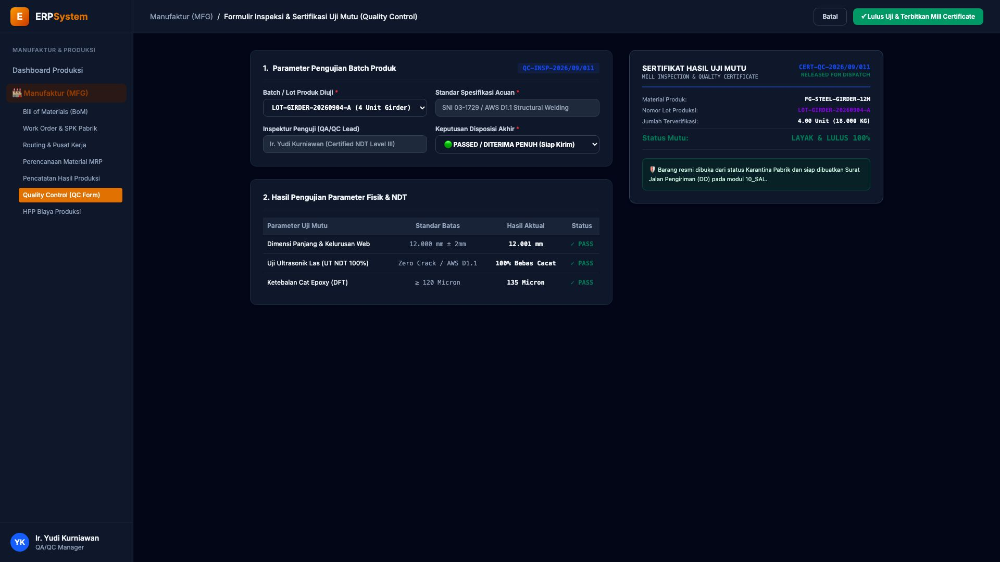

# 🎨 Design UI — Formulir Inspeksi Kontrol Kualitas Produksi (QC) (Data Entry Screen)

> Mockup antarmuka **Formulir Inspeksi & Sertifikasi Uji Mutu Produksi (Manufacturing Quality Control Data Entry)**: desain *Split-Screen Form* dengan formulir input parameter pengujian di sebelah kiri (Nomor laporan `QC-INSP-2026/09/011`, batch produk `LOT-GIRDER-20260904-A`, standar SNI 03-1729 / AWS D1.1, inspektur Ir. Yudi Kurniawan, hasil uji: Dimensi kelurusan 12.001mm PASS, Uji Ultrasonik NDT 100% Bebas Cacat PASS, Ketebalan cat 135 Micron PASS, keputusan Disposisi PASSED Diterima Penuh) dan *Live Sertifikat Hasil Uji Mutu Resmi (Mill Inspection & Quality Release Certificate) & Status Buka Karantina Siap Kirim* di sebelah kanan pada modul `MFG` (Manufaktur / Produksi) dalam ERP System.

---

## Light Mode

---

## Dark Mode

---

## 📝 Komponen & Fitur Formulir Input

1. **Panel Kiri — Formulir Parameter Pengujian & Hasil NDT**:
   - Nomor Laporan: `QC-INSP-2026/09/011` &bull; Lot: `LOT-GIRDER-20260904-A`.
   - Standar Acuan: **SNI 03-1729 / AWS D1.1 Structural Welding**.
   - Hasil Pengujian:
     - Dimensi Panjang & Kelurusan: **12.001 mm (Batas 12.000 ± 2mm ✓ PASS)**
     - Uji Ultrasonik NDT: **100% Bebas Cacat Retak / Porositas (✓ PASS)**
     - Ketebalan Cat Epoxy DFT: **135 Micron (Batas &ge; 120 &mu;m ✓ PASS)**
   - Keputusan: **🟢 PASSED / DITERIMA PENUH (Release to Ship)**.

2. **Panel Kanan — Sertifikat Mutu & Pelepasan Pengiriman**:
   - Sertifikat Resmi *Mill Inspection & Quality Release Certificate*.
   - Status Karantina: *Released for Dispatch (Siap Dibuatkan Surat Jalan DO di 10_SAL)*.
