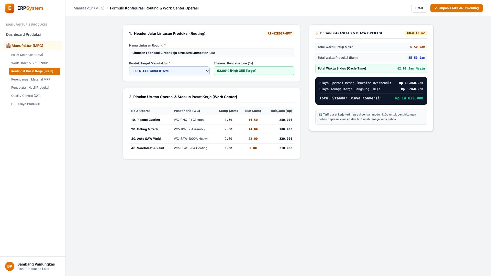
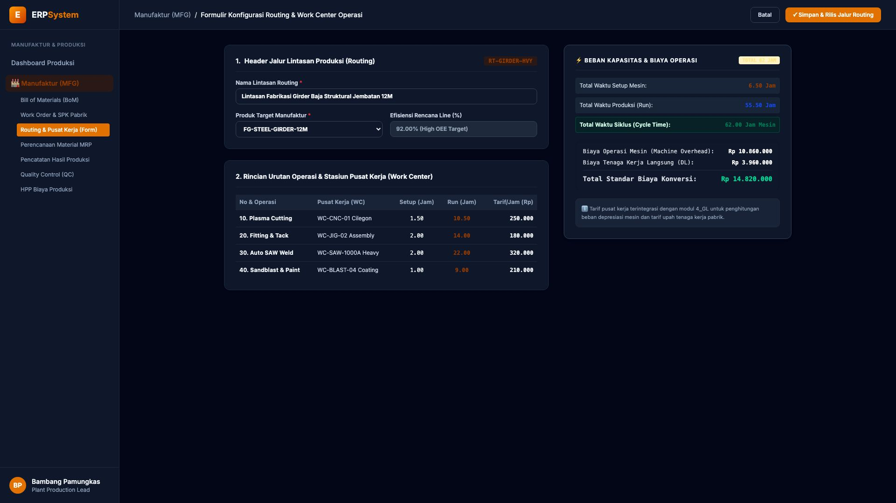

# 🎨 Design UI — Formulir Routing & Work Center Operasi Pabrik (Data Entry Screen)

> Mockup antarmuka **Formulir Konfigurasi Routing & Pusat Kerja Mesin (MFG Routing & Work Center Data Entry)**: desain *Split-Screen Form* dengan formulir input urutan operasi pabrik di sebelah kiri (Kode Routing `RT-GIRDER-HVY`, produk target `FG-STEEL-GIRDER-12M`, target efisiensi line 92%, urutan operasi: Op 10 Plasma Cutting CNC 10.5 Jam @ Rp 250rb, Op 20 Fitting Jig 14 Jam @ Rp 180rb, Op 30 Auto SAW Weld 22 Jam @ Rp 320rb, Op 40 Sandblast & Epoxy Paint 9 Jam @ Rp 210rb) dan *Live Beban Kapasitas Mesin (Total Siklus 62.00 Jam) & Estimasi Standar Biaya Konversi (Overhead Mesin Rp 10.860.000 + Tenaga Kerja Langsung Rp 3.960.000 = Rp 14.820.000)* di sebelah kanan pada modul `MFG` (Manufaktur / Produksi) dalam ERP System.

---

## Light Mode

---

## Dark Mode

---

## 📝 Komponen & Fitur Formulir Input

1. **Panel Kiri — Formulir Parameter Routing & Daftar Stasiun Kerja**:
   - Kode Routing: `RT-GIRDER-HVY` &bull; Target OEE: **92.00%**.
   - Nama: *Lintasan Fabrikasi Girder Baja Struktural Jembatan 12M*.
   - Rincian Operasi & Tarif Work Center:
     - Op 10: *CNC Plasma Cutting* (Setup: 1.5 Jam, Run: 10.5 Jam &bull; Rp 250.000/Jam)
     - Op 20: *Fitting & Tack Weld* (Setup: 2.0 Jam, Run: 14.0 Jam &bull; Rp 180.000/Jam)
     - Op 30: *Auto SAW 1000A Welding* (Setup: 2.0 Jam, Run: 22.0 Jam &bull; Rp 320.000/Jam)
     - Op 40: *Sandblasting & Coating* (Setup: 1.0 Jam, Run: 9.0 Jam &bull; Rp 210.000/Jam)

2. **Panel Kanan — Beban Kapasitas & Biaya Konversi Manufaktur**:
   - Total Waktu Setup: **6.50 Jam**.
   - Total Waktu Produksi (Run): **55.50 Jam**.
   - **Total Cycle Time: 62.00 Jam Mesin**.
   - Standar Biaya Konversi Pabrik:
     - Machine Overhead: Rp 10.860.000
     - Direct Labor (DL): Rp 3.960.000
     - **Total Biaya Konversi: Rp 14.820.000**.
