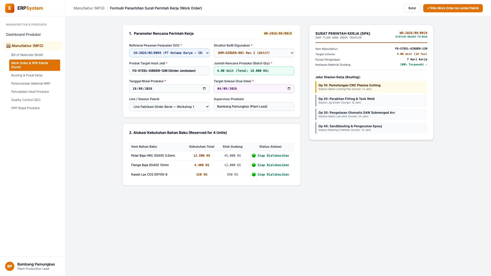
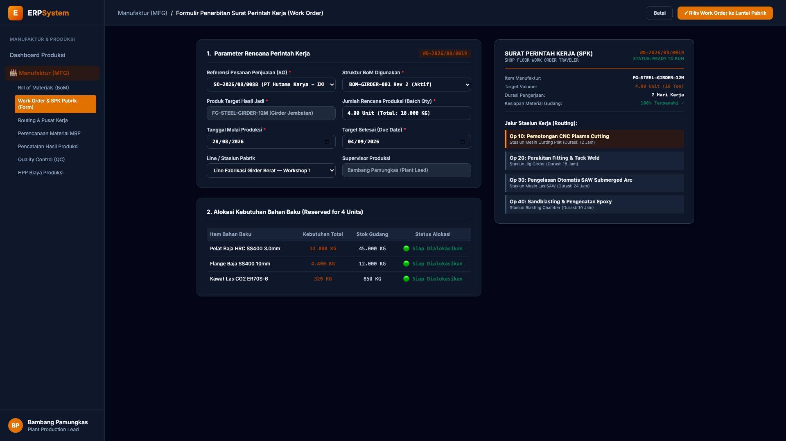

# 🎨 Design UI — Formulir Penerbitan Perintah Kerja Produksi (Work Order) (Data Entry Screen)

> Mockup antarmuka **Formulir Penerbitan Surat Perintah Kerja Pabrik (Work Order / Manufacturing Order Data Entry)**: desain *Split-Screen Form* dengan formulir input perencanaan produksi di sebelah kiri (Nomor WO `WO-2026/08/0019`, pesanan SO `SO-2026/08/0088 PT Hutama Karya`, produk jadi Girder Jembatan `FG-STEEL-GIRDER-12M`, batch order 4 unit / 18 Ton, jadwal 28/08 - 04/09/2026, alokasi material gudang 12.800 KG Plat HRC, 4.400 KG Flange, 320 KG Kawat Las) dan *Live Surat Perintah Kerja Pabrik (Shop Floor Traveler), Kesiapan Material 100% Terpenuhi & Jadwal Jalur Stasiun Kerja Mesin (Op 10 Pemotongan Plasma &rarr; Op 20 Perakitan Fitting &rarr; Op 30 Las Otomatis SAW &rarr; Op 40 Sandblasting Epoxy)* di sebelah kanan pada modul `MFG` (Manufaktur / Produksi) dalam ERP System.

---

## Light Mode

---

## Dark Mode

---

## 📝 Komponen & Fitur Formulir Input

1. **Panel Kiri — Formulir Parameter Work Order & Alokasi Bahan**:
   - Nomor Perintah Kerja: `WO-2026/08/0019` &bull; Ref SO: `SO-2026/08/0088`.
   - Produk: `FG-STEEL-GIRDER-12M (Girder Jembatan Baja 12M)`.
   - Kuantitas Rencana: **4.00 Unit (Total: 18.000 KG)**.
   - Jadwal Eksekusi: **28/08/2026 s/d 04/09/2026 (7 Hari Kerja)**.
   - Alokasi Bahan Baku Gudang: *100% Reserved & Siap Potong*.

2. **Panel Kanan — Dokumen SPK Pabrik & Jalur Stasiun Mesin (Routing)**:
   - Dokumen *Shop Floor Work Order Traveler* Resmi Berbarcode.
   - Jalur Stasiun Kerja:
     - **Op 10**: Pemotongan CNC Plasma Cutting (12 Jam)
     - **Op 20**: Perakitan Fitting & Tack Weld (16 Jam)
     - **Op 30**: Pengelasan Otomatis SAW Submerged Arc (24 Jam)
     - **Op 40**: Sandblasting & Pengecatan Epoxy (10 Jam)
