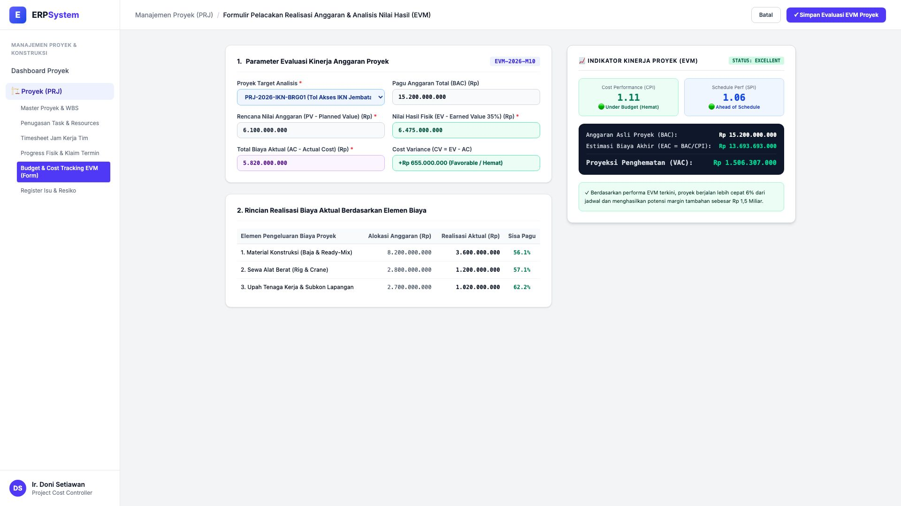
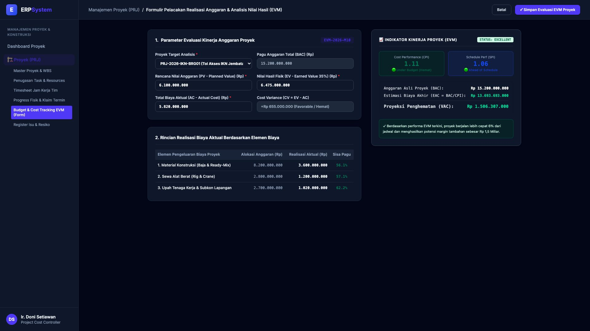

# 🎨 Design UI — Formulir Pelacakan Biaya & Anggaran Proyek (EVM) (Data Entry Screen)

> Mockup antarmuka **Formulir Pelacakan Realisasi Anggaran & Analisis Nilai Hasil (Project Cost Budget Tracking & EVM Data Entry)**: desain *Split-Screen Form* dengan formulir input metrik EVM di sebelah kiri (Kode Evaluasi `EVM-2026-M10`, Proyek `PRJ-2026-IKN-BRG01`, pagu BAC Rp 15.200.000.000, Planned Value PV Rp 6,1 M, Earned Value EV Rp 6,475 M, Actual Cost AC Rp 5,82 M, Cost Variance +Rp 655 Jt Hemat, realisasi per elemen biaya: material Rp 3,6 M, alat berat Rp 1,2 M, upah tenaga kerja Rp 1,02 M) dan *Live Indikator Kinerja Proyek EVM (Cost Performance Index CPI 1.11 Favorable, Schedule Performance Index SPI 1.06 Ahead of Schedule, Estimasi Biaya Akhir EAC Rp 13,69 M & Proyeksi Penghematan VAC Rp 1,5 Miliar)* di sebelah kanan pada modul `PRJ` (Manajemen Proyek) dalam ERP System.

---

## Light Mode

---

## Dark Mode

---

## 📝 Komponen & Fitur Formulir Input

1. **Panel Kiri — Formulir Parameter EVM & Rincian Realisasi Biaya**:
   - Kode Evaluasi: `EVM-2026-M10` &bull; Periode: **Oktober 2026**.
   - Proyek: `PRJ-2026-IKN-BRG01 (Tol Akses IKN Jembatan 60M)`.
   - Pagu Anggaran Asli (BAC): **Rp 15.200.000.000**.
   - Komponen Nilai Hasil:
     - Planned Value (PV): **Rp 6.100.000.000**
     - Earned Value (EV 35%): **Rp 6.475.000.000**
     - Actual Cost (AC): **Rp 5.820.000.000**
     - Cost Variance (CV): **+Rp 655.000.000 (Favorable / Hemat)**
   - Rincian Realisasi Pengeluaran: Material Rp 3,6 M (Sisa 56.1%), Alat Berat Rp 1,2 M (Sisa 57.1%), Tenaga Kerja & Subkon Rp 1,02 M (Sisa 62.2%).

2. **Panel Kanan — Indikator EVM & Proyeksi Biaya Akhir Proyek**:
   - **Cost Performance Index (CPI): 1.11** (🟢 Efisiensi Biaya Tinggi).
   - **Schedule Performance Index (SPI): 1.06** (🟢 Lebih Cepat 6% dari Jadwal).
   - Estimasi Total Biaya Penyelesaian (EAC): **Rp 13.693.693.000**.
   - Proyeksi Penghematan Akhir (VAC): **Rp 1.506.307.000**.
