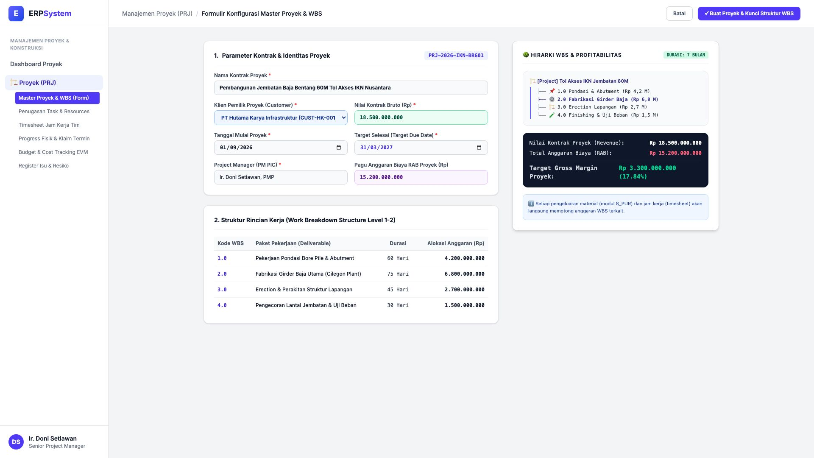
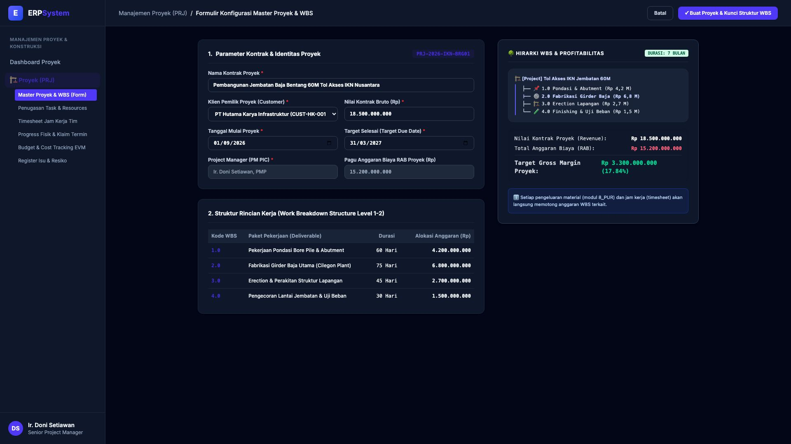

# 🎨 Design UI — Formulir Master Proyek & Work Breakdown Structure (WBS) (Data Entry Screen)

> Mockup antarmuka **Formulir Konfigurasi Master Proyek & WBS (Project Creation & WBS Data Entry)**: desain *Split-Screen Form* dengan formulir input master proyek di sebelah kiri (Kode Proyek `PRJ-2026-IKN-BRG01`, nama Pembangunan Jembatan Baja Bentang 60M Tol Akses IKN, Klien PT Hutama Karya Infrastruktur, Nilai Kontrak Bruto Rp 18.500.000.000, Jadwal 01/09/2026 - 31/03/2027 durasi 7 bulan, Project Manager Ir. Doni Setiawan PMP, Pagu Anggaran RAB Rp 15.200.000.000, Rincian WBS 1.0 s/d 4.0) dan *Live Struktur Hirarki WBS Tree & Analisis Target Profitabilitas Margin Proyek (Gross Profit Margin 17.84% / Rp 3,3 Miliar)* di sebelah kanan pada modul `PRJ` (Manajemen Proyek) dalam ERP System.

---

## Light Mode

---

## Dark Mode

---

## 📝 Komponen & Fitur Formulir Input

1. **Panel Kiri — Formulir Parameter Master Proyek & Paket WBS**:
   - Kode Proyek: `PRJ-2026-IKN-BRG01` &bull; Klien: `PT Hutama Karya Infrastruktur`.
   - Nilai Kontrak (Revenue): **Rp 18.500.000.000**.
   - Pagu Anggaran RAB: **Rp 15.200.000.000**.
   - Durasi Pengerjaan: **01/09/2026 s/d 31/03/2027 (7 Bulan)**.
   - Pembagian Paket WBS:
     - 1.0 Pondasi Bore Pile & Abutment (Rp 4,2 Miliar)
     - 2.0 Fabrikasi Girder Baja Utama (Rp 6,8 Miliar)
     - 3.0 Erection & Perakitan Struktur Lapangan (Rp 2,7 Miliar)
     - 4.0 Pengecoran & Uji Beban Jembatan (Rp 1,5 Miliar)

2. **Panel Kanan — Hirarki WBS & Analisis Keuntungan Finansial**:
   - Pohon Hirarki *WBS Tree Visualization*.
   - Proyeksi Margin Profitabilitas:
     - Nilai Kontrak Proyek: **Rp 18.500.000.000**
     - Total RAB Anggaran Biaya: **Rp 15.200.000.000**
     - **Target Gross Profit Margin: Rp 3.300.000.000 (17.84%)**.
