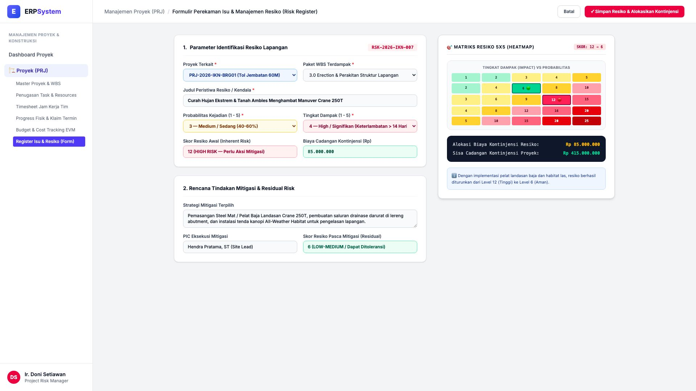
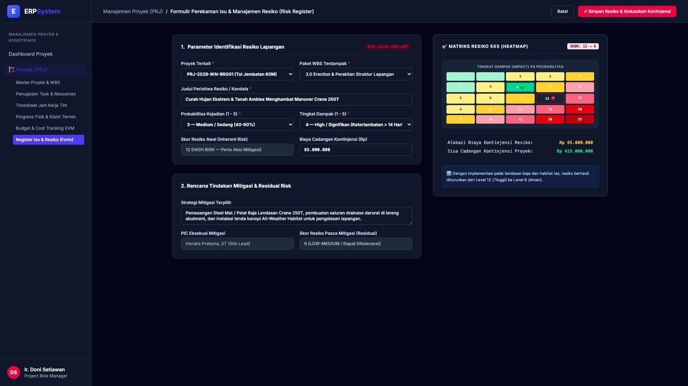

# 🎨 Design UI — Formulir Register Isu & Manajemen Resiko Proyek (Data Entry Screen)

> Mockup antarmuka **Formulir Perekaman Isu & Manajemen Resiko Proyek (Project Issue & Risk Register Data Entry)**: desain *Split-Screen Form* dengan formulir input identifikasi resiko lapangan di sebelah kiri (Kode Resiko `RSK-2026-IKN-007`, proyek `PRJ-2026-IKN-BRG01`, WBS `3.0 Erection Lapangan`, peristiwa: Curah hujan ekstrem & tanah ambles menghambat manuver crane 250T, probabilitas kejadian 3 Medium, tingkat dampak 4 High, skor resiko awal 12 HIGH RISK, strategi mitigasi pembuatan habitat las & pelat baja landasan crane, biaya kontinjensi Rp 85.000.000, PIC Hendra Pratama ST, skor resiko residual 6 LOW-MEDIUM) dan *Live Matriks Resiko 5x5 (Heatmap Matrix Sebelum vs Sesudah Mitigasi) & Alokasi Dana Cadangan Kontinjensi Proyek (Sisa Cadangan Rp 415 Jt)* di sebelah kanan pada modul `PRJ` (Manajemen Proyek) dalam ERP System.

---

## Light Mode

---

## Dark Mode

---

## 📝 Komponen & Fitur Formulir Input

1. **Panel Kiri — Formulir Identifikasi Resiko & Rencana Aksi Mitigasi**:
   - Kode Resiko: `RSK-2026-IKN-007` &bull; WBS: `3.0 Erection Jembatan`.
   - Peristiwa Resiko: *Curah Hujan Ekstrem Menghambat Manuver Crane 250T*.
   - Analisis Resiko Awal:
     - Probabilitas Kejadian: **3 — Medium (40-60%)**
     - Tingkat Dampak: **4 — High (Keterlambatan > 14 Hari)**
     - Skor Resiko Awal (*Inherent Risk*): **12 (HIGH RISK 🔴)**
   - Tindakan Mitigasi: Landasan *Steel Mat* Crane, drainase darurat & *All-Weather Habitat Tents*.
   - Alokasi Biaya Kontinjensi Resiko: **Rp 85.000.000**.
   - Skor Resiko Pasca Mitigasi (*Residual Risk*): **6 (LOW-MEDIUM 🟢)**.

2. **Panel Kanan — Matriks Heatmap 5x5 & Dana Cadangan Kontinjensi**:
   - Visualisasi Matriks Resiko 5x5: Pergeseran dari zona bahaya (12 🔴) ke zona aman terkendali (6 🟢).
   - Pengendalian Dana Kontinjensi:
     - Alokasi Terpakai: Rp 85.000.000
     - Sisa Cadangan Kontinjensi Proyek: **Rp 415.000.000**.
