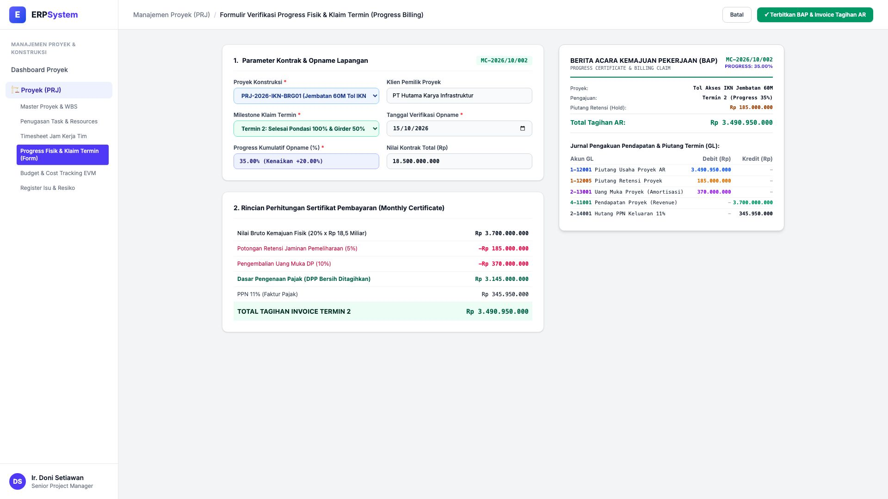
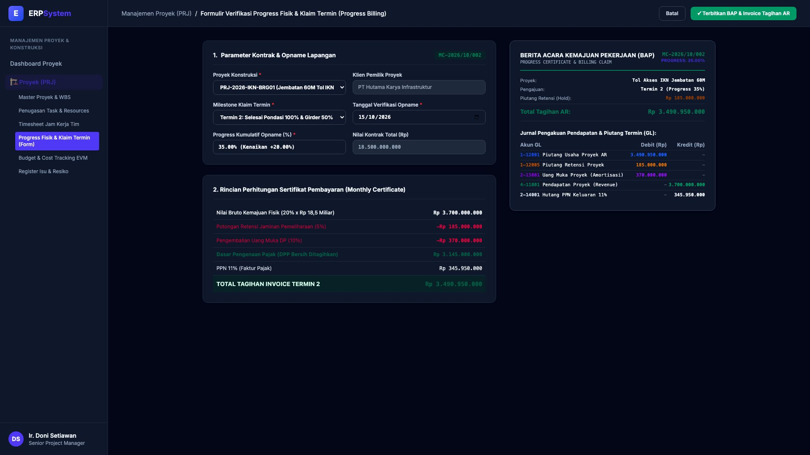

# 🎨 Design UI — Formulir Progress Fisik & Klaim Termin Proyek (Data Entry Screen)

> Mockup antarmuka **Formulir Verifikasi Progress Fisik & Klaim Termin Proyek (Progress Opname & Milestone Billing Data Entry)**: desain *Split-Screen Form* dengan formulir input klaim termin di sebelah kiri (Nomor Klaim `MC-2026/10/002`, Proyek Tol Akses IKN Jembatan 60M `PRJ-2026-IKN-BRG01`, Termin 2 Pondasi Selesai 100% & Girder 50%, verifikasi opname fisik kumulatif 35.00% naik +20%, nilai bruto Rp 3.700.000.000, potongan retensi 5% -Rp 185 Jt, potong DP 10% -Rp 370 Jt, DPP Bersih Rp 3.145.000.000 + PPN 11% Rp 345,95 Jt = Total Tagihan Rp 3.490.950.000) dan *Live Berita Acara Kemajuan Pekerjaan (Official BAP & Progress Certificate) & Jurnal Piutang Usaha Proyek AR (Debit Piutang Proyek, Piutang Retensi, Amortisasi DP vs Kredit Pendapatan & Hutang PPN)* di sebelah kanan pada modul `PRJ` (Manajemen Proyek) dalam ERP System.

---

## Light Mode

---

## Dark Mode

---

## 📝 Komponen & Fitur Formulir Input

1. **Panel Kiri — Formulir Parameter Opname & Perhitungan Klaim Termin**:
   - Nomor Klaim: `MC-2026/10/002` &bull; Milestone: **Termin 2 (Progress 35%)**.
   - Proyek: `PRJ-2026-IKN-BRG01 (Tol Akses IKN Jembatan 60M)`.
   - Realisasi Fisik Opname: **35.00% (Kenaikan Periode Ini +20.00%)**.
   - Rincian Perhitungan Tagihan (Monthly Certificate):
     - Nilai Bruto Pekerjaan (20% x Rp 18,5 M): **Rp 3.700.000.000**
     - Potongan Retensi Pemeliharaan (5%): **-Rp 185.000.000**
     - Amortisasi Pengembalian Uang Muka DP (10%): **-Rp 370.000.000**
     - Dasar Pengenaan Pajak (DPP): **Rp 3.145.000.000**
     - PPN 11%: **Rp 345.950.000**
     - **Total Nilai Invoice Ditagihkan: Rp 3.490.950.000**.

2. **Panel Kanan — Dokumen BAP & Jurnal Piutang Proyek**:
   - Berita Acara Kemajuan Pekerjaan (*Official BAP Certificate*).
   - Jurnal Akuntansi Piutang Termin AR:
     - Debit `1-12001 Piutang Usaha Proyek AR`: Rp 3.490.950.000
     - Debit `1-12005 Piutang Retensi Proyek`: Rp 185.000.000
     - Debit `2-13001 Uang Muka Proyek`: Rp 370.000.000
     - Kredit `4-11001 Pendapatan Proyek`: Rp 3.700.000.000
     - Kredit `2-14001 Hutang PPN Keluaran 11%`: Rp 345.950.000
