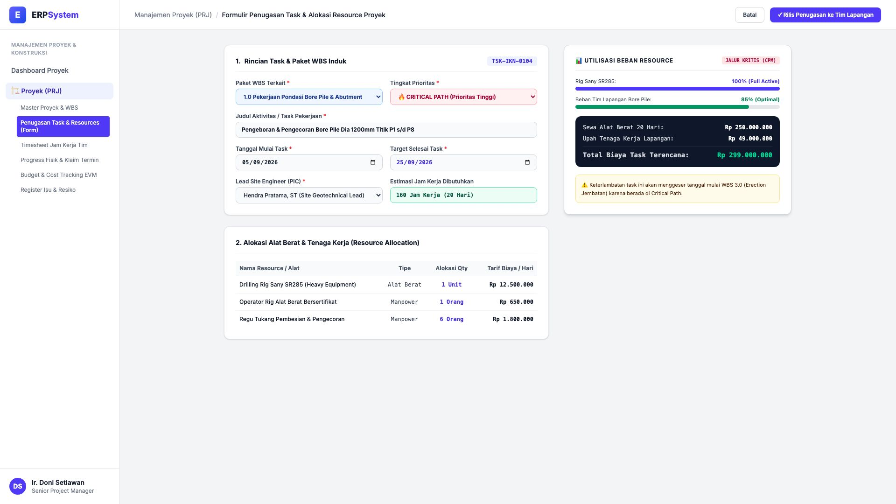
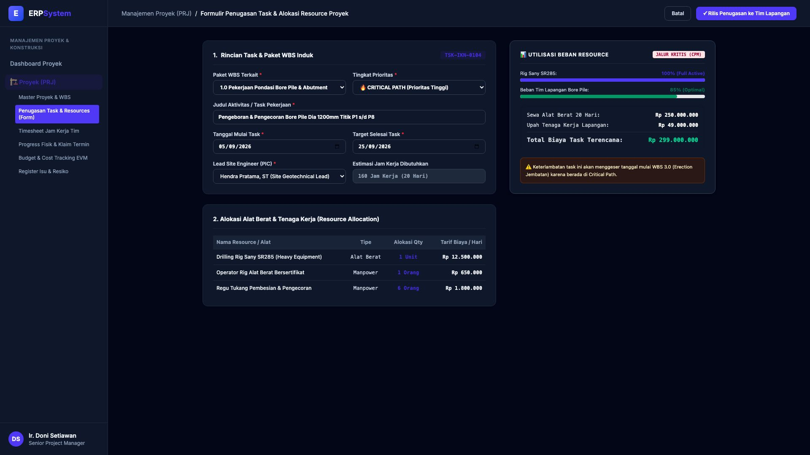

# 🎨 Design UI — Formulir Penugasan Task & Alokasi Resource Proyek (Data Entry Screen)

> Mockup antarmuka **Formulir Penugasan Tugas & Alokasi Resource (Project Task & Resource Assignment Data Entry)**: desain *Split-Screen Form* dengan formulir input task di sebelah kiri (Kode Task `TSK-IKN-0104`, WBS `1.0 Pondasi Bore Pile`, nama Pengeboran & Pengecoran Bore Pile Dia 1200mm Titik P1-P8, prioritas CRITICAL PATH, jadwal 05/09 - 25/09/2026, PIC Hendra Pratama ST, alokasi: 1 Rig Mesin Bor Sany SR285 Rp 12,5 Jt/hr, 1 Operator Rig Rp 650rb/hr, 6 Regu Tukang Besi Rp 1,8 Jt/hr) dan *Live Matriks Utilisasi Kapasitas Resource Lapangan & Estimasi Total Biaya Task (Rp 299.000.000) serta Peringatan Jalur Kritis CPM* di sebelah kanan pada modul `PRJ` (Manajemen Proyek) dalam ERP System.

---

## Light Mode

---

## Dark Mode

---

## 📝 Komponen & Fitur Formulir Input

1. **Panel Kiri — Formulir Parameter Task & Alokasi Sumber Daya**:
   - Kode Task: `TSK-IKN-0104` &bull; WBS Induk: `1.0 Pondasi Bore Pile`.
   - Prioritas: **🔥 CRITICAL PATH (Jalur Kritis)**.
   - Lead PIC: *Hendra Pratama, ST*.
   - Durasi Pengerjaan: **20 Hari Kerja (160 Jam)**.
   - Alokasi Peralatan & Tenaga Kerja:
     - 1 Unit *Drilling Rig Sany SR285* (Rp 12.500.000/Hari)
     - 1 Orang *Operator Rig Bersertifikat* (Rp 650.000/Hari)
     - 6 Orang *Regu Tukang Pembesian/Pengecoran* (Rp 1.800.000/Hari)

2. **Panel Kanan — Beban Kerja & Estimasi Biaya Pekerjaan**:
   - Utilisasi Beban Alat Berat: **100% (Full Active)**.
   - Utilisasi Tim Lapangan: **85% (Optimal Load)**.
   - Total Estimasi Biaya Task: **Rp 299.000.000** (Sewa Alat Rp 250 Jt + Upah Tenaga Kerja Rp 49 Jt).
   - Pengendalian Jalur Kritis (CPM Warning).
