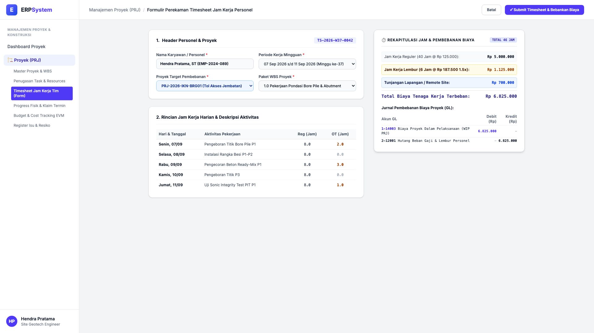
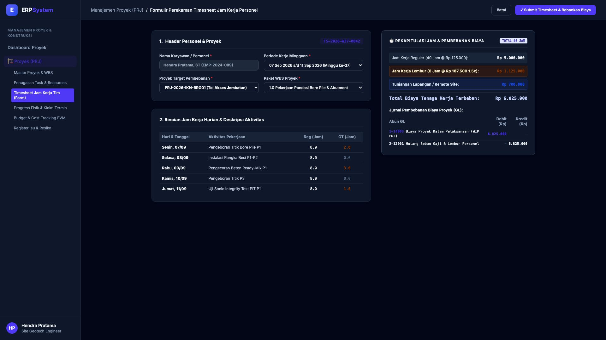

# 🎨 Design UI — Formulir Timesheet Jam Kerja Tim Proyek (Data Entry Screen)

> Mockup antarmuka **Formulir Perekaman Jam Kerja Personel Proyek (Project Timesheet Data Entry)**: desain *Split-Screen Form* dengan formulir input jam kerja di sebelah kiri (Nomor Timesheet `TS-2026-W37-0042`, karyawan Hendra Pratama ST, proyek `PRJ-2026-IKN-BRG01`, WBS `1.0 Pondasi Bore Pile`, rincian harian Senin-Jumat: 40 Jam Reguler + 6 Jam Lembur, aktivitas pengeboran & pengecoran P1-P4) dan *Live Rekapitulasi Pembebanan Upah Tenaga Kerja Proyek (Gaji Pokok Rp 5 Jt + Lembur Rp 1,125 Jt + Tunjangan Remote Rp 700rb = Total Rp 6.825.000) & Jurnal GL Pembebanan Biaya Tenaga Kerja (Debit WIP Proyek vs Kredit Hutang Gaji)* di sebelah kanan pada modul `PRJ` (Manajemen Proyek) dalam ERP System.

---

## Light Mode

---

## Dark Mode

---

## 📝 Komponen & Fitur Formulir Input

1. **Panel Kiri — Formulir Header Personel & Log Jam Harian**:
   - Nomor Timesheet: `TS-2026-W37-0042` &bull; Minggu ke-37 (07-11 Sep 2026).
   - Karyawan: `Hendra Pratama, ST` &bull; WBS: `1.0 Pondasi Bore Pile`.
   - Log Jam Kerja Harian:
     - Senin: 8 Jam Reg + 2 Jam OT (Pengeboran P1)
     - Selasa: 8 Jam Reg (Instalasi Besi P1-P2)
     - Rabu: 8 Jam Reg + 3 Jam OT (Pengecoran Ready-Mix P1)
     - Kamis: 8 Jam Reg (Pengeboran P3)
     - Jumat: 8 Jam Reg + 1 Jam OT (Uji Sonic PIT P1)

2. **Panel Kanan — Rekapitulasi Jam & Jurnal Beban Proyek**:
   - Total Jam Terinput: **46 Jam (40 Jam Reguler + 6 Jam Lembur)**.
   - Total Biaya Tenaga Kerja Terbeban: **Rp 6.825.000**.
   - Jurnal Akuntansi GL:
     - Debit `1-14003 Biaya Proyek Dalam Pelaksanaan (WIP PRJ)`: Rp 6.825.000
     - Kredit `2-12001 Hutang Beban Gaji & Lembur Personel`: Rp 6.825.000
