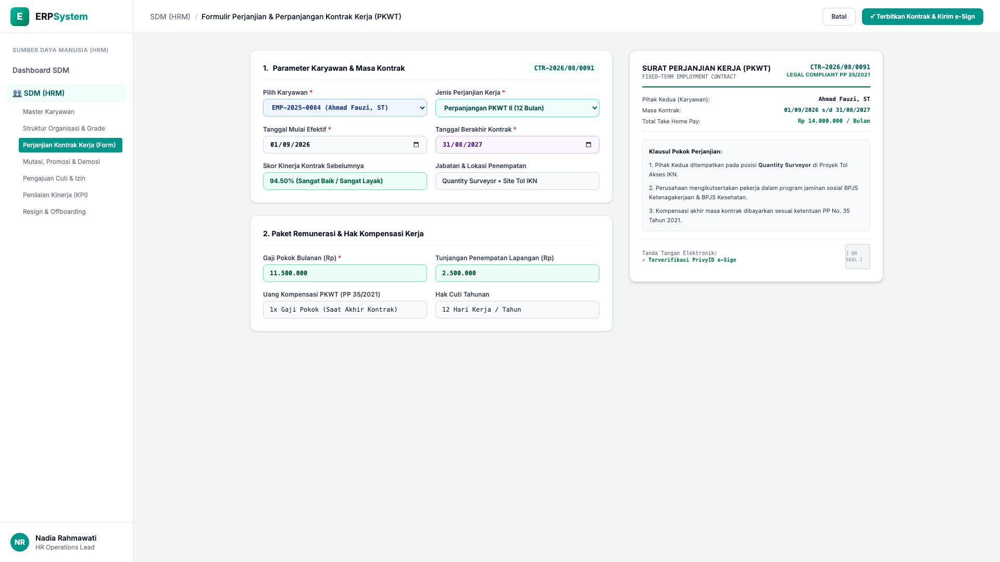
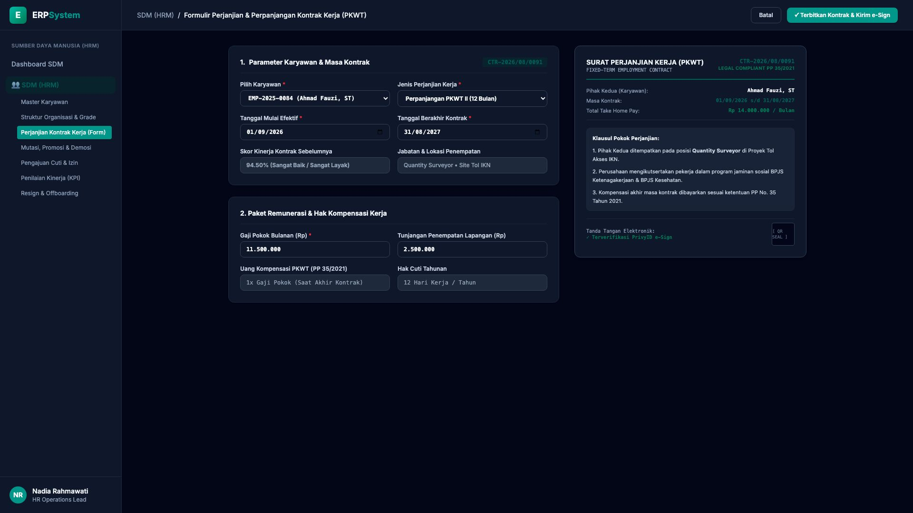

# 🎨 Design UI — Formulir Perjanjian Kontrak Kerja (PKWT/PKWTT) (Data Entry Screen)

> Mockup antarmuka **Formulir Perjanjian & Perpanjangan Kontrak Kerja (Employee Contract Renewal Data Entry)**: desain *Split-Screen Form* dengan formulir input perpanjangan kontrak di sebelah kiri (Nomor Kontrak `CTR-2026/08/0091`, karyawan Ahmad Fauzi ST `EMP-2025-0084`, jenis Perpanjangan PKWT II 12 Bulan, masa berlaku 01/09/2026 - 31/08/2027, evaluasi kinerja kontrak I 94.50% Sangat Baik, jabatan Quantity Surveyor Site Tol IKN, kompensasi: Gaji Pokok Rp 11,5 Jt + Tunjangan Site Rp 2,5 Jt = THP Rp 14 Jt/Bulan, uang kompensasi PP 35/2021 1x Gaji) dan *Live Dokumen Surat Perjanjian Kerja Resmi (Official Employment Contract PKWT) dengan Klausul Hukum Ketenagakerjaan & e-Sign PrivyID Terverifikasi* di sebelah kanan pada modul `HRM` (Sumber Daya Manusia) dalam ERP System.

---

## Light Mode

---

## Dark Mode

---

## 📝 Komponen & Fitur Formulir Input

1. **Panel Kiri — Formulir Parameter Masa Kontrak & Paket Kompensasi**:
   - Nomor Kontrak: `CTR-2026/08/0091` &bull; Karyawan: `Ahmad Fauzi, ST (EMP-2025-0084)`.
   - Jenis Kontrak: **Perpanjangan PKWT II (12 Bulan)**.
   - Masa Berlaku: **01/09/2026 s/d 31/08/2027**.
   - Evaluasi Kinerja: **94.50% (Sangat Baik / Sangat Layak Dilanjutkan)**.
   - Paket Kompensasi:
     - Gaji Pokok Bulanan: **Rp 11.500.000**
     - Tunjangan Penempatan Lapangan: **Rp 2.500.000**
     - **Total THP: Rp 14.000.000 / Bulan**
     - Hak Kompensasi Akhir Kontrak: 1x Gaji Pokok (PP 35/2021)

2. **Panel Kanan — Dokumen Perjanjian Kerja & Tanda Tangan Digital**:
   - Dokumen Kontrak Resmi *Fixed-Term Employment Contract*.
   - Klausul Kepatuhan Ketenagakerjaan UU Cipta Kerja & PP 35/2021.
   - Integrasi *PrivyID Electronic Signature Verification*.
