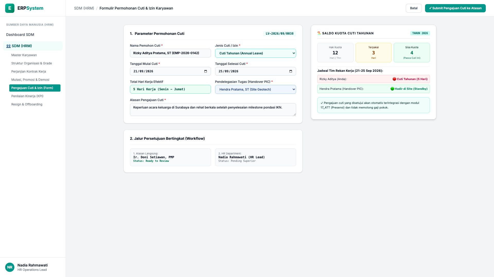
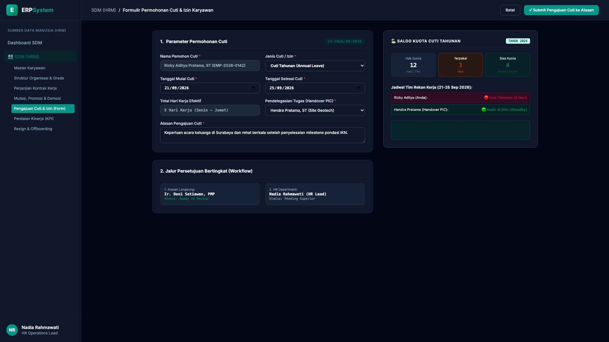

# 🎨 Design UI — Formulir Pengajuan Cuti & Izin Karyawan (Data Entry Screen)

> Mockup antarmuka **Formulir Pengajuan Cuti & Izin Karyawan (Employee Leave Request Data Entry)**: desain *Split-Screen Form* dengan formulir input pengajuan cuti di sebelah kiri (Nomor Pengajuan `LV-2026/09/0038`, pemohon Rizky Aditya Pratama ST `EMP-2026-0142`, jenis Cuti Tahunan, tanggal 21/09 - 25/09/2026 durasi 5 hari kerja, pendelegasian tugas Handover PIC Hendra Pratama ST, alasan acara keluarga di Surabaya, alur persetujuan Atasan Langsung Ir. Doni Setiawan & HR Lead Nadia Rahmawati) dan *Live Ringkasan Saldo Kuota Cuti Karyawan (Hak 12 Hari, Terpakai 3 Hari, Pengajuan 5 Hari &rarr; Sisa 4 Hari) & Kalender Ketersediaan Rekan Tim Lapangan* di sebelah kanan pada modul `HRM` (Sumber Daya Manusia) dalam ERP System.

---

## Light Mode

---

## Dark Mode

---

## 📝 Komponen & Fitur Formulir Input

1. **Panel Kiri — Formulir Parameter Cuti & Alur Persetujuan**:
   - Nomor Pengajuan: `LV-2026/09/0038` &bull; Pemohon: `Rizky Aditya Pratama, ST`.
   - Jenis: **Cuti Tahunan (Annual Leave)**.
   - Rentang Tanggal: **21/09/2026 s/d 25/09/2026 (5 Hari Kerja)**.
   - Handover PIC Delegasi: *Hendra Pratama, ST*.
   - Workflow Approval: *1. Ir. Doni Setiawan (PM Atasan Langsung) &rarr; 2. Nadia Rahmawati (HR Lead)*.

2. **Panel Kanan — Saldo Kuota Cuti & Kalender Tim**:
   - Kuota Tahunan: **12 Hari**.
   - Saldo Cuti Terpakai: **3 Hari**.
   - Pengajuan Saat Ini: **5 Hari**.
   - **Sisa Kuota Cuti Pasca Approval: 4 Hari**.
   - Integrasi Otomatis: Sinkronisasi status kehadiran ke modul `17_ATT` tanpa pemotongan gaji pokok.
