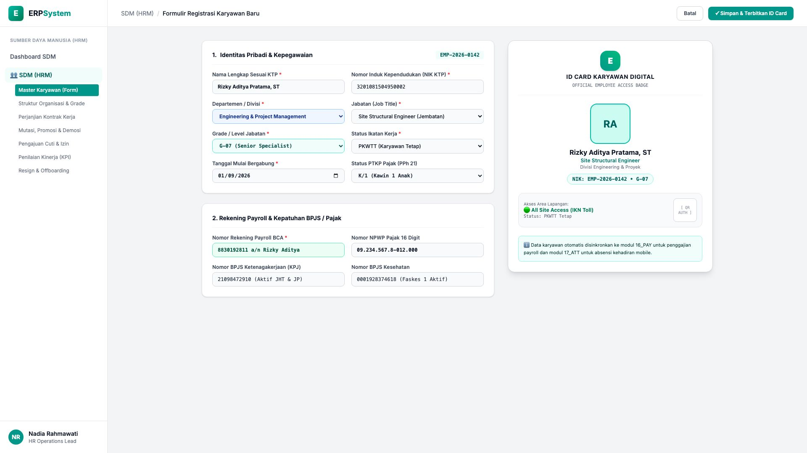
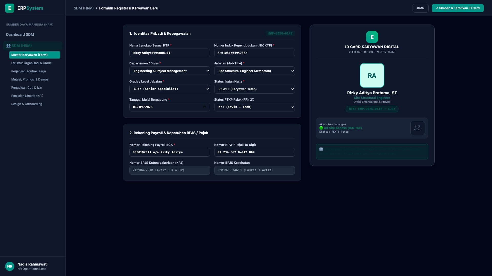

# 🎨 Design UI — Formulir Master Karyawan & Registrasi Data Karyawan (Data Entry Screen)

> Mockup antarmuka **Formulir Registrasi Karyawan Baru & Master Karyawan (Employee Master Profile Data Entry)**: desain *Split-Screen Form* dengan formulir input data kepegawaian di sebelah kiri (NIK Karyawan `EMP-2026-0142`, nama lengkap Rizky Aditya Pratama ST, NIK KTP `3201081504950002`, NPWP `09.234.567.8-012.000`, Divisi Engineering & Proyek, Jabatan Site Structural Engineer, Grade G-07 Senior Specialist, Status PKWTT Tetap, Tgl Masuk 01/09/2026, PTKP K/1, Rekening Payroll BCA 8830192811, BPJS Ketenagakerjaan & Kesehatan terdaftar aktif) dan *Live Kartu ID Karyawan Digital (Official Company Digital ID Badge) dengan Pasfoto, NIK, QR Barcode Akses Lapangan IKN & Sinkronisasi Modul Payroll PAY/ATT* di sebelah kanan pada modul `HRM` (Sumber Daya Manusia) dalam ERP System.

---

## Light Mode

---

## Dark Mode

---

## 📝 Komponen & Fitur Formulir Input

1. **Panel Kiri — Formulir Identitas Karyawan & Payroll Compliance**:
   - NIK Sistem: `EMP-2026-0142` &bull; Tanggal Masuk: **01/09/2026**.
   - Nama: `Rizky Aditya Pratama, ST` &bull; Status: **PKWTT (Tetap)**.
   - Departemen: `Engineering & Project Management`.
   - Jabatan & Grade: `Site Structural Engineer &bull; G-07 (Senior Specialist)`.
   - Rekening Payroll: *BCA 8830192811 a/n Rizky Aditya*.
   - Kepatuhan Pajak & Jamsostek:
     - PTKP: **K/1 (Kawin 1 Anak)** &bull; NPWP: `09.234.567.8-012.000`
     - BPJS Ketenagakerjaan (KPJ): `21098472910` (JHT, JKK, JKM, JP)
     - BPJS Kesehatan: `0001928374618`

2. **Panel Kanan — ID Card Karyawan Digital & Izin Akses**:
   - Kartu Identitas Digital Resmi (*Company Digital Badge ID*).
   - QR Code Otentikasi Pintu Masuk / Presensi Mobile GPS.
   - Hak Akses Lokasi: *All Site Access (IKN Toll Bridge Project)*.
