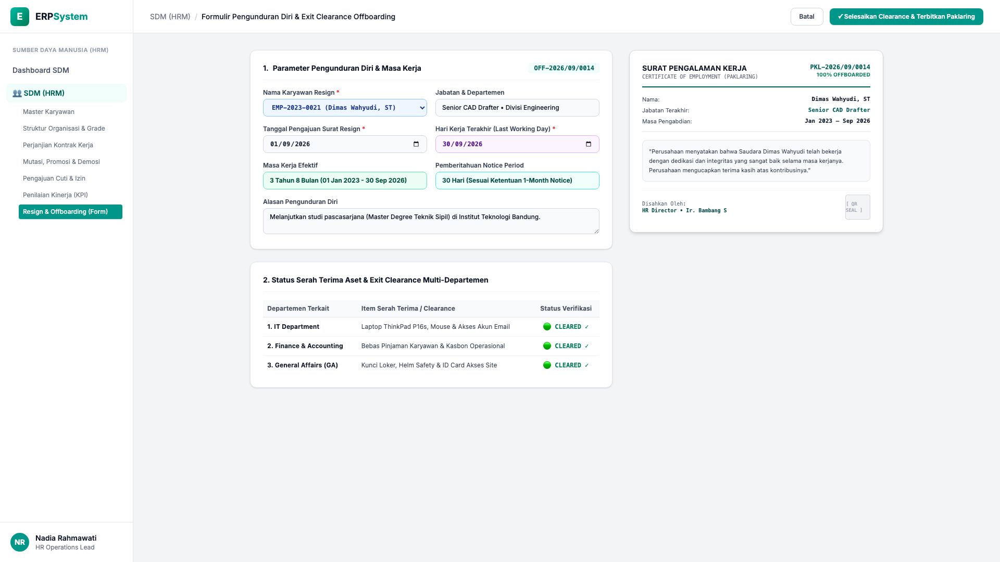
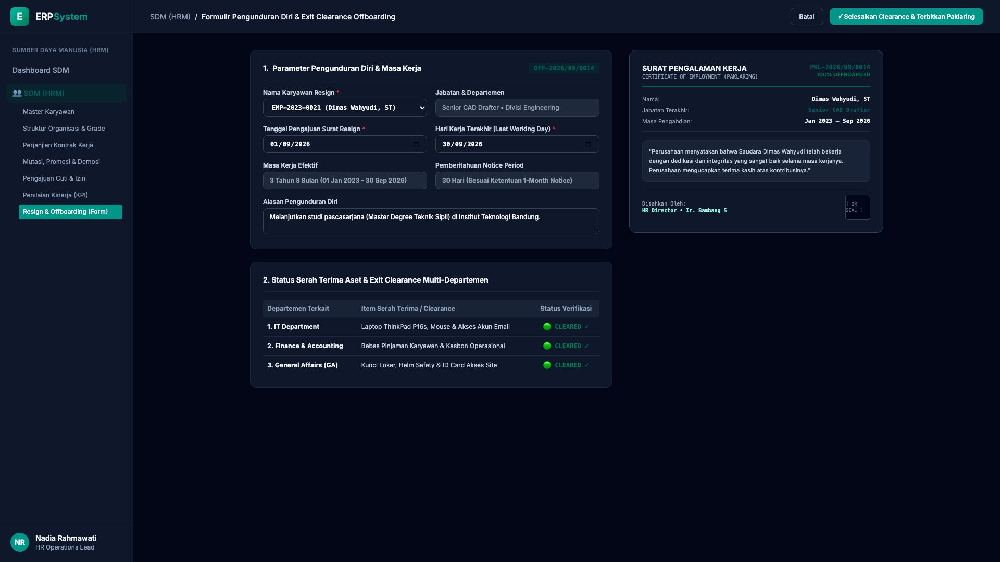

# 🎨 Design UI — Formulir Pengunduran Diri & Clearance Offboarding (Data Entry Screen)

> Mockup antarmuka **Formulir Pengunduran Diri & Serah Terima Aset Offboarding (Resignation & Exit Clearance Data Entry)**: desain *Split-Screen Form* dengan formulir input pengunduran diri di sebelah kiri (Nomor Dokumen `OFF-2026/09/0014`, karyawan Dimas Wahyudi ST `EMP-2023-0021`, jabatan Senior CAD Drafter, pengajuan 01/09/2026, Last Working Day 30/09/2026 1-Month Notice, masa kerja 3 Tahun 8 Bulan, checklist clearance 3 departemen: IT Laptop ThinkPad cleared, Finance Bebas Kasbon cleared, GA Kunci Loker & ID Card cleared) dan *Live Surat Pengalaman Kerja Resmi (Certificate of Employment / Paklaring Document) dengan Tanda Tangan Direksi & QR Seal* di sebelah kanan pada modul `HRM` (Sumber Daya Manusia) dalam ERP System.

---

## Light Mode

---

## Dark Mode

---

## 📝 Komponen & Fitur Formulir Input

1. **Panel Kiri — Formulir Parameter Resign & Checklist Clearance**:
   - Nomor Pengajuan: `OFF-2026/09/0014` &bull; Karyawan: `Dimas Wahyudi, ST`.
   - Jabatan: `Senior CAD Drafter &bull; Divisi Engineering`.
   - Periode: Pengajuan 01/09/2026 &bull; **Hari Terakhir (LWD): 30/09/2026 (1-Month Notice)**.
   - Masa Pengabdian: **3 Tahun 8 Bulan (Jan 2023 s/d Sep 2026)**.
   - Checklist Verifikasi Exit Clearance Multi-Departemen:
     - 💻 **IT Department**: Laptop ThinkPad P16s, mouse & email cleared (🟢 ✓)
     - 💰 **Finance & Accounting**: Bebas pinjaman & kasbon operasional cleared (🟢 ✓)
     - 🏢 **General Affairs**: Kunci loker, seragam & kartu akses ID cleared (🟢 ✓)

2. **Panel Kanan — Dokumen Surat Paklaring Resmi**:
   - Surat Pengalaman Kerja (*Official Certificate of Employment*).
   - Pengesahan HR Director & Tanda Tangan Elektronik Ber-QR Seal.
   - Pemutusan Akses Otomatis pada Modul `19_USR` dan Penggajian Terakhir di `16_PAY`.
