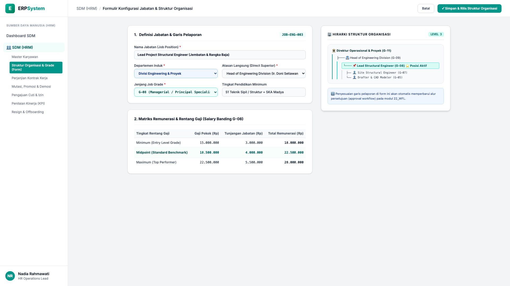
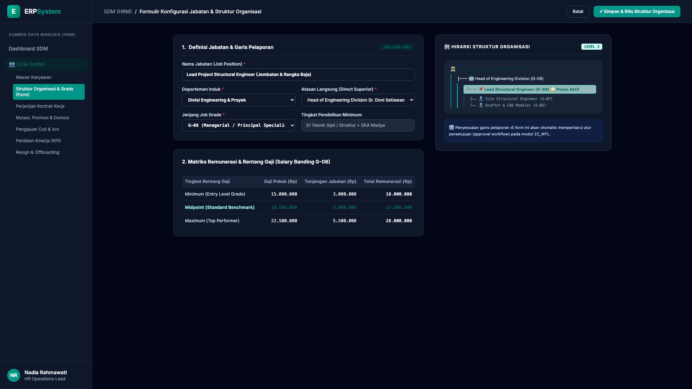

# 🎨 Design UI — Formulir Konfigurasi Jabatan & Struktur Organisasi (Data Entry Screen)

> Mockup antarmuka **Formulir Struktur Organisasi & Grade Jabatan (Organization Structure & Job Grade Data Entry)**: desain *Split-Screen Form* dengan formulir input jabatan di sebelah kiri (Kode Jabatan `JOB-ENG-003`, nama Lead Project Structural Engineer, Divisi Engineering & Proyek, atasan langsung Head of Engineering Division, Job Grade `G-08 Managerial / Principal Specialist`, kualifikasi S1 Sipil + SKA Madya, matriks salary banding: Minimum Rp 18 Jt - Midpoint Rp 22,5 Jt - Maximum Rp 28 Jt) dan *Live Struktur Hirarki Pohon Organisasi (Org Hierarchy Tree dari Direktur Operasional &rarr; Head of Div &rarr; Lead Structural Engineer &rarr; Site Engineer & Drafter)* di sebelah kanan pada modul `HRM` (Sumber Daya Manusia) dalam ERP System.

---

## Light Mode

---

## Dark Mode

---

## 📝 Komponen & Fitur Formulir Input

1. **Panel Kiri — Formulir Parameter Jabatan & Matriks Gaji**:
   - Kode Jabatan: `JOB-ENG-003` &bull; Job Title: *Lead Project Structural Engineer*.
   - Departemen: `Divisi Engineering & Proyek`.
   - Atasan Langsung (*Superior*): *Head of Engineering Division*.
   - Jenjang Grade: **G-08 (Managerial / Principal Specialist)**.
   - Matriks Rentang Remunerasi (*Salary Banding*):
     - Minimum: Gaji Pokok Rp 15 Jt + Tunjangan Rp 3 Jt = **Rp 18.000.000**
     - Midpoint: Gaji Pokok Rp 18,5 Jt + Tunjangan Rp 4 Jt = **Rp 22.500.000**
     - Maximum: Gaji Pokok Rp 22,5 Jt + Tunjangan Rp 5,5 Jt = **Rp 28.000.000**

2. **Panel Kanan — Visualisasi Pohon Organisasi & Alur Pelaporan**:
   - Diagram Hirarki Organisasi (*Org Tree Level 1 s/d Level 4*).
   - Integrasi Otomatis dengan Approval Matrix Modul `22_WFL`.
