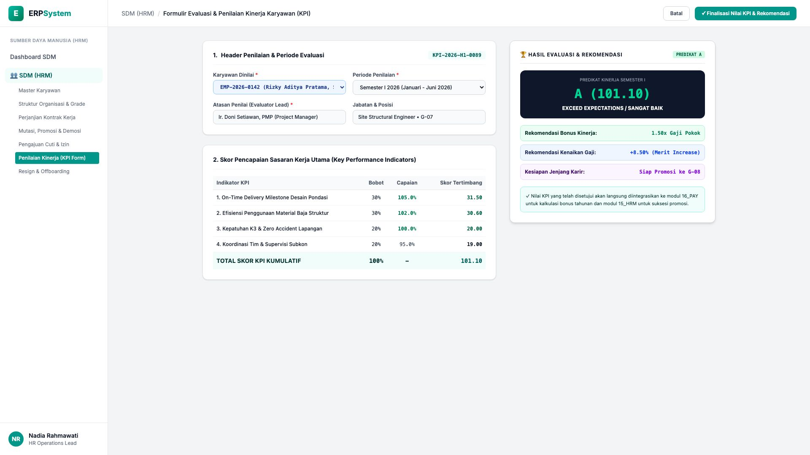
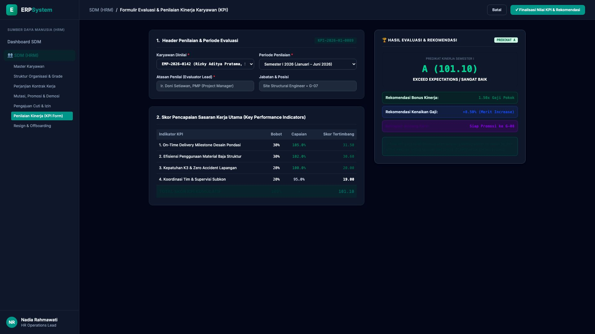

# 🎨 Design UI — Formulir Penilaian Kinerja Karyawan (KPI Scorecard) (Data Entry Screen)

> Mockup antarmuka **Formulir Evaluasi & Penilaian Kinerja Karyawan (Performance Appraisal KPI Data Entry)**: desain *Split-Screen Form* dengan formulir input penilaian KPI di sebelah kiri (Nomor Dokumen `KPI-2026-H1-0089`, karyawan dinilai Rizky Aditya Pratama ST `EMP-2026-0142`, periode Semester I 2026, evaluator Ir. Doni Setiawan PMP, rincian skor KPI: On-Time Delivery Milestone 105% skor 31.5, Efisiensi Material Baja 102% skor 30.6, K3 & Zero Accident 100% skor 20.0, Koordinasi Subkon 95% skor 19.0, Total Skor Kumulatif 101.10 Predikat A Exceed Expectations) dan *Live Kartu Scorecard Predikat Kinerja A & Rekomendasi Reward (Bonus 1.5x Gaji Pokok, Merit Increase +8.5%, Kesiapan Promosi ke G-08)* di sebelah kanan pada modul `HRM` (Sumber Daya Manusia) dalam ERP System.

---

## Light Mode

---

## Dark Mode

---

## 📝 Komponen & Fitur Formulir Input

1. **Panel Kiri — Formulir Parameter Evaluasi & Matriks Skor KPI**:
   - Kode Evaluasi: `KPI-2026-H1-0089` &bull; Periode: **Semester I 2026**.
   - Karyawan: `Rizky Aditya Pratama, ST` &bull; Jabatan: `Site Structural Engineer (G-07)`.
   - Atasan Penilai: *Ir. Doni Setiawan, PMP (Project Manager)*.
   - Rincian Capaian KPI:
     - On-Time Delivery Desain Pondasi: **105.0% (Bobot 30% &rarr; Skor 31.50)**
     - Efisiensi Material Baja Struktur: **102.0% (Bobot 30% &rarr; Skor 30.60)**
     - Kepatuhan K3 & Zero Accident: **100.0% (Bobot 20% &rarr; Skor 20.00)**
     - Koordinasi Tim & Subkon: **95.0% (Bobot 20% &rarr; Skor 19.00)**
     - **Total Skor Tertimbang: 101.10 (Predikat A - Exceed Expectations)**

2. **Panel Kanan — Scorecard Hasil & Rekomendasi Remunerasi**:
   - Predikat Akhir: **A (Sangat Baik / Exceed Expectations)**.
   - Rekomendasi Reward:
     - Bonus Kinerja: **1.50x Gaji Pokok** (Modul `16_PAY`)
     - Kenaikan Gaji Berkala (*Merit Increase*): **+8.50%**
     - Suksesi Karir: *Rekomendasi Promosi ke Job Grade G-08*.
