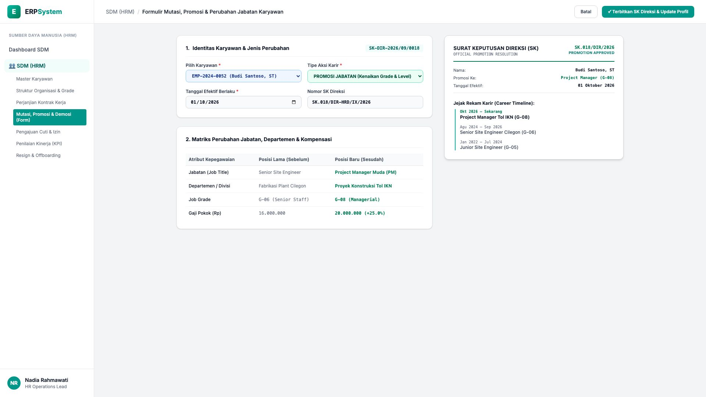
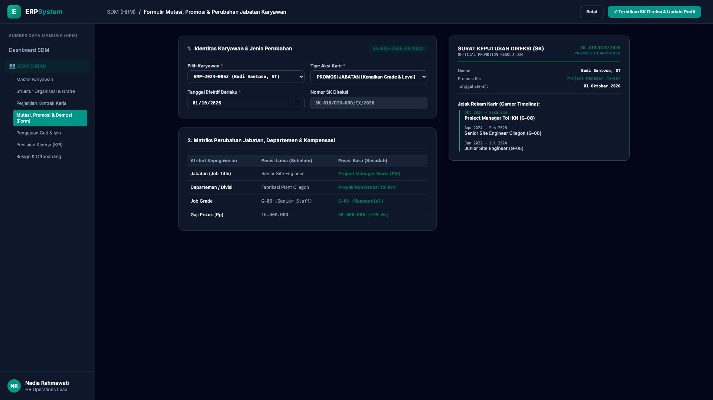

# 🎨 Design UI — Formulir Mutasi, Promosi & Demosi Karyawan (Data Entry Screen)

> Mockup antarmuka **Formulir Perekaman Mutasi & Promosi Jabatan (Employee Career Movement & Promotion Data Entry)**: desain *Split-Screen Form* dengan formulir input mutasi/promosi di sebelah kiri (Nomor SK `SK-DIR-2026/09/0018`, karyawan Budi Santoso ST `EMP-2024-0052`, aksi PROMOSI JABATAN, tgl efektif 01/10/2026, perbandingan sebelum vs sesudah: Senior Site Engineer &rarr; Project Manager Muda Tol IKN, Grade G-06 &rarr; G-08, Gaji Pokok Rp 16 Jt &rarr; Rp 20 Jt +25%) dan *Live Surat Keputusan Direksi (Official Promotion Board Resolution SK) & Jejak Rekam Karir (Career Timeline)* di sebelah kanan pada modul `HRM` (Sumber Daya Manusia) dalam ERP System.

---

## Light Mode

---

## Dark Mode

---

## 📝 Komponen & Fitur Formulir Input

1. **Panel Kiri — Formulir Parameter Aksi Karir & Matriks Perubahan**:
   - Nomor SK: `SK-DIR-2026/09/0018` &bull; Karyawan: `Budi Santoso, ST (EMP-2024-0052)`.
   - Jenis Aksi: **PROMOSI JABATAN (Kenaikan Grade & Level)**.
   - Tanggal Efektif: **01/10/2026**.
   - Matriks Perubahan Sebelum vs Sesudah:
     - Jabatan: Senior Site Engineer &rarr; **Project Manager Muda (PM)**
     - Divisi: Fabrikasi Plant Cilegon &rarr; **Proyek Konstruksi Tol IKN**
     - Grade: G-06 (Senior Staff) &rarr; **G-08 (Managerial)**
     - Gaji Pokok: Rp 16.000.000 &rarr; **Rp 20.000.000 (+25.0%)**

2. **Panel Kanan — Dokumen SK Direksi & Timeline Karir**:
   - Dokumen SK Direksi Resmi (*Official Board Resolution SK Promosi*).
   - Riwayat Jejak Karir Karyawan (*Career Progression Timeline 2022 - Sekarang*).
