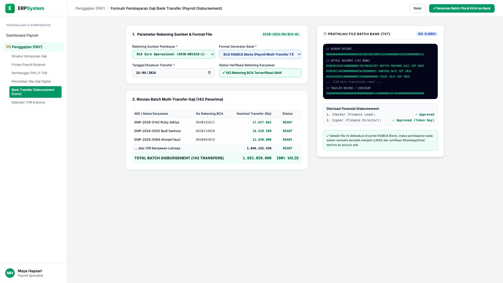
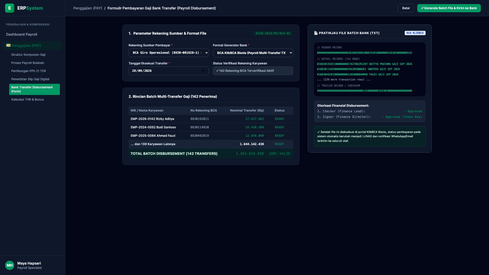

# 🎨 Design UI — Formulir Pembayaran Gaji Bank Transfer (Data Entry Screen)

> Mockup antarmuka **Formulir Pembayaran Gaji Bank Transfer (Bank Payroll Disbursement Data Entry)**: desain *Split-Screen Form* dengan formulir eksekusi disbursement bank di sebelah kiri (Nomor Transaksi `DISB-2026/09/BCA-01`, rekening sumber BCA Giro Operasional `8830-001928-1` Saldo Rp 4,85 Miliar, format KlikBCA Bisnis TXT Multi-Transfer, tgl transfer 28/09/2026, rincian 142 penerima gaji: Rizky Aditya Rp 17,63 Jt, Budi Santoso Rp 18,42 Jt, Ahmad Fauzi Rp 12,85 Jt & 139 staf lainnya &rarr; Total Pembayaran Rp 1.693.050.000) dan *Live Pratinjau Struktur File Batch Bank BCA TXT (Header Record, Detail Rows & Checksum Trailer) serta Status Otorisasi Checker/Signer Token* di sebelah kanan pada modul `PAY` (Penggajian) dalam ERP System.

---

## Light Mode

---

## Dark Mode

---

## 📝 Komponen & Fitur Formulir Input

1. **Panel Kiri — Formulir Parameter Rekening & Batch Transfer**:
   - Nomor Transaksi: `DISB-2026/09/BCA-01` &bull; Tanggal: **28 September 2026**.
   - Rekening Sumber: *BCA Giro Operasional 8830-001928-1 (Saldo Rp 4,85 M)*.
   - Format File: **BCA KlikBCA Bisnis Auto-Debet Multi-Transfer (TXT File)**.
   - Status Verifikasi: **142/142 Rekening Bank BCA Valid & Terverifikasi**.
   - **Total Nilai Pembayaran: Rp 1.693.050.000** (142 Karyawan).

2. **Panel Kanan — File Batch Bank & Otorisasi Finansial**:
   - Pratinjau Format File Standar *KlikBCA Batch TXT*.
   - Hash Integrity & Checksum Trailer Verifier.
   - Status Otorisasi Keuangan: *Checker (Finance Lead) ✓ & Signer (Finance Director) ✓*.
