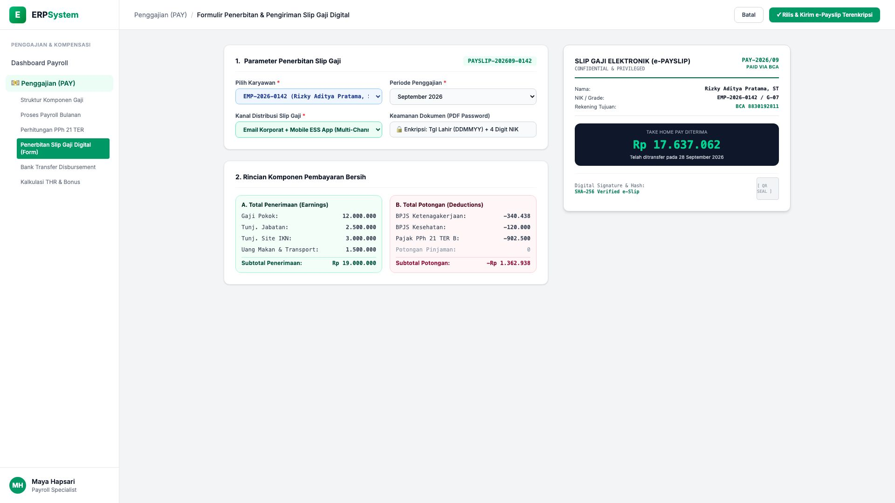
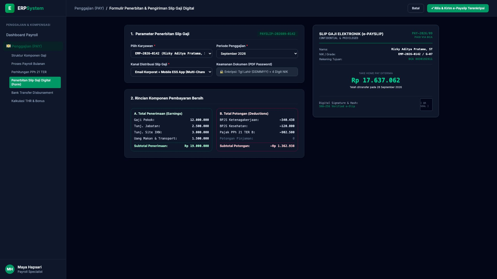

# 🎨 Design UI — Formulir Penerbitan Slip Gaji Digital (Data Entry Screen)

> Mockup antarmuka **Formulir Penerbitan & Distribusi Slip Gaji Digital (Digital Payslip Generation Data Entry)**: desain *Split-Screen Form* dengan formulir konfigurasi rilis slip gaji di sebelah kiri (Nomor Slip `PAYSLIP-202609-0142`, karyawan Rizky Aditya Pratama ST `EMP-2026-0142`, periode September 2026, saluran pengiriman Email & Mobile ESS, proteksi enkripsi sandi PDF, rincian: Penerimaan Rp 19.000.000, Potongan -Rp 1.362.938 &rarr; Gaji Bersih Ditransfer Rp 17.637.062) dan *Live Dokumen Slip Gaji Elektronik Resmi (Official Digital e-Payslip) dengan Watermark Kerahasiaan, Rincian Komponen & QR Seal Otentikasi SHA-256* di sebelah kanan pada modul `PAY` (Penggajian) dalam ERP System.

---

## Light Mode

---

## Dark Mode

---

## 📝 Komponen & Fitur Formulir Input

1. **Panel Kiri — Formulir Parameter Penerbitan & Keamanan Dokumen**:
   - Nomor Dokumen: `PAYSLIP-202609-0142` &bull; Periode: **September 2026**.
   - Karyawan: `Rizky Aditya Pratama, ST` &bull; Grade: `G-07`.
   - Saluran Distribusi: *Email Korporat + Mobile Employee Self-Service (ESS)*.
   - Enkripsi Keamanan: *Password Terproteksi (Kombinasi Tanggal Lahir + 4 Digit NIK KTP)*.
   - Rincian Penerimaan & Potongan:
     - Gaji Pokok: **Rp 12.000.000**
     - Total Tunjangan (Jabatan, Site, Makan/Transport): **Rp 7.000.000**
     - **Subtotal Penerimaan: Rp 19.000.000**
     - BPJS TK: **-Rp 340.438**
     - BPJS Kes: **-Rp 120.000**
     - Pajak PPh 21 TER: **-Rp 902.500**
     - **Subtotal Potongan: -Rp 1.362.938**

2. **Panel Kanan — Dokumen e-Payslip Digital Resmi**:
   - Tampilan Lembar Slip Gaji Resmi (*Official Electronic Payslip*).
   - **Take Home Pay Ditransfer: Rp 17.637.062** (Rekening BCA `8830192811`).
   - Kode Otentikasi QR Seal & Verifikasi Kriptografis SHA-256.
