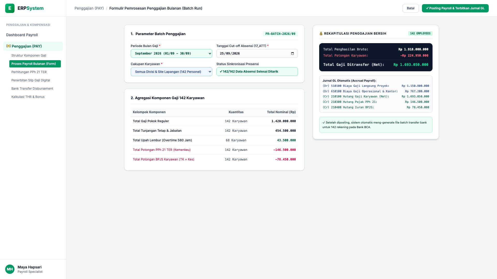
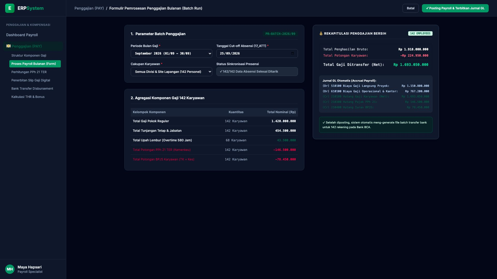

# 🎨 Design UI — Formulir Pemrosesan Penggajian Bulanan (Data Entry Screen)

> Mockup antarmuka **Formulir Pemrosesan Penggajian Bulanan (Monthly Batch Payroll Processing Data Entry)**: desain *Split-Screen Form* dengan formulir eksekusi payroll di sebelah kiri (Nomor Batch `PR-BATCH-2026/09`, periode September 2026, cut-off presensi 25/09/2026, cakupan 142 Karyawan Proyek & Kantor, agregasi: Gaji Pokok Rp 1,42 Miliar, Tunjangan Rp 454,5 Jt, Lembur 580 Jam Rp 43,5 Jt = Bruto Rp 1,918 Miliar, Potongan Pajak PPh 21 Rp 146,5 Jt, BPJS Rp 78,45 Jt) dan *Live Rekapitulasi Gaji Bersih Ditransfer (Total Net Rp 1.693.050.000) & Jurnal GL Otomatis Accrual Payroll (Biaya Gaji Dr Rp 1,918 Miliar vs Hutang Gaji/Pajak/BPJS Cr)* di sebelah kanan pada modul `PAY` (Penggajian) dalam ERP System.

---

## Light Mode

---

## Dark Mode

---

## 📝 Komponen & Fitur Formulir Input

1. **Panel Kiri — Formulir Parameter Batch Payroll & Agregasi Gaji**:
   - Nomor Batch: `PR-BATCH-2026/09` &bull; Periode: **September 2026**.
   - Integrasi Presensi: *Cut-off 25/09/2026 (142 Data Karyawan Tersinkron Modul 17_ATT)*.
   - Ringkasan Komponen Penggajian:
     - Gaji Pokok Reguler (142 org): **Rp 1.420.000.000**
     - Tunjangan Tetap & Jabatan (142 org): **Rp 454.500.000**
     - Upah Lembur Overtime (580 Jam - 68 org): **Rp 43.500.000**
     - **Total Penghasilan Bruto: Rp 1.918.000.000**
     - Potongan Pajak PPh 21 TER: **-Rp 146.500.000**
     - Potongan BPJS Karyawan: **-Rp 78.450.000**

2. **Panel Kanan — Rekap Gaji Bersih & Jurnal Akuntansi GL**:
   - **Total Gaji Bersih Ditransfer (Net THP): Rp 1.693.050.000**
   - Jurnal GL Otomatis (Modul `4_GL`):
     - `(Dr) 510100 Biaya Gaji Langsung Proyek`: **Rp 1.150.800.000**
     - `(Dr) 610100 Biaya Gaji Operasional & Kantor`: **Rp 767.200.000**
     - `(Cr) 210100 Hutang Gaji Karyawan`: **Rp 1.693.050.000**
     - `(Cr) 210300 Hutang Pajak PPh 21`: **Rp 146.500.000**
     - `(Cr) 210400 Hutang Iuran BPJS`: **Rp 78.450.000**
