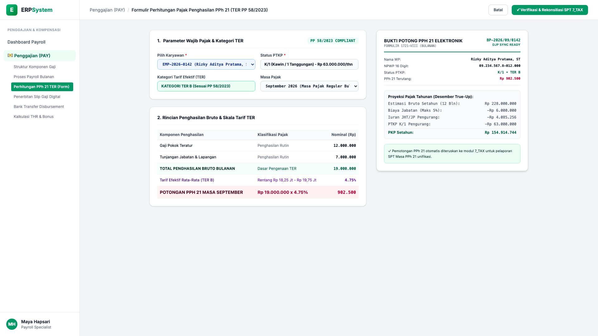
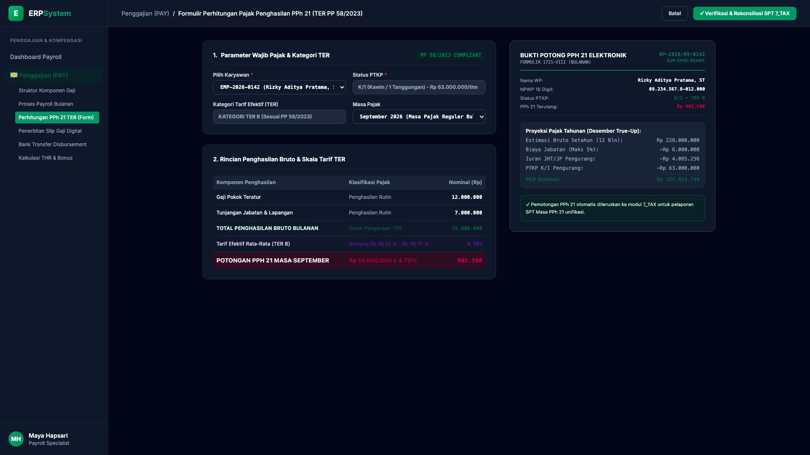

# 🎨 Design UI — Formulir Perhitungan PPh 21 (TER PP 58/2023) (Data Entry Screen)

> Mockup antarmuka **Formulir Perhitungan Pajak Penghasilan PPh 21 TER (PPh 21 Tax Calculation Data Entry)**: desain *Split-Screen Form* dengan formulir input parameter pajak di sebelah kiri (karyawan Rizky Aditya Pratama ST `EMP-2026-0142`, status PTKP `K/1 Kawin 1 Anak`, Kategori Tarif Efektif **TER B**, Masa Pajak September 2026, dasar pengenaan pajak Bruto Rp 19.000.000, tarif TER B 4.75% &rarr; Potongan PPh 21 Masa September Rp 902.500) dan *Live Dokumen Bukti Potong Pajak Elektronik (e-Bupot PPh 21 Formulir 1721-VIII / 1721-A1 Kemenkeu DJP) & Proyeksi Pajak Tahunan PKP Akhir Tahun* di sebelah kanan pada modul `PAY` (Penggajian) dalam ERP System.

---

## Light Mode

---

## Dark Mode

---

## 📝 Komponen & Fitur Formulir Input

1. **Panel Kiri — Formulir Wajib Pajak & Tarif TER PP 58/2023**:
   - Wajib Pajak: `Rizky Aditya Pratama, ST` &bull; NPWP: `09.234.567.8-012.000`.
   - Status PTKP: **K/1 (Kawin 1 Tanggungan)**.
   - Kategori Tarif: **TER Kategori B (PP 58/2023)**.
   - Rincian Kalkulasi Pajak:
     - Gaji Pokok Teratur: **Rp 12.000.000**
     - Tunjangan Rutin: **Rp 7.000.000**
     - Total Penghasilan Bruto: **Rp 19.000.000**
     - Tarif TER B Efektif: **4.75%** (Rentang Rp 18,25 Jt - Rp 19,75 Jt)
     - **Potongan PPh 21 Masa September: Rp 902.500**

2. **Panel Kanan — Bukti Potong e-Bupot & Proyeksi Akhir Tahun**:
   - Bukti Potong Elektronik *Formulir 1721-VIII*.
   - Proyeksi PKP Setahun & Sinkronisasi Pelaporan SPT Unifikasi ke modul `7_TAX`.
